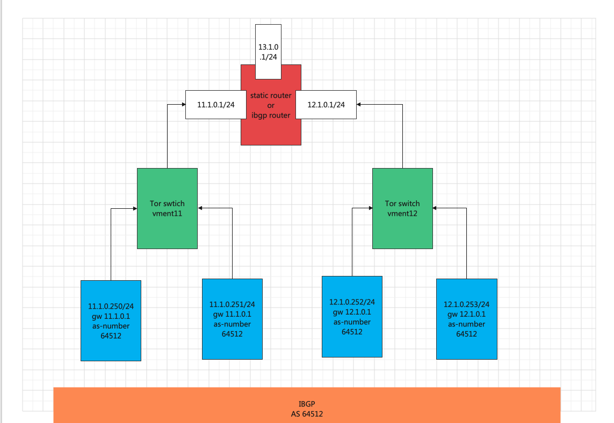
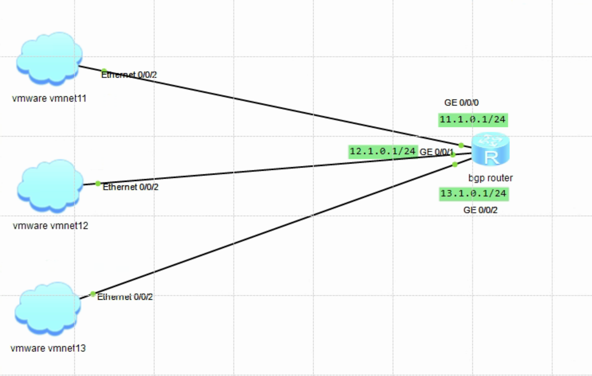
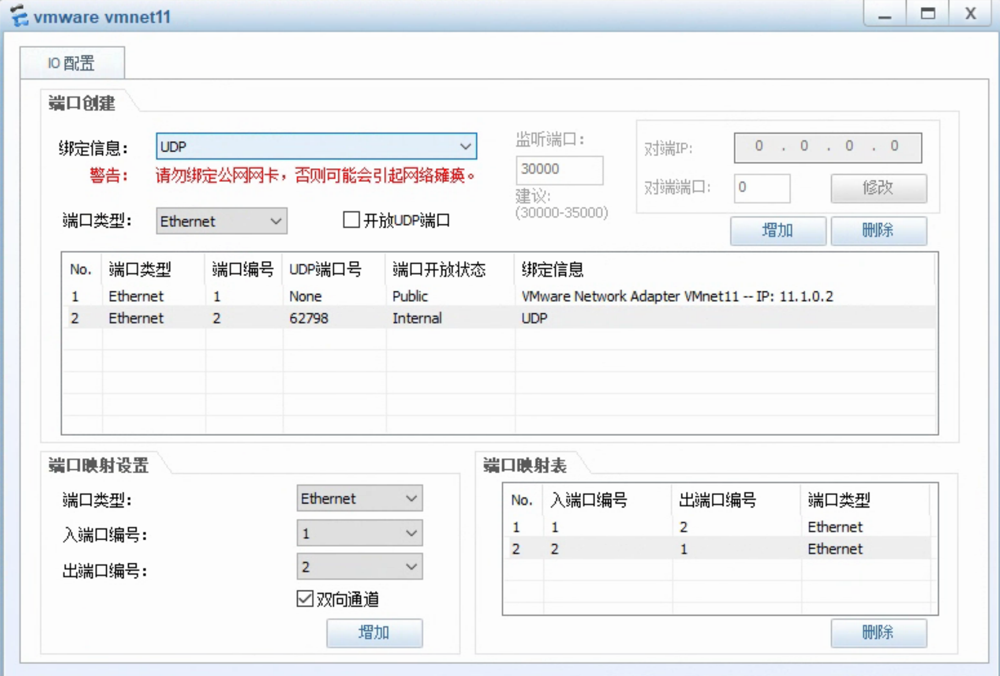
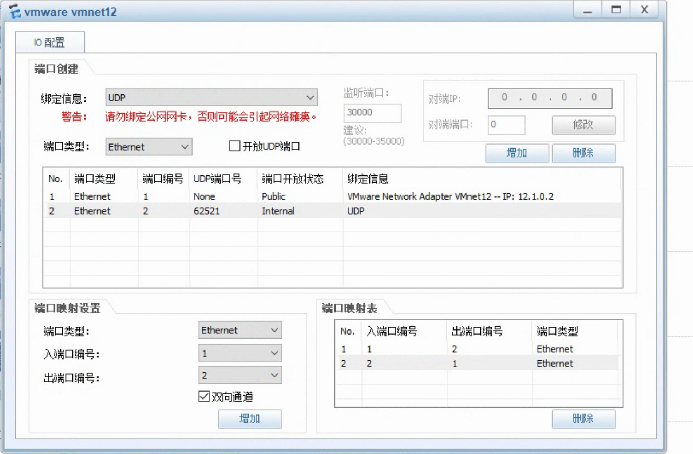
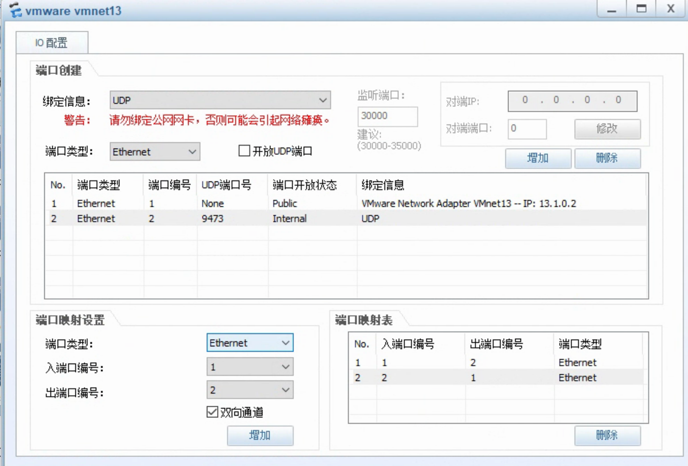

* [1 cluster network info](#1-cluster-network-info)
   * [vmware net info](#vmware-net-info)
   * [windows network info](#windows-network-info)
   * [linux server net info](#linux-server-net-info)
* [2   version info](#2---version-info)
* [3 linux router](#3-linux-router)
* [4  init cluster](#4--init-cluster)
   * [master 11.1.0.250](#master-1110250)
   * [node 11.1.0.251](#node-1110251)
   * [node  12.1.0.252](#node--1210252)
   * [node 12.1.0.253](#node-1210253)
* [5 install calico](#5-install-calico)
   * [install  calico cni](#install--calico-cni)
   * [verify  no ipvlan and  no vxlan](#verify--no-ipvlan-and--no-vxlan)
   * [verify node status ready](#verify-node-status-ready)
   * [install calicoctl](#install-calicoctl)
      * [get  bgp info](#get--bgp-info)
* [6 delete  taint](#6-delete--taint)
* [7 test pod network](#7-test-pod-network)
   * [create deployment](#create-deployment)
   * [create service](#create-service)
   * [get info](#get-info)
* [8  get  each  node  pod subnet](#8--get--each--node--pod-subnet)
* [9  use static route  for pod network](#9--use-static-route--for-pod-network)
   * [auto add pod route shell](#auto-add-pod-route-shell)
      * [router linux  192.168.3.254](#router-linux--1921683254)
   * [test pod ip  on router linux](#test-pod-ip--on-router-linux)
   * [test pod ip  on router linux on  11.1.0.250](#test-pod-ip--on-router-linux-on--1110250)
   * [test pod ip  on router linux on  12.1.0.252](#test-pod-ip--on-router-linux-on--1210252)
   * [summary](#summary)
* [10 bird as globalBgpReplaceStaticRoute](#10-bird-as-globalbgpreplacestaticroute)
   * [on k8s cluster crate global bgp](#on-k8s-cluster-crate-global-bgp)
   * [config external  ibgp peer](#config-external--ibgp-peer)
      * [dell  static route for pod subnet](#dell--static-route-for-pod-subnet)
      * [config bird ibgp](#config-bird-ibgp)
   * [cat  bgp  status](#cat--bgp--status)
   * [test pod subnet access each other](#test-pod-subnet-access-each-other)
   * [stop external bird ibgp peer](#stop-external-bird-ibgp-peer)
   * [start bird and get some info](#start-bird-and-get-some-info)
      * [get  ibgp router info](#get--ibgp-router-info)
* [11phsicalRouterReplaceBgpSoftwareBird](#11phsicalrouterreplacebgpsoftwarebird)
   * [router linux shutdown](#router-linux-shutdown)
   * [ensp config](#ensp-config)
      * [cloud vmware vmnet11](#cloud-vmware-vmnet11)
      * [cloud vmware vmnet12](#cloud-vmware-vmnet12)
      * [cloud vmware vmnet13](#cloud-vmware-vmnet13)
      * [router  AR2240](#router--ar2240)
   * [config router ip](#config-router-ip)
   * [before config bgp get bgp status](#before-config-bgp-get-bgp-status)
   * [config ensp bgp](#config-ensp-bgp)
   * [get calico bgp status](#get-calico-bgp-status)
   * [test](#test)
      * [recreate deployment](#recreate-deployment)
      * [ensp router test](#ensp-router-test)
      * [each node curl nginx pod](#each-node-curl-nginx-pod)
* [12 use  bgp  when add a k8s node](#12-use--bgp--when-add-a-k8s-node)
   * [add a k8s node   node  subnet vment11](#add-a-k8s-node---node--subnet-vment11)
   * [node ip is  11.1.0.252](#node-ip-is--1110252)
   * [bird  config  add  config for 11.1.0.252](#bird--config--add--config-for-1110252)
* [13 monitor Etcd add static route](#13-monitor-etcd-add-static-route)
   * [test etcd watch](#test-etcd-watch)
      * [delete a node](#delete-a-node)
      * [1 watch  是否有新节点加入](#1-watch--是否有新节点加入)
      * [2 在指定节点上创建一个非host网络 类型的pod  触发分配pod subnet](#2-在指定节点上创建一个非host网络-类型的pod--触发分配pod-subnet)
      * [3 watch etcd  对 confirmed  put 事件添加  路由](#3-watch-etcd--对-confirmed--put-事件添加--路由)
* [14 testRoutesAggregation other linux](#14-testroutesaggregation-other-linux)


```
no Route Reflectors 
```


https://projectcalico.docs.tigera.io/archive/v3.21/reference/architecture/design/l2-interconnect-fabric


https://projectcalico.docs.tigera.io/archive/v3.21/reference/architecture/design/l3-interconnect-fabric#bgp-only-interconnect-fabrics





if   two pods'node  have   same    subent    they    will use Physics L2      tor

if   two pods'node  have   diffent   seubnet  they   will use Physics L2     router


# 1 cluster network info


## vmware net info


| subnet         | vmwareNet                              | vmware net mode |
| -------------- | -------------------------------------- | --------------- |
| 11.1.0.0/24    | vmnet11   disable dhcp                 | host only       |
| 12.1.0.0/24    | vmnet12    disable dhcp                | host only       |
| 13.1.0.0/24    | vmnet13    disable dhcp                | host only       |
| 192.168.3.0/24 | is windows  network  can access public | bridge          |
|                |                                        |                 |


## windows network info


| net card                       | ip                             | vmware net |
| ------------------------------ | ------------------------------ | ---------- |
| windows10 phisisycal net card  | 192.168.3.12/24 gw 192.168.3.1 |            |
| VMware Network Adapter VMnet11 | 11.1.0.2/24 no gw              | vmnet11    |
| VMware Network Adapter VMnet12 | 12.1.0.2/24 no gw              | vmnet12    |
| VMware Network Adapter VMnet13 | 13.1.0.2/24 no gw              | vmnet13    |
|                                |                                |            |


## linux server net info 


| host         | eth0                             | eth1        | eth2        | eth3  bgp-router-id | eth4  svc ip   |
| ------------ | -------------------------------- | ----------- | ----------- | ------------------- | -------------- |
| master       | 11.1.0.250/24  gw 11.1.0.1       | no          | no          | no                  |                |
| node         | 11.1.0.251/24  gw 11.1.0.1       | no          | no          | no                  |                |
| node         | 12.1.0.252/24  gw 12.1.0.1       | no          | no          | no                  |                |
| node         | 12.1.0.253/24  gw 12.1.0.1       | no          | no          | no                  |                |
|              |                                  |             |             |                     |                |
| linux-router | 192.168.3.254/24  gw 192.168.3.1 | 11.1.0.1/24 | 12.1.0.1/24 | 13.1.0.1/24         | 10.1.0.0/16 ？ |
|              |                                  |             |             |                     |                |
|              |                                  |             |             |                     |                |
|              |                                  |             |             |                     |                |


linux-router use  eth0  access public network

master and node  access pubic network   example  get image resources    use  linux-router


```
[root@bgp-router ~]# ip a | grep eth
2: eth0: <BROADCAST,MULTICAST,UP,LOWER_UP> mtu 1500 qdisc pfifo_fast state UP group default qlen 1000
    link/ether 00:0c:29:ff:ee:e8 brd ff:ff:ff:ff:ff:ff
    inet 192.168.3.254/24 brd 192.168.3.255 scope global eth0
3: eth1: <BROADCAST,MULTICAST,UP,LOWER_UP> mtu 1500 qdisc pfifo_fast state UP group default qlen 1000
    link/ether 00:0c:29:ff:ee:f2 brd ff:ff:ff:ff:ff:ff
    inet 11.1.0.1/24 brd 11.1.0.255 scope global eth1
4: eth2: <BROADCAST,MULTICAST,UP,LOWER_UP> mtu 1500 qdisc pfifo_fast state UP group default qlen 1000
    link/ether 00:0c:29:ff:ee:fc brd ff:ff:ff:ff:ff:ff
    inet 12.1.0.1/24 brd 12.1.0.255 scope global eth2
5: eth3: <BROADCAST,MULTICAST,UP,LOWER_UP> mtu 1500 qdisc pfifo_fast state UP group default qlen 1000
    link/ether 00:0c:29:ff:ee:06 brd ff:ff:ff:ff:ff:ff
    inet 13.1.0.1/24 brd 13.1.0.255 scope global eth3
[root@bgp-router ~]# 


[root@bgp-router ~]# route -n
Kernel IP routing table
Destination     Gateway         Genmask         Flags Metric Ref    Use Iface
0.0.0.0         192.168.3.1     0.0.0.0         UG    0      0        0 eth0
11.1.0.0        0.0.0.0         255.255.255.0   U     0      0        0 eth1
12.1.0.0        0.0.0.0         255.255.255.0   U     0      0        0 eth2
13.1.0.0        0.0.0.0         255.255.255.0   U     0      0        0 eth3
169.254.0.0     0.0.0.0         255.255.0.0     U     1002   0        0 eth0
169.254.0.0     0.0.0.0         255.255.0.0     U     1003   0        0 eth1
169.254.0.0     0.0.0.0         255.255.0.0     U     1004   0        0 eth2
169.254.0.0     0.0.0.0         255.255.0.0     U     1005   0        0 eth3
192.168.3.0     0.0.0.0         255.255.255.0   U     0      0        0 eth0
[root@bgp-router ~]# 


cat /proc/sys/net/ipv4/ip_forward
1


[root@bgp-router ~]# iptables -t nat -nL
Chain PREROUTING (policy ACCEPT)
target     prot opt source               destination         

Chain INPUT (policy ACCEPT)
target     prot opt source               destination         

Chain OUTPUT (policy ACCEPT)
target     prot opt source               destination         

Chain POSTROUTING (policy ACCEPT)
target     prot opt source               destination         
[root@bgp-router ~]# 


```


# 2 version info


| software                                              | version                                  |
| ----------------------------------------------------- | ---------------------------------------- |
| os                                                    | centos7.8  kernel 3.10.0-1127.el7.x86_64 |
| kubernetes/kubeadm                                    | v1.23.5                                  |
| calico                                                | v3.23.1                                  |
| calicoctl                                             | v3.20.5                                  |
| custom  bird  that out of cluster   (global bgp peer) | 1.6.8                                    |
|                                                       |                                          |
|                                                       |                                          |
|                                                       |                                          |
|                                                       |                                          |


# 3 linux router


Let  11.1.0.0/24  and   12.1.0.0/24 subnet  access public net   with  192.168.3.254 


```
echo "1" > /proc/sys/net/ipv4/ip_forward
```


```
iptables -t nat -A POSTROUTING -s 11.1.0.0/24  ! -d 11.1.0.0/24  -o eth0  -j SNAT --to-source 192.168.3.254
iptables -t nat -A POSTROUTING -s 12.1.0.0/24  ! -d 12.1.0.0/24  -o eth0  -j SNAT --to-source 192.168.3.254
```


# 4  init cluster


## master 11.1.0.250


```
cat > /opt/kube-1.23.5-config.yaml << EOF
apiVersion: kubeadm.k8s.io/v1beta3
kind: InitConfiguration
localAPIEndpoint:
  advertiseAddress: 0.0.0.0
  bindPort: 6443
nodeRegistration:
  name: 11.1.0.250
bootstrapTokens:
- groups:
  - system:bootstrappers:kubeadm:default-node-token
  token: usvieq.2zg86228emymgcd4
  ttl: 2400000h0m0s
  usages:
  - signing
  - authentication
---
apiVersion: kubeadm.k8s.io/v1beta3
kind: ClusterConfiguration
kubernetesVersion: v1.23.5
imageRepository: registry.aliyuncs.com/google_containers
controlPlaneEndpoint: 11.1.0.250:6443
controllerManager: {}
scheduler: {}
networking:
  serviceSubnet: 10.96.0.0/12
  podSubnet: 10.244.0.0/16
---
apiVersion: kubeproxy.config.k8s.io/v1alpha1
kind: KubeProxyConfiguration
mode: ipvs
EOF
```


```
kubeadm  init --config  /opt/kube-1.23.5-config.yaml
```


## node 11.1.0.251  

```
kubeadm join 11.1.0.250:6443 --node-name=11.1.0.251 \
--token usvieq.2zg86228emymgcd4 \
--discovery-token-ca-cert-hash sha256:e7e45388ef5186a2f74b92164944bba093ddf4985256636ffa8c14e2f775ae25 
```


## node  12.1.0.252   

```
kubeadm join 11.1.0.250:6443 --node-name=12.1.0.252 \
--token usvieq.2zg86228emymgcd4 \
--discovery-token-ca-cert-hash sha256:e7e45388ef5186a2f74b92164944bba093ddf4985256636ffa8c14e2f775ae25 
```


## node 12.1.0.253

```
kubeadm join 11.1.0.250:6443 --node-name=12.1.0.253 \
--token usvieq.2zg86228emymgcd4 \
--discovery-token-ca-cert-hash sha256:e7e45388ef5186a2f74b92164944bba093ddf4985256636ffa8c14e2f775ae25 
```


# 5 install calico


## install  calico cni


```
curl  https://projectcalico.docs.tigera.io/v3.23/manifests/calico.yaml -O
```


```
vim calico.yaml

4405             - name: CALICO_IPV4POOL_IPIP
4406               value: "Never"
4407             # Enable or Disable VXLAN on the default IP pool.
4408             - name: CALICO_IPV4POOL_VXLAN
4409               value: "Never"
4410             # Enable or Disable VXLAN on the default IPv6 IP pool.
4411             - name: CALICO_IPV6POOL_VXLAN
4412               value: "Never"
```


```
kubectl apply -f  calico.yaml
```


## verify  no ipvlan and  no vxlan

```
kubectl  -n kube-system   get ippools  default-ipv4-ippool  -o  json  | jq .spec

{
  "allowedUses": [
    "Workload",
    "Tunnel"
  ],
  "blockSize": 26,
  "cidr": "10.244.0.0/16",
  "ipipMode": "Never",
  "natOutgoing": true,
  "nodeSelector": "all()",
  "vxlanMode": "Never"
}
```


## verify node status ready


```
kubectl  get node
NAME         STATUS   ROLES                  AGE     VERSION
11.1.0.250   Ready    control-plane,master   31m     v1.23.5
11.1.0.251   Ready    <none>                 14m     v1.23.5
12.1.0.252   Ready    <none>                 8m36s   v1.23.5
12.1.0.253   Ready    <none>                 8m17s   v1.23.5
```


## install calicoctl


```
curl -O -L https://github.com/projectcalico/calicoctl/releases/download/v3.20.5/calicoctl-linux-amd64
```

```
mv calicoctl-linux-amd64  /usr/local/bin/calicoctl
chmod +x /usr/local/bin/calicoctl 
```


### get  bgp info


```
calicoctl  node status

Calico process is running.

IPv4 BGP status
+--------------+-------------------+-------+----------+-------------+
| PEER ADDRESS |     PEER TYPE     | STATE |  SINCE   |    INFO     |
+--------------+-------------------+-------+----------+-------------+
| 11.1.0.251   | node-to-node mesh | up    | 06:38:53 | Established |
| 12.1.0.252   | node-to-node mesh | up    | 06:39:02 | Established |
| 12.1.0.253   | node-to-node mesh | up    | 06:39:04 | Established |
+--------------+-------------------+-------+----------+-------------+

IPv6 BGP status
No IPv6 peers found.
```


# 6 delete  taint


```
kubectl taint node  11.1.0.250    node-role.kubernetes.io/master:NoSchedule-
```


# 7 test pod network


##  create deployment


```
cat <<EOF | kubectl apply -f -
apiVersion: apps/v1
kind: Deployment
metadata:
  name: nginx-deployment
  labels:
    app: nginx
spec:
  replicas: 4
  selector:
    matchLabels:
      app: nginx
  template:
    metadata:
      labels:
        app: nginx
    spec:
      containers:
      - name: nginx
        image: yimtune/nginx:1.21.6
        ports:
        - containerPort: 80
EOF
```


## create service 


```
kubectl  -n default expose deploy  nginx-deployment  --port=80 --target-port=80 --type=NodePort
```


## get info


```
kubectl  get pod -l app=nginx -o wide

NAME                                READY   STATUS    RESTARTS   AGE   IP               NODE         
nginx-deployment-6f8cbdc6f5-6sslr   1/1     Running   0          23s   10.244.240.64    12.1.0.253
nginx-deployment-6f8cbdc6f5-8cnnq   1/1     Running   0          23s   10.244.187.0     11.1.0.250
nginx-deployment-6f8cbdc6f5-ggsmq   1/1     Running   0          23s   10.244.223.0     12.1.0.252
nginx-deployment-6f8cbdc6f5-wnbt5   1/1     Running   0          23s   10.244.229.195   11.1.0.251  
```


```
curl 10.244.240.64
curl 10.244.187.0
curl 10.244.223.0
curl 10.244.229.195
```


```
kubectl  get svc -l app=nginx
NAME               TYPE       CLUSTER-IP      EXTERNAL-IP   PORT(S)        AGE
nginx-deployment   NodePort   10.98.159.204   <none>        80:32014/TCP   8m17s
```


```
curl  10.98.159.204
```


# 8  get  each  node  pod subnet


```
kubectl get ipamblocks.crd.projectcalico.org -o jsonpath="{range .items[*]}{'podNetwork: '}{.spec.cidr}{'\t NodeIP: '}{.spec.affinity}{'\n'}"

```


```
podNetwork: 10.244.187.0/26      NodeIP: host:11.1.0.250
podNetwork: 10.244.223.0/26      NodeIP: host:12.1.0.252
podNetwork: 10.244.229.192/26    NodeIP: host:11.1.0.251
podNetwork: 10.244.240.64/26     NodeIP: host:12.1.0.253
```


use json


```
kubectl get ipamblocks.crd.projectcalico.org -o json | jq '.items[]'
```


```
kubectl get ipamblocks.crd.projectcalico.org -o json | jq '.items[].spec.cidr'

"10.244.187.0/26"
"10.244.223.0/26"
"10.244.229.192/26"
"10.244.240.64/26"
```


```
kubectl get ipamblocks.crd.projectcalico.org -o json | jq '.items[].spec.affinity'

"host:11.1.0.250"
"host:12.1.0.252"
"host:11.1.0.251"
"host:12.1.0.253"
```


```
kubectl get ipamblocks.crd.projectcalico.org -ojson|jq '.items[]|{subnet: .spec.cidr, nodeInfo: .spec.affinity}'

```


```
{
  "subnet": "10.244.187.0/26",
  "nodeInfo": "host:11.1.0.250"
}
{
  "subnet": "10.244.223.0/26",
  "nodeInfo": "host:12.1.0.252"
}
{
  "subnet": "10.244.229.192/26",
  "nodeInfo": "host:11.1.0.251"
}
{
  "subnet": "10.244.240.64/26",
  "nodeInfo": "host:12.1.0.253"
}
```


output  json array 


```
kubectl get ipamblocks.crd.projectcalico.org -ojson|jq  '.items[]|{subnet: .spec.cidr, nodeInfo: .spec.affinity}'  | jq -s
[
  {
    "subnet": "10.244.187.0/26",
    "nodeInfo": "host:11.1.0.250"
  },
  {
    "subnet": "10.244.223.0/26",
    "nodeInfo": "host:12.1.0.252"
  },
  {
    "subnet": "10.244.229.192/26",
    "nodeInfo": "host:11.1.0.251"
  },
  {
    "subnet": "10.244.240.64/26",
    "nodeInfo": "host:12.1.0.253"
  }
]
```


#  9  use static route  for pod network


##  auto add pod route shell


### router linux  192.168.3.254


run a shell to  monitor sub and node  info  and add static route


```
```


```
ip route add  10.244.223.0/26  via 12.1.0.252
```


```
cat calico-bgp-cross-subnet-static-route-manager.sh

#!/bin/bash
export routeInfo=$(kubectl get ipamblocks.crd.projectcalico.org  -o json|jq  '.items[]|{subnet: .spec.cidr, nodeInfo: .spec.affinity}'   | jq -s)

export routeNumber=$(echo $routeInfo| jq length)


for ((i=0;i<$routeNumber;i++));do 
sub=$(echo  $routeInfo | jq .[$i].subnet | sed -e 's@\"@@g')
host=$(echo $routeInfo | jq .[$i].nodeInfo| sed 's/host://g' | sed -e 's@\"@@g')

#echo $sub $host
ip route add  $sub  via $host
done
```


```
before  add pod sub net route 

route -n
Kernel IP routing table
Destination     Gateway         Genmask         Flags Metric Ref    Use Iface
0.0.0.0         192.168.3.1     0.0.0.0         UG    0      0        0 eth0
11.1.0.0        0.0.0.0         255.255.255.0   U     0      0        0 eth1
12.1.0.0        0.0.0.0         255.255.255.0   U     0      0        0 eth2
13.1.0.0        0.0.0.0         255.255.255.0   U     0      0        0 eth3
169.254.0.0     0.0.0.0         255.255.0.0     U     1002   0        0 eth0
169.254.0.0     0.0.0.0         255.255.0.0     U     1003   0        0 eth1
169.254.0.0     0.0.0.0         255.255.0.0     U     1004   0        0 eth2
169.254.0.0     0.0.0.0         255.255.0.0     U     1005   0        0 eth3
192.168.3.0     0.0.0.0         255.255.255.0   U     0      0        0 eth0


add pod sub net route 
sh calico-bgp-cross-subnet-static-route-manager.sh 


after   add pod sub net route 
route -n

Kernel IP routing table
Destination     Gateway         Genmask         Flags Metric Ref    Use Iface
0.0.0.0         192.168.3.1     0.0.0.0         UG    0      0        0 eth0
10.244.187.0    11.1.0.250      255.255.255.192 UG    0      0        0 eth1
10.244.223.0    12.1.0.252      255.255.255.192 UG    0      0        0 eth2
10.244.229.192  11.1.0.251      255.255.255.192 UG    0      0        0 eth1
10.244.240.64   12.1.0.253      255.255.255.192 UG    0      0        0 eth2
11.1.0.0        0.0.0.0         255.255.255.0   U     0      0        0 eth1
12.1.0.0        0.0.0.0         255.255.255.0   U     0      0        0 eth2
13.1.0.0        0.0.0.0         255.255.255.0   U     0      0        0 eth3
169.254.0.0     0.0.0.0         255.255.0.0     U     1002   0        0 eth0
169.254.0.0     0.0.0.0         255.255.0.0     U     1003   0        0 eth1
169.254.0.0     0.0.0.0         255.255.0.0     U     1004   0        0 eth2
169.254.0.0     0.0.0.0         255.255.0.0     U     1005   0        0 eth3
192.168.3.0     0.0.0.0         255.255.255.0   U     0      0        0 eth0
```


##    test pod ip  on router linux


```
kubectl get pods -lapp=nginx -ogo-template --template='{{range .items}}{{printf "%s\n" .status.podIP}}{{end}}'
 
```


```
10.244.240.64
10.244.187.0
10.244.223.0
10.244.229.195
```


```
for line in `kubectl get pods -lapp=nginx -ogo-template --template='{{range .items}}{{printf "%s\n" .status.podIP}}{{end}}'`; do curl  -L -s -o /dev/null -w "%{http_code}" $line && echo ":ok"; done

```


```
200:ok
200:ok
200:ok
200:ok
```


##   test pod ip  on router linux on  11.1.0.250


```
for line in `kubectl get pods -lapp=nginx -ogo-template --template='{{range .items}}{{printf "%s\n" .status.podIP}}{{end}}'`; do  traceroute  $line&& echo "" ; done

```


```
traceroute to 10.244.240.64 (10.244.240.64), 30 hops max, 60 byte packets
 1  gateway (11.1.0.1)  0.351 ms  0.250 ms  0.186 ms
 2  12.1.0.253 (12.1.0.253)  1.131 ms  1.023 ms  0.947 ms
 3  10.244.240.64 (10.244.240.64)  0.775 ms  1.756 ms  1.657 ms

traceroute to 10.244.187.0 (10.244.187.0), 30 hops max, 60 byte packets
 1  10.244.187.0 (10.244.187.0)  0.062 ms  0.024 ms  0.023 ms

traceroute to 10.244.223.0 (10.244.223.0), 30 hops max, 60 byte packets
 1  gateway (11.1.0.1)  38.599 ms * *
 2  12.1.0.252 (12.1.0.252)  38.451 ms  38.411 ms  38.370 ms
 3  10.244.223.0 (10.244.223.0)  38.330 ms  38.290 ms  38.249 ms

traceroute to 10.244.229.195 (10.244.229.195), 30 hops max, 60 byte packets
 1  11.1.0.251 (11.1.0.251)  3.049 ms  2.971 ms  2.927 ms
 2  10.244.229.195 (10.244.229.195)  2.888 ms  2.848 ms  2.809 ms

```


##  test pod ip  on router linux on  12.1.0.252


```
for line in `kubectl get pods -lapp=nginx -ogo-template --template='{{range .items}}{{printf "%s\n" .status.podIP}}{{end}}'`; do  traceroute  $line&& echo "" ; done

```


```
traceroute to 10.244.240.64 (10.244.240.64), 30 hops max, 60 byte packets
 1  12.1.0.253 (12.1.0.253)  0.318 ms  0.290 ms  0.233 ms
 2  10.244.240.64 (10.244.240.64)  0.630 ms  0.617 ms  0.571 ms

traceroute to 10.244.187.0 (10.244.187.0), 30 hops max, 60 byte packets
 1  gateway (12.1.0.1)  0.287 ms  0.218 ms  0.170 ms
 2  11.1.0.250 (11.1.0.250)  0.416 ms  0.505 ms  0.439 ms
 3  10.244.187.0 (10.244.187.0)  0.366 ms  0.419 ms  0.519 ms

traceroute to 10.244.223.0 (10.244.223.0), 30 hops max, 60 byte packets
 1  10.244.223.0 (10.244.223.0)  0.089 ms  0.037 ms  0.034 ms

traceroute to 10.244.229.195 (10.244.229.195), 30 hops max, 60 byte packets
 1  gateway (12.1.0.1)  0.491 ms  0.393 ms  0.211 ms
 2  11.1.0.251 (11.1.0.251)  4.046 ms  3.951 ms  3.785 ms
 3  10.244.229.195 (10.244.229.195)  3.552 ms  4.436 ms  4.233 ms
```


## summary 

calico bgp mode cross subnet 

calico only provider a map 

but   only  map cant't  realy reach

must have  real road 


if  pod's   node is same subnet  pod use L2

if  pod's   node is not  same subnet  pod use L3 by linux-router 


# 10 bird as globalBgpReplaceStaticRoute


##   on k8s cluster crate global bgp 


before add


```
calicoctl  node status
Calico process is running.

IPv4 BGP status
+--------------+-------------------+-------+------------+-------------+
| PEER ADDRESS |     PEER TYPE     | STATE |   SINCE    |    INFO     |
+--------------+-------------------+-------+------------+-------------+
| 11.1.0.251   | node-to-node mesh | up    | 2022-06-14 | Established |
| 12.1.0.252   | node-to-node mesh | up    | 2022-06-14 | Established |
| 12.1.0.253   | node-to-node mesh | up    | 2022-06-14 | Established |
```


global ibgp peer


```
cat > 13.1.0.1-bird-ibgp.yaml  << EOF
apiVersion: projectcalico.org/v3
kind: BGPPeer
metadata:
  name: bird-ibgp-13-1-0-1
spec:
  peerIP: 13.1.0.1
  asNumber: 64512
EOF
```


```
calicoctl  create -f 13.1.0.1-bird-ibgp.yaml --allow-version-mismatch
```


after add global bgp peer 


```
[root@11-1-0-250 ~]# calicoctl  node status
Calico process is running.

IPv4 BGP status
+--------------+-------------------+-------+------------+--------------------------------+
| PEER ADDRESS |     PEER TYPE     | STATE |   SINCE    |              INFO              |
+--------------+-------------------+-------+------------+--------------------------------+
| 11.1.0.251   | node-to-node mesh | up    | 2022-06-14 | Established                    |
| 12.1.0.252   | node-to-node mesh | up    | 2022-06-14 | Established                    |
| 12.1.0.253   | node-to-node mesh | up    | 2022-06-14 | Established                    |
| 13.1.0.1     | global            | start | 07:36:56   | Active Socket: Connection      |
|              |                   |       |            | refused                        |
+--------------+-------------------+-------+------------+--------------------------------+
```


##  config external  ibgp peer


### dell  static route for pod subnet


```
cat del-pod-subnet-static-route.sh 
```


```
#!/bin/bash
export routeInfo=$(kubectl get ipamblocks.crd.projectcalico.org  -o json|jq  '.items[]|{subnet: .spec.cidr, nodeInfo: .spec.affinity}'   | jq -s)

export routeNumber=$(echo $routeInfo| jq length)


for ((i=0;i<$routeNumber;i++));do 
sub=$(echo  $routeInfo | jq .[$i].subnet | sed -e 's@\"@@g')
host=$(echo $routeInfo | jq .[$i].nodeInfo| sed 's/host://g' | sed -e 's@\"@@g')

#echo $sub $host
#ip route add  $sub  via $host
ip route del  $sub  via $host
done
```


```
sh del-pod-subnet-static-route.sh
```


check pod subnet static is deleted


```
route -n
Kernel IP routing table
Destination     Gateway         Genmask         Flags Metric Ref    Use Iface
0.0.0.0         192.168.3.1     0.0.0.0         UG    0      0        0 eth0
11.1.0.0        0.0.0.0         255.255.255.0   U     0      0        0 eth1
12.1.0.0        0.0.0.0         255.255.255.0   U     0      0        0 eth2
13.1.0.0        0.0.0.0         255.255.255.0   U     0      0        0 eth3
169.254.0.0     0.0.0.0         255.255.0.0     U     1002   0        0 eth0
169.254.0.0     0.0.0.0         255.255.0.0     U     1003   0        0 eth1
169.254.0.0     0.0.0.0         255.255.0.0     U     1004   0        0 eth2
169.254.0.0     0.0.0.0         255.255.0.0     U     1005   0        0 eth3
192.168.3.0     0.0.0.0         255.255.255.0   U     0      0        0 eth0
```


### config bird ibgp


```
cat  /etc/bird.conf
```


```
cat >  /etc/bird.conf  << EOF
function apply_communities ()
{
}

######### include "/opt/bird_aggr.cfg";
protocol static {
   # IP blocks for this host.
   #route 10.244.229.192/26 blackhole;
}


# Aggregation of routes on this host; export the block, nothing beneath it.
function calico_aggr ()
{
      # Block 10.244.229.192/26 is confirmed
      #if ( net = 10.244.229.192/26 ) then { accept; }
      #if ( net ~ 10.244.229.192/26 ) then { reject; }
}

#########  include "/opt/bird_ipam.cfg";
function reject_disabled_pools ()
{
}

filter calico_export_to_bgp_peers {
  reject_disabled_pools();
  apply_communities();
  calico_aggr();

  if ( net ~ 10.244.0.0/16 ) then {
    accept;
  }
  reject;
}


filter calico_kernel_programming {
  if ( net ~ 10.244.0.0/16 ) then {
    #krt_tunnel = "";
    accept;
  }

  accept;
}
###### 

log syslog all;

router id 13.1.0.1;


# Configure synchronization between routing tables and kernel.


protocol kernel {
  learn;
  #persist; 
  scan time 2; 
  import all;
  export filter calico_kernel_programming; # Default is export none
  graceful restart;  
  merge paths on; 
}

protocol device {
  debug { states };
  scan time 2;    # Scan interfaces every 2 seconds
}

protocol direct {
  debug { states };
  interface "*";
}

template bgp bgp_template {
  debug { states };
  description "Connection to BGP peer";
  local as 64512;
  multihop;
  gateway recursive; 
  import all;
  export filter calico_export_to_bgp_peers;  # Only want to export routes for workloads.
  add paths on;
  graceful restart;
  connect delay time 2;
  connect retry time 5;
  error wait time 5,30;
}


protocol bgp Mesh_11_1_0_250 from bgp_template {
  neighbor 11.1.0.250 as 64512;
  source address 11.1.0.1; 
  #passive on;
}

protocol bgp Mesh_11_1_0_251 from bgp_template {
  neighbor 11.1.0.251 as 64512;
  source address 11.1.0.1; 
  #passive on;
}


protocol bgp Mesh_12_1_0_252 from bgp_template {
  neighbor 12.1.0.252 as 64512;
  source address 12.1.0.1; 
  #passive on;
}

protocol bgp Mesh_12_1_0_253 from bgp_template {
  neighbor 12.1.0.253 as 64512;
  source address 12.1.0.1; 
  #passive on;
}
EOF
```


```
systemctl  start  bird
```


get route 


```
[root@bgp-router ~]# route -n
Kernel IP routing table
Destination     Gateway         Genmask         Flags Metric Ref    Use Iface
0.0.0.0         192.168.3.1     0.0.0.0         UG    0      0        0 eth0
10.244.187.0    11.1.0.250      255.255.255.192 UG    0      0        0 eth1
10.244.223.0    12.1.0.252      255.255.255.192 UG    0      0        0 eth2
10.244.229.192  11.1.0.251      255.255.255.192 UG    0      0        0 eth1
10.244.240.64   12.1.0.253      255.255.255.192 UG    0      0        0 eth2
11.1.0.0        0.0.0.0         255.255.255.0   U     0      0        0 eth1
12.1.0.0        0.0.0.0         255.255.255.0   U     0      0        0 eth2
13.1.0.0        0.0.0.0         255.255.255.0   U     0      0        0 eth3
169.254.0.0     0.0.0.0         255.255.0.0     U     1002   0        0 eth0
169.254.0.0     0.0.0.0         255.255.0.0     U     1003   0        0 eth1
169.254.0.0     0.0.0.0         255.255.0.0     U     1004   0        0 eth2
169.254.0.0     0.0.0.0         255.255.0.0     U     1005   0        0 eth3
192.168.3.0     0.0.0.0         255.255.255.0   U     0      0        0 eth0
```


##  cat  bgp  status


```
[root@11-1-0-250 ~]# calicoctl  node status
Calico process is running.

IPv4 BGP status
+--------------+-------------------+-------+------------+-------------+
| PEER ADDRESS |     PEER TYPE     | STATE |   SINCE    |    INFO     |
+--------------+-------------------+-------+------------+-------------+
| 11.1.0.251   | node-to-node mesh | up    | 2022-06-14 | Established |
| 12.1.0.252   | node-to-node mesh | up    | 2022-06-14 | Established |
| 12.1.0.253   | node-to-node mesh | up    | 2022-06-14 | Established |
| 13.1.0.1     | global            | up    | 07:46:17   | Established |

[root@11-1-0-251 ~]# calicoctl  node status
Calico process is running.

IPv4 BGP status
+--------------+-------------------+-------+------------+-------------+
| PEER ADDRESS |     PEER TYPE     | STATE |   SINCE    |    INFO     |
+--------------+-------------------+-------+------------+-------------+
| 11.1.0.250   | node-to-node mesh | up    | 2022-06-14 | Established |
| 12.1.0.252   | node-to-node mesh | up    | 2022-06-14 | Established |
| 12.1.0.253   | node-to-node mesh | up    | 2022-06-14 | Established |
| 13.1.0.1     | global            | up    | 07:46:16   | Established |
+--------------+-------------------+-------+------------+-------------+

[root@12-1-0-252 ~]#  calicoctl  node status
Calico process is running.

IPv4 BGP status
+--------------+-------------------+-------+------------+-------------+
| PEER ADDRESS |     PEER TYPE     | STATE |   SINCE    |    INFO     |
+--------------+-------------------+-------+------------+-------------+
| 11.1.0.250   | node-to-node mesh | up    | 2022-06-14 | Established |
| 11.1.0.251   | node-to-node mesh | up    | 2022-06-14 | Established |
| 12.1.0.253   | node-to-node mesh | up    | 2022-06-14 | Established |
| 13.1.0.1     | global            | up    | 07:46:15   | Established |
+--------------+-------------------+-------+------------+-------------+


[root@12-1-0-253 ~]# calicoctl  node status
Calico process is running.

IPv4 BGP status
+--------------+-------------------+-------+------------+-------------+
| PEER ADDRESS |     PEER TYPE     | STATE |   SINCE    |    INFO     |
+--------------+-------------------+-------+------------+-------------+
| 11.1.0.250   | node-to-node mesh | up    | 2022-06-14 | Established |
| 11.1.0.251   | node-to-node mesh | up    | 2022-06-14 | Established |
| 12.1.0.252   | node-to-node mesh | up    | 2022-06-14 | Established |
| 13.1.0.1     | global            | up    | 07:46:16   | Established |
+--------------+-------------------+-------+------------+-------------+
```


## test pod subnet access each other


```
kubectl  get pod -l app=nginx -o wide
NAME                                READY   STATUS    RESTARTS   AGE   IP               NODE         NOMINATED NODE   READINESS GATES
nginx-deployment-6f8cbdc6f5-6sslr   1/1     Running   0          24h   10.244.240.64    12.1.0.253   <none>           <none>
nginx-deployment-6f8cbdc6f5-8cnnq   1/1     Running   0          24h   10.244.187.0     11.1.0.250   <none>           <none>
nginx-deployment-6f8cbdc6f5-ggsmq   1/1     Running   0          24h   10.244.223.0     12.1.0.252   <none>           <none>
nginx-deployment-6f8cbdc6f5-wnbt5   1/1     Running   0          24h   10.244.229.195   11.1.0.251   <none>           <none>
```


test command 

```
for line in `kubectl get pods -lapp=nginx -ogo-template --template='{{range .items}}{{printf "%s\n" .status.podIP}}{{end}}'`; do curl  -L -s -o /dev/null -w "%{http_code}" $line && echo ":ok"; done

```


```
[root@11-1-0-250 ~]# for line in `kubectl get pods -lapp=nginx -ogo-template --template='{{range .items}}{{printf "%s\n" .status.podIP}}{{end}}'`; do curl  -L -s -o /dev/null -w "%{http_code}" $line && echo ":ok"; done

200:ok
200:ok
200:ok
200:ok


[root@11-1-0-251 ~]# for line in `kubectl get pods -lapp=nginx -ogo-template --template='{{range .items}}{{printf "%s\n" .status.podIP}}{{end}}'`; do curl  -L -s -o /dev/null -w "%{http_code}" $line && echo ":ok"; done

200:ok
200:ok
200:ok
200:ok

[root@12-1-0-252 ~]# for line in `kubectl get pods -lapp=nginx -ogo-template --template='{{range .items}}{{printf "%s\n" .status.podIP}}{{end}}'`; do curl  -L -s -o /dev/null -w "%{http_code}" $line && echo ":ok"; done
200:ok
200:ok
200:ok
200:ok

[root@12-1-0-253 ~]# for line in `kubectl get pods -lapp=nginx -ogo-template --template='{{range .items}}{{printf "%s\n" .status.podIP}}{{end}}'`; do curl  -L -s -o /dev/null -w "%{http_code}" $line && echo ":ok"; done
200:ok
200:ok
200:ok
200:ok
```


## stop external bird ibgp peer


```
[root@bgp-router ~]# systemctl stop   bird
[root@bgp-router ~]# route -n
Kernel IP routing table
Destination     Gateway         Genmask         Flags Metric Ref    Use Iface
0.0.0.0         192.168.3.1     0.0.0.0         UG    0      0        0 eth0
11.1.0.0        0.0.0.0         255.255.255.0   U     0      0        0 eth1
12.1.0.0        0.0.0.0         255.255.255.0   U     0      0        0 eth2
13.1.0.0        0.0.0.0         255.255.255.0   U     0      0        0 eth3
169.254.0.0     0.0.0.0         255.255.0.0     U     1002   0        0 eth0
169.254.0.0     0.0.0.0         255.255.0.0     U     1003   0        0 eth1
169.254.0.0     0.0.0.0         255.255.0.0     U     1004   0        0 eth2
169.254.0.0     0.0.0.0         255.255.0.0     U     1005   0        0 eth3
192.168.3.0     0.0.0.0         255.255.255.0   U     0      0        0 eth0
```


```
[root@11-1-0-250 ~]# calicoctl  node status
Calico process is running.

IPv4 BGP status
+--------------+-------------------+-------+------------+--------------------------------+
| PEER ADDRESS |     PEER TYPE     | STATE |   SINCE    |              INFO              |
+--------------+-------------------+-------+------------+--------------------------------+
| 11.1.0.251   | node-to-node mesh | up    | 2022-06-14 | Established                    |
| 12.1.0.252   | node-to-node mesh | up    | 2022-06-14 | Established                    |
| 12.1.0.253   | node-to-node mesh | up    | 2022-06-14 | Established                    |
| 13.1.0.1     | global            | start | 08:02:03   | Active Socket: Connection      |
|              |                   |       |            | refused                        |
+--------------+-------------------+-------+------------+--------------------------------+
```


different  node subnet can't access 


```
for line in `kubectl get pods -lapp=nginx -ogo-template --template='{{range .items}}{{printf "%s\n" .status.podIP}}{{end}}'`; do curl  -L -s -o /dev/null -w "%{http_code}" $line && echo ":ok"; done
```


## start bird and get some info


```
systemctl  start   bird
```


```
[root@bgp-router ~]# birdcl  show  protocols 
BIRD 1.6.8 ready.
name     proto    table    state  since       info
static1  Static   master   up     09:58:27    
kernel1  Kernel   master   up     09:58:27    
device1  Device   master   up     09:58:27    
direct1  Direct   master   up     09:58:27    
Mesh_11_1_0_250 BGP      master   up     09:58:46    Established   
Mesh_11_1_0_251 BGP      master   up     09:58:41    Established   
Mesh_12_1_0_252 BGP      master   up     09:58:42    Established   
Mesh_12_1_0_253 BGP      master   up     09:58:44    Established   
```


```
birdcl  show  protocols   protocol-name
```


```
[root@bgp-router ~]# birdcl  show  protocols  Mesh_11_1_0_250 
BIRD 1.6.8 ready.
name     proto    table    state  since       info
Mesh_11_1_0_250 BGP      master   up     09:58:45    Established   

[root@bgp-router ~]# birdcl  show  protocols  Mesh_11_1_0_251 
BIRD 1.6.8 ready.
name     proto    table    state  since       info
Mesh_11_1_0_251 BGP      master   up     09:58:40    Established   

[root@bgp-router ~]# birdcl  show  protocols  Mesh_12_1_0_252 
BIRD 1.6.8 ready.
name     proto    table    state  since       info
Mesh_12_1_0_252 BGP      master   up     09:58:41    Established   

[root@bgp-router ~]# birdcl  show  protocols  Mesh_12_1_0_253 
BIRD 1.6.8 ready.
name     proto    table    state  since       info
Mesh_12_1_0_253 BGP      master   up     09:58:43    Established   
[root@bgp-router ~]# 
```


more info

```
birdcl  show  protocols  all  protocol-name 
```


```
[root@bgp-router ~]# birdcl  show  protocols  all Mesh_11_1_0_250 
BIRD 1.6.8 ready.
name     proto    table    state  since       info
Mesh_11_1_0_250 BGP      master   up     09:58:45    Established   
  Description:    Connection to BGP peer
  Preference:     100
  Input filter:   ACCEPT
  Output filter:  calico_export_to_bgp_peers
  Routes:         1 imported, 0 exported, 1 preferred
  Route change stats:     received   rejected   filtered    ignored   accepted
    Import updates:              1          0          0          0          1
    Import withdraws:            0          0        ---          0          0
    Export updates:             10          4          6        ---          0
    Export withdraws:            0        ---        ---        ---          0
  BGP state:          Established
    Neighbor address: 11.1.0.250
    Neighbor AS:      64512
    Neighbor ID:      11.1.0.250
    Neighbor caps:    refresh enhanced-refresh restart-able llgr-aware AS4 add-path-rx add-path-tx
    Session:          internal multihop AS4 add-path-rx add-path-tx
    Source address:   11.1.0.1
    Hold timer:       172/240
    Keepalive timer:  1/80
    
    
    
    
[root@bgp-router ~]# birdcl  show  protocols  all Mesh_11_1_0_251 
BIRD 1.6.8 ready.
name     proto    table    state  since       info
Mesh_11_1_0_251 BGP      master   up     09:58:40    Established   
  Description:    Connection to BGP peer
  Preference:     100
  Input filter:   ACCEPT
  Output filter:  calico_export_to_bgp_peers
  Routes:         1 imported, 0 exported, 1 preferred
  Route change stats:     received   rejected   filtered    ignored   accepted
    Import updates:              1          0          0          0          1
    Import withdraws:            0          0        ---          0          0
    Export updates:             10          4          6        ---          0
    Export withdraws:            0        ---        ---        ---          0
  BGP state:          Established
    Neighbor address: 11.1.0.251
    Neighbor AS:      64512
    Neighbor ID:      11.1.0.251
    Neighbor caps:    refresh enhanced-refresh restart-able llgr-aware AS4 add-path-rx add-path-tx
    Session:          internal multihop AS4 add-path-rx add-path-tx
    Source address:   11.1.0.1
    Hold timer:       105/240
    Keepalive timer:  60/80

[root@bgp-router ~]# 


[root@bgp-router ~]# birdcl  show  protocols  all Mesh_12_1_0_252
BIRD 1.6.8 ready.
name     proto    table    state  since       info
Mesh_12_1_0_252 BGP      master   up     09:58:41    Established   
  Description:    Connection to BGP peer
  Preference:     100
  Input filter:   ACCEPT
  Output filter:  calico_export_to_bgp_peers
  Routes:         1 imported, 0 exported, 1 preferred
  Route change stats:     received   rejected   filtered    ignored   accepted
    Import updates:              1          0          0          0          1
    Import withdraws:            0          0        ---          0          0
    Export updates:             10          4          6        ---          0
    Export withdraws:            0        ---        ---        ---          0
  BGP state:          Established
    Neighbor address: 12.1.0.252
    Neighbor AS:      64512
    Neighbor ID:      12.1.0.252
    Neighbor caps:    refresh enhanced-refresh restart-able llgr-aware AS4 add-path-rx add-path-tx
    Session:          internal multihop AS4 add-path-rx add-path-tx
    Source address:   12.1.0.1
    Hold timer:       189/240
    Keepalive timer:  69/80

[root@bgp-router ~]# 


[root@bgp-router ~]# birdcl  show  protocols  all Mesh_12_1_0_253
BIRD 1.6.8 ready.
name     proto    table    state  since       info
Mesh_12_1_0_253 BGP      master   up     09:58:44    Established   
  Description:    Connection to BGP peer
  Preference:     100
  Input filter:   ACCEPT
  Output filter:  calico_export_to_bgp_peers
  Routes:         1 imported, 0 exported, 1 preferred
  Route change stats:     received   rejected   filtered    ignored   accepted
    Import updates:              1          0          0          0          1
    Import withdraws:            0          0        ---          0          0
    Export updates:             10          4          6        ---          0
    Export withdraws:            0        ---        ---        ---          0
  BGP state:          Established
    Neighbor address: 12.1.0.253
    Neighbor AS:      64512
    Neighbor ID:      12.1.0.253
    Neighbor caps:    refresh enhanced-refresh restart-able llgr-aware AS4 add-path-rx add-path-tx
    Session:          internal multihop AS4 add-path-rx add-path-tx
    Source address:   12.1.0.1
    Hold timer:       216/240
    Keepalive timer:  25/80

[root@bgp-router ~]# 
```


### get  ibgp router info


```
[root@bgp-router ~]# birdcl  show route all 10.244.187.0/26
BIRD 1.6.8 ready.
10.244.187.0/26    via 11.1.0.250 on eth1 [Mesh_11_1_0_250 09:58:45] * (100/0) [i]
        Type: BGP unicast univ
        BGP.origin: IGP
        BGP.as_path: 
        BGP.next_hop: 11.1.0.250
        BGP.local_pref: 100


[root@bgp-router ~]# birdcl  show route all 10.244.229.192/26
BIRD 1.6.8 ready.
10.244.229.192/26  via 11.1.0.251 on eth1 [Mesh_11_1_0_251 09:58:40] * (100/0) [i]
        Type: BGP unicast univ
        BGP.origin: IGP
        BGP.as_path: 
        BGP.next_hop: 11.1.0.251
        BGP.local_pref: 100


[root@bgp-router ~]# birdcl  show route all 10.244.223.0/26
BIRD 1.6.8 ready.
10.244.223.0/26    via 12.1.0.252 on eth2 [Mesh_12_1_0_252 09:58:41] * (100/0) [i]
        Type: BGP unicast univ
        BGP.origin: IGP
        BGP.as_path: 
        BGP.next_hop: 12.1.0.252
        BGP.local_pref: 100

[root@bgp-router ~]# birdcl  show route all 10.244.240.64/26
BIRD 1.6.8 ready.
10.244.240.64/26   via 12.1.0.253 on eth2 [Mesh_12_1_0_253 09:58:43] * (100/0) [i]
        Type: BGP unicast univ
        BGP.origin: IGP
        BGP.as_path: 
        BGP.next_hop: 12.1.0.253
        BGP.local_pref: 100
[root@bgp-router ~]# 

```


# 11phsicalRouterReplaceBgpSoftwareBird


## router linux shutdown


```
poweroff
```


## ensp config





### cloud vmware vmnet11




### cloud vmware vmnet12




### cloud vmware vmnet13




### router  AR2240


| interface | ip          | vmware net |
| --------- | ----------- | ---------- |
| GE 0/0/0  | 11.1.0.1/24 | vmnet11    |
| GE 0/0/1  | 12.1.0.1/24 | vmnet12    |
| GE 0/0/2  | 13.1.0.1/24 | vmnet13    |


## config router ip


```
AR2240

sys

int g 0/0/0  
ip a 11.1.0.1 24

int g 0/0/1  
ip a 12.1.0.1 24

int g 0/0/2
ip a 13.1.0.1 24


ping 11.1.0.250
ping 11.1.0.251

ping 12.1.0.252
ping 12.1.0.253
```


## before config bgp get bgp status


```
[root@11-1-0-250 ~]# calicoctl  node status
Calico process is running.

IPv4 BGP status
+--------------+-------------------+-------+------------+--------------------------------+
| PEER ADDRESS |     PEER TYPE     | STATE |   SINCE    |              INFO              |
+--------------+-------------------+-------+------------+--------------------------------+
| 11.1.0.251   | node-to-node mesh | up    | 2022-06-14 | Established                    |
| 12.1.0.252   | node-to-node mesh | up    | 09:37:10   | Established                    |
| 12.1.0.253   | node-to-node mesh | up    | 09:37:14   | Established                    |
| 13.1.0.1     | global            | start | 09:26:37   | Connect Socket: No route to    |
|              |                   |       |            | host                           |
+--------------+-------------------+-------+------------+--------------------------------+


13.1.0.1 is linux-router it is  shutdown
```


## config ensp bgp


```
bgp 64512
router-id 13.1.0.1
peer 11.1.0.250 as-number 64512

peer 11.1.0.251 as-number 64512

peer 12.1.0.252 as-number 64512

peer 12.1.0.253 as-number 64512
```


```
dis bgp peer
```


```
[Huawei-bgp]dis bgp peer

 BGP local router ID : 13.1.0.1
 Local AS number : 64512
 Total number of peers : 4		  Peers in established state : 4

  Peer            V          AS  MsgRcvd  MsgSent  OutQ  Up/Down       State Pre fRcv

  11.1.0.250      4       64512        6        5     0 00:02:07 Established    
   1
  11.1.0.251      4       64512        6        4     0 00:01:58 Established    
   1
  12.1.0.252      4       64512        6        4     0 00:01:41 Established    
   1
  12.1.0.253      4       64512        4        3     0 00:00:16 Established    
   1
[Huawei-bgp]
```


```
dis  ip routing-table 
```


```
[Huawei-bgp]dis  ip routing-table 
Route Flags: R - relay, D - download to fib
------------------------------------------------------------------------------
Routing Tables: Public
         Destinations : 17       Routes : 17       

Destination/Mask    Proto   Pre  Cost      Flags NextHop         Interface

   10.244.187.0/26  IBGP    255  0          RD   11.1.0.250      GigabitEthernet0/0/0
   10.244.223.0/26  IBGP    255  0          RD   12.1.0.252      GigabitEthernet0/0/1
 10.244.229.192/26  IBGP    255  0          RD   11.1.0.251      GigabitEthernet0/0/0
  10.244.240.64/26  IBGP    255  0          RD   12.1.0.253      GigabitEthernet0/0/1
       11.1.0.0/24  Direct  0    0           D   11.1.0.1        GigabitEthernet0/0/0
       11.1.0.1/32  Direct  0    0           D   127.0.0.1       GigabitEthernet0/0/0
     11.1.0.255/32  Direct  0    0           D   127.0.0.1       GigabitEthernet0/0/0
       12.1.0.0/24  Direct  0    0           D   12.1.0.1        GigabitEthernet0/0/1
       12.1.0.1/32  Direct  0    0           D   127.0.0.1       GigabitEthernet0/0/1
     12.1.0.255/32  Direct  0    0           D   127.0.0.1       GigabitEthernet0/0/1
       13.1.0.0/24  Direct  0    0           D   13.1.0.1        GigabitEthernet0/0/2
       13.1.0.1/32  Direct  0    0           D   127.0.0.1       GigabitEthernet0/0/2
     13.1.0.255/32  Direct  0    0           D   127.0.0.1       GigabitEthernet0/0/2
      127.0.0.0/8   Direct  0    0           D   127.0.0.1       InLoopBack0
      127.0.0.1/32  Direct  0    0           D   127.0.0.1       InLoopBack0
127.255.255.255/32  Direct  0    0           D   127.0.0.1       InLoopBack0
255.255.255.255/32  Direct  0    0           D   127.0.0.1       InLoopBack0
```


## get calico bgp status


```
[root@11-1-0-250 ~]# calicoctl  node status
Calico process is running.

IPv4 BGP status
+--------------+-------------------+-------+------------+-------------+
| PEER ADDRESS |     PEER TYPE     | STATE |   SINCE    |    INFO     |
+--------------+-------------------+-------+------------+-------------+
| 11.1.0.251   | node-to-node mesh | up    | 2022-06-14 | Established |
| 12.1.0.252   | node-to-node mesh | up    | 09:37:10   | Established |
| 12.1.0.253   | node-to-node mesh | up    | 09:37:14   | Established |
| 13.1.0.1     | global            | up    | 09:47:50   | Established |
+--------------+-------------------+-------+------------+-------------+

IPv6 BGP status
No IPv6 peers found.


[root@11-1-0-251 ~]# calicoctl  node status
Calico process is running.

IPv4 BGP status
+--------------+-------------------+-------+------------+-------------+
| PEER ADDRESS |     PEER TYPE     | STATE |   SINCE    |    INFO     |
+--------------+-------------------+-------+------------+-------------+
| 11.1.0.250   | node-to-node mesh | up    | 2022-06-14 | Established |
| 12.1.0.252   | node-to-node mesh | up    | 09:37:10   | Established |
| 12.1.0.253   | node-to-node mesh | up    | 09:37:13   | Established |
| 13.1.0.1     | global            | up    | 09:47:59   | Established |
+--------------+-------------------+-------+------------+-------------+

IPv6 BGP status
No IPv6 peers found.


[root@12-1-0-252 ~]# calicoctl  node status
Calico process is running.

IPv4 BGP status
+--------------+-------------------+-------+------------+-------------+
| PEER ADDRESS |     PEER TYPE     | STATE |   SINCE    |    INFO     |
+--------------+-------------------+-------+------------+-------------+
| 11.1.0.250   | node-to-node mesh | up    | 09:37:11   | Established |
| 11.1.0.251   | node-to-node mesh | up    | 09:37:11   | Established |
| 12.1.0.253   | node-to-node mesh | up    | 2022-06-14 | Established |
| 13.1.0.1     | global            | up    | 09:48:16   | Established |
+--------------+-------------------+-------+------------+-------------+

IPv6 BGP status
No IPv6 peers found.


[root@12-1-0-253 ~]# calicoctl  node status
Calico process is running.

IPv4 BGP status
+--------------+-------------------+-------+------------+-------------+
| PEER ADDRESS |     PEER TYPE     | STATE |   SINCE    |    INFO     |
+--------------+-------------------+-------+------------+-------------+
| 11.1.0.250   | node-to-node mesh | up    | 09:37:15   | Established |
| 11.1.0.251   | node-to-node mesh | up    | 09:37:15   | Established |
| 12.1.0.252   | node-to-node mesh | up    | 2022-06-14 | Established |
| 13.1.0.1     | global            | up    | 09:49:42   | Established |
+--------------+-------------------+-------+------------+-------------+

IPv6 BGP status
No IPv6 peers found.
```


## test


###  recreate deployment


```
kubectl  delete deploy nginx-deployment
```


```
cat <<EOF | kubectl apply -f -
apiVersion: apps/v1
kind: Deployment
metadata:
  name: nginx-deployment
  labels:
    app: nginx
spec:
  replicas: 4
  selector:
    matchLabels:
      app: nginx
  template:
    metadata:
      labels:
        app: nginx
    spec:
      containers:
      - name: nginx
        image: yimtune/nginx:1.21.6
        ports:
        - containerPort: 80
EOF
```


```
one pod on each node
[root@11-1-0-250 ~]# kubectl  get pod -o wide  
NAME                                READY   STATUS    RESTARTS   AGE   IP               NODE         NOMINATED NODE   READINESS GATES
nginx-deployment-6f8cbdc6f5-6j6sg   1/1     Running   0          10s   10.244.229.197   11.1.0.251   <none>           <none>
nginx-deployment-6f8cbdc6f5-6wmgv   1/1     Running   0          10s   10.244.223.1     12.1.0.252   <none>           <none>
nginx-deployment-6f8cbdc6f5-gzk7h   1/1     Running   0          10s   10.244.240.65    12.1.0.253   <none>           <none>
nginx-deployment-6f8cbdc6f5-qznwr   1/1     Running   0          10s   10.244.187.2     11.1.0.250   <none>           <none>
```


```
kubectl get pods -lapp=nginx -ogo-template --template='{{range .items}}{{printf "%s\n" .status.podIP}}{{end}}'
10.244.229.197
10.244.223.1
10.244.240.65
10.244.187.2
```


### ensp router test


```
ping 
10.244.229.197
10.244.223.1
10.244.240.65
10.244.187.2
```


### each node curl nginx pod


```
[root@11-1-0-250 ~]# for line in `kubectl get pods -lapp=nginx -ogo-template --template='{{range .items}}{{printf "%s\n" .status.podIP}}{{end}}'`; do curl  -L -s -o /dev/null -w "%{http_code}" $line && echo ":ok"; done
200:ok
200:ok
200:ok
200:ok
[root@11-1-0-250 ~]# 


[root@11-1-0-251 ~]# for line in `kubectl get pods -lapp=nginx -ogo-template --template='{{range .items}}{{printf "%s\n" .status.podIP}}{{end}}'`; do curl  -L -s -o /dev/null -w "%{http_code}" $line && echo ":ok"; done
200:ok
200:ok
200:ok
200:ok
[root@11-1-0-251 ~]# 


[root@12-1-0-252 ~]# for line in `kubectl get pods -lapp=nginx -ogo-template --template='{{range .items}}{{printf "%s\n" .status.podIP}}{{end}}'`; do curl  -L -s -o /dev/null -w "%{http_code}" $line && echo ":ok"; done
200:ok
200:ok
200:ok
200:ok
[root@12-1-0-252 ~]# 

[root@12-1-0-253 ~]# for line in `kubectl get pods -lapp=nginx -ogo-template --template='{{range .items}}{{printf "%s\n" .status.podIP}}{{end}}'`; do curl  -L -s -o /dev/null -w "%{http_code}" $line && echo ":ok"; done
200:ok
200:ok
200:ok
200:ok
[root@12-1-0-253 ~]# 
```


# 12 use  bgp  when add a k8s node


## add a k8s node   node  subnet vment11  


## node ip is  11.1.0.252


## bird  config  add  config for 11.1.0.252


like this


when add a k8s node

calico  use  confd  auto  config  bird  config  


you also can  auto config bird config when add a k8s node

you must monitor k8s cluster node   if  find node add event   you also  can use confd auto config  bird config


or like this

```
kubectl  get node -w
```


in face you can use informmer  is better


# 13 monitor Etcd add static route


monitor etcd  pod subnet info  not use kubectl

```
kubectl get ipamblocks.crd.projectcalico.org -o jsonpath="{range .items[*]}{'podNetwork: '}{.spec.cidr}{'\t NodeIP: '}{.spec.affinity}{'\n'}"

```


etcd info


when add  node calico not 立即 分配pod sub 只有上面运行了非host 网络模式的pod后 才会分配pod node

```
ETCDCTL_API=3 etcdctl --endpoints=https://11.1.0.250:2379 \
--cacert=/etc/kubernetes/pki/etcd/ca.crt  \
--cert=/etc/kubernetes/pki/apiserver-etcd-client.crt \
--key=/etc/kubernetes/pki/apiserver-etcd-client.key  \
get /registry/crd.projectcalico.org/ipamblocks/  --prefix --keys-only
```


```
ETCDCTL_API=3 etcdctl --endpoints=https://11.1.0.250:2379 \
--cacert=/etc/kubernetes/pki/etcd/ca.crt  \
--cert=/etc/kubernetes/pki/apiserver-etcd-client.crt \
--key=/etc/kubernetes/pki/apiserver-etcd-client.key  \
get /registry/crd.projectcalico.org/blockaffinities/  --prefix --keys-only
```


## test etcd watch


### delete a node


```
kubectl  delete  node  12.1.0.253
```


watch pod subnet

```
ETCDCTL_API=3 etcdctl --endpoints=https://11.1.0.250:2379 \
--cacert=/etc/kubernetes/pki/etcd/ca.crt  \
--cert=/etc/kubernetes/pki/apiserver-etcd-client.crt \
--key=/etc/kubernetes/pki/apiserver-etcd-client.key  \
watch --prefix \
/registry/crd.projectcalico.org/blockaffinities/
```


```
PUT
/registry/crd.projectcalico.org/blockaffinities/12.1.0.252-10-244-223-0-26
{"apiVersion":"crd.projectcalico.org/v1","kind":"BlockAffinity","metadata":{"annotations":{"projectcalico.org/metadata":"{\"creationTimestamp\":null}"},"creationTimestamp":"2022-06-16T05:25:47Z","generation":1,"managedFields":[{"apiVersion":"crd.projectcalico.org/v1","fieldsType":"FieldsV1","fieldsV1":{"f:metadata":{"f:annotations":{".":{},"f:projectcalico.org/metadata":{}}},"f:spec":{".":{},"f:cidr":{},"f:deleted":{},"f:node":{},"f:state":{}}},"manager":"Go-http-client","operation":"Update","time":"2022-06-16T05:25:47Z"}],"name":"12.1.0.252-10-244-223-0-26","uid":"0767f741-e37c-4dde-95d3-1854a32421d1"},"spec":{"cidr":"10.244.223.0/26","deleted":"false","node":"12.1.0.252","state":"pending"}}

PUT
/registry/crd.projectcalico.org/blockaffinities/12.1.0.252-10-244-223-0-26
{"apiVersion":"crd.projectcalico.org/v1","kind":"BlockAffinity","metadata":{"annotations":{"projectcalico.org/metadata":"{\"creationTimestamp\":null}"},"creationTimestamp":"2022-06-16T05:25:47Z","generation":2,"managedFields":[{"apiVersion":"crd.projectcalico.org/v1","fieldsType":"FieldsV1","fieldsV1":{"f:metadata":{"f:annotations":{".":{},"f:projectcalico.org/metadata":{}}},"f:spec":{".":{},"f:cidr":{},"f:deleted":{},"f:node":{},"f:state":{}}},"manager":"Go-http-client","operation":"Update","time":"2022-06-16T05:25:47Z"}],"name":"12.1.0.252-10-244-223-0-26","uid":"0767f741-e37c-4dde-95d3-1854a32421d1"},"spec":{"cidr":"10.244.223.0/26","deleted":"false","node":"12.1.0.252","state":"confirmed"}}
```


```
confirmed
```


### 1 watch  是否有新节点加入

###  2 在指定节点上创建一个非host网络 类型的pod  触发分配pod subnet

### 3 watch etcd  对 confirmed  put 事件添加  路由


# 14 testRoutesAggregation other linux


```
[root@localhost ~]# ip a
1: lo: <LOOPBACK,UP,LOWER_UP> mtu 65536 qdisc noqueue state UNKNOWN group default qlen 1000
    link/loopback 00:00:00:00:00:00 brd 00:00:00:00:00:00
    inet 127.0.0.1/8 scope host lo
       valid_lft forever preferred_lft forever
    inet6 ::1/128 scope host 
       valid_lft forever preferred_lft forever
2: eth0: <BROADCAST,MULTICAST,UP,LOWER_UP> mtu 1500 qdisc pfifo_fast state UP group default qlen 1000
    link/ether 00:0c:29:6e:c1:14 brd ff:ff:ff:ff:ff:ff
    inet 192.168.3.25/24 brd 192.168.3.255 scope global dynamic eth0
       valid_lft 86124sec preferred_lft 86124sec
    inet6 fe80::20c:29ff:fe6e:c114/64 scope link 
       valid_lft forever preferred_lft forever
```


| ip           | net card | default gateway |
| ------------ | -------- | --------------- |
| 192.168.3.25 | eth0     | 192.168.1.1     |
|              |          |                 |
|              |          |                 |


test Routes Aggregation other on linux server 


```
before add pod subent route

[root@localhost ~]# route -n
Kernel IP routing table
Destination     Gateway         Genmask         Flags Metric Ref    Use Iface
0.0.0.0         192.168.3.1     0.0.0.0         UG    0      0        0 eth0
169.254.0.0     0.0.0.0         255.255.0.0     U     1002   0        0 eth0
192.168.3.0     0.0.0.0         255.255.255.0   U     0      0        0 eth0


#add pod subnet
ip route add  10.244.0.0/16  via 192.168.3.254


# after  add pod subent rout
[root@localhost ~]# route -n
Kernel IP routing table
Destination     Gateway         Genmask         Flags Metric Ref    Use Iface
0.0.0.0         192.168.3.1     0.0.0.0         UG    0      0        0 eth0
10.244.0.0      192.168.3.254   255.255.0.0     UG    0      0        0 eth0
169.254.0.0     0.0.0.0         255.255.0.0     U     1002   0        0 eth0
192.168.3.0     0.0.0.0         255.255.255.0   U     0      0        0 eth0
[root@localhost ~]# 

```


```
[root@localhost ~]# tracepath  10.244.229.202
 1?: [LOCALHOST]                                         pmtu 1500
 1:  192.168.3.254                                         0.370ms 
 1:  192.168.3.254                                         0.268ms 
 2:  11.1.0.251                                            0.604ms 
 3:  10.244.229.202                                        0.689ms reached
     Resume: pmtu 1500 hops 3 back 3 
[root@localhost ~]# 


[root@localhost ~]# tracepath  10.244.187.7
 1?: [LOCALHOST]                                         pmtu 1500
 1:  192.168.3.254                                         0.378ms 
 1:  192.168.3.254                                         0.346ms 
 2:  11.1.0.250                                            0.829ms 
 3:  10.244.187.7                                          1.734ms reached
     Resume: pmtu 1500 hops 3 back 3 
     
[root@localhost ~]# tracepath 10.244.223.0
 1?: [LOCALHOST]                                         pmtu 1500
 1:  192.168.3.254                                         0.340ms 
 1:  192.168.3.254                                         0.253ms 
 2:  12.1.0.252                                            0.554ms 
 3:  10.244.223.0                                          1.786ms reached
     Resume: pmtu 1500 hops 3 back 3 
[root@localhost ~]# 


Routes Aggregation is ok


```


