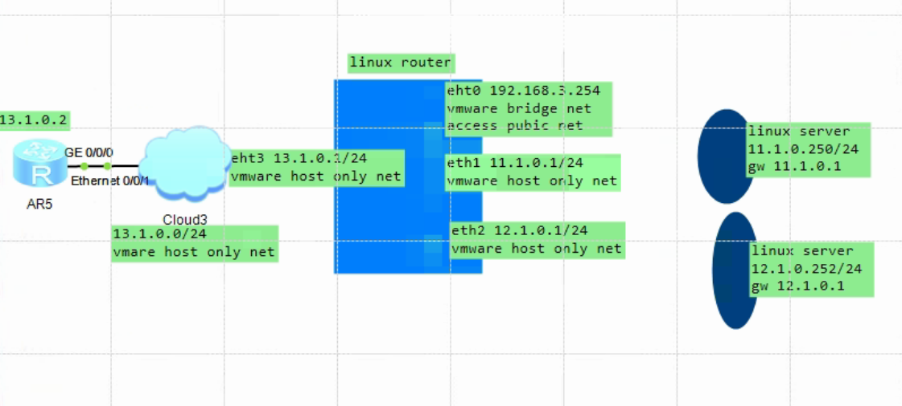

```
swap
swapoff  -a
```


```
cat  > /etc/rc.d/rc.local  << EOF
#!/bin/bash
ntpdate ntp1.aliyun.com
touch /var/lock/subsys/local
EOF
```


```
chmod +x /etc/rc.d/rc.local
```


```
yum-config-manager --add-repo \
https://mirrors.aliyun.com/docker-ce/linux/centos/docker-ce.repo
```


```
mkdir  /etc/docker
```


```
cat > /etc/docker/daemon.json  << EOF
{
  "exec-opts": ["native.cgroupdriver=systemd"],
  "registry-mirrors": ["https://2xdz2l32.mirror.aliyuncs.com"]
}
EOF
```


```
yum -y install docker-ce-20.10.14-3.el7
systemctl  enable --now docker
```


```
cat > /etc/yum.repos.d/kubernetes.repo <<  EOF
[kubernetes]
name=Kubernetes
baseurl=https://mirrors.aliyun.com/kubernetes/yum/repos/kubernetes-el7-x86_64/
enabled=1
gpgcheck=0
EOF
```


```
yum  -y install   kubelet-1.23.5-0
```


```
yum  -y install   kubectl-1.23.5-0
```


```
yum -y install    kubeadm-1.23.5-0
```


```bash
yum   -y install bash-completion
source /usr/share/bash-completion/bash_completion
echo 'source <(kubectl completion bash)'     >>  /root/.bashrc
source  /root/.bashrc
```


```
kubeadm config images pull --v=5 \
--image-repository registry.aliyuncs.com/google_containers \
--kubernetes-version v1.23.5
```


```
docker pull docker.io/calico/cni:v3.23.1
docker pull docker.io/calico/node:v3.23.1
docker pull docker.io/calico/kube-controllers:v3.23.1
```


```
docker pull  docker pull yimtune/nginx:1.21.6
```


```bash
#11.1.0.250 

kubeadm init \
--apiserver-advertise-address=11.1.0.250 \
--image-repository registry.aliyuncs.com/google_containers \
--kubernetes-version v1.23.5 \
--service-cidr=10.1.0.0/16 \
--pod-network-cidr=10.244.0.0/16 \
--node-name=11.1.0.250


#11.1.0.251
kubeadm join 11.1.0.250:6443 --node-name=11.1.0.251 --token gsk0ef.tapo8t16nkl8b24t \
        --discovery-token-ca-cert-hash sha256:86879795a2b9bd176eb9374011de78fa0cc8de506292a7a53af1ab0d10211446 
        
        
```


```bash
kubectl apply -f https://docs.projectcalico.org/v3.23/manifests/calico.yaml
```


https://projectcalico.docs.tigera.io/networking/vxlan-ipip#configure-ip-in-ip-encapsulation-for-only-cross-subnet-traffic


```
CALICO_IPV4POOL_IPIP=
```


```
mode:
                    description: The IPIP mode.  This can be one of "always" or "cross-subnet". 
                    A mode of "always" will also use IPIP tunneling for routing to
                      destination IP addresses within this pool.  
                    A mode of "cross-subnet"
                      will only use IPIP tunneling when the destination node is on
                      a different subnet to the originating node.  
                      
                    The default value
                      (if not specified) is "always".
```


```
CALICO_IPV4POOL_VXLAN=Never
CALICO_IPV6POOL_VXLAN=Never

CALICO_IPV4POOL_IPIP=Always


CALICO_NETWORKING_BACKEND
calico_backend: "bird"
```


```
kubectl  -n kube-system   get ippools  default-ipv4-ippool  -o yaml
```


### 关闭  ipip 关闭  vxlan


```
curl  https://projectcalico.docs.tigera.io/v3.23/manifests/calico.yaml -O
```


```
            - name: CALICO_IPV4POOL_IPIP
              value: "Never"
            # Enable or Disable VXLAN on the default IP pool.
            - name: CALICO_IPV4POOL_VXLAN
              value: "Never"
            # Enable or Disable VXLAN on the default IPv6 IP pool.
            - name: CALICO_IPV6POOL_VXLAN
              value: "Never"
```


```
kubectl apply -f  calico.yaml
```


```
kubectl  -n kube-system   get ippools  default-ipv4-ippool  -o  json  | jq .spec
{
  "allowedUses": [
    "Workload",
    "Tunnel"
  ],
  "blockSize": 26,
  "cidr": "10.244.0.0/16",
  "ipipMode": "Never",
  "natOutgoing": true,
  "nodeSelector": "all()",
  "vxlanMode": "Never"
}
```


```
curl -O -L https://github.com/projectcalico/calicoctl/releases/download/v3.20.5/calicoctl-linux-amd64
```


```
mv calicoctl-linux-amd64  /usr/local/bin/calicoctl
```


```
calicoctl  get node --context=kubernetes-admin@kubernetes  --allow-version-mismatc
NAME         
11.1.0.250   
11.1.0.251   


calicoctl  get ipPool  --context=kubernetes-admin@kubernetes   --allow-version-mismatc
NAME                  CIDR            SELECTOR   
default-ipv4-ippool   10.244.0.0/16   all()      


calicoctl node status --allow-version-mismatch
Calico process is running.

IPv4 BGP status
+--------------+-------------------+-------+----------+-------------+
| PEER ADDRESS |     PEER TYPE     | STATE |  SINCE   |    INFO     |
+--------------+-------------------+-------+----------+-------------+
| 11.1.0.251   | node-to-node mesh | up    | 07:45:55 | Established |
+--------------+-------------------+-------+----------+-------------+


calicoctl   get wep   -A     --allow-version-mismatch      --context=kubernetes-admin@kubernetes

NAMESPACE     WORKLOAD                                  NODE         NETWORKS          INTERFACE         
kube-system   calico-kube-controllers-6b77fff45-mbm7m   11.1.0.250   10.244.187.0/32   cali56d12f39cc8   
kube-system   coredns-6d8c4cb4d-fvgxm                   11.1.0.250   10.244.187.1/32   cali79dc463f951   
kube-system   coredns-6d8c4cb4d-lgcr6                   11.1.0.250   10.244.187.2/32   calic9de5850bd6   


```


```
docker cp 41ab4:/usr/bin/birdcl  /tmp/


birdcl    show route // birdcl show route all
BIRD v0.3.3+birdv1.6.8 ready.
0.0.0.0/0          via 11.1.0.1 on eth0 [kernel1 07:45:49] * (10)
11.1.0.0/24        dev eth0 [direct1 07:45:49] * (240)
169.254.0.0/16     dev eth0 [kernel1 07:45:49] * (10)
10.244.187.0/26    blackhole [static1 07:45:58] * (200)
10.244.187.0/32    dev cali56d12f39cc8 [kernel1 07:45:58] * (10)
10.244.187.1/32    dev cali79dc463f951 [kernel1 07:45:58] * (10)
10.244.187.2/32    dev calic9de5850bd6 [kernel1 07:45:58] * (10)
172.17.0.0/16      dev docker0 [direct1 07:45:49] * (240)


birdcl  show  protocols 

BIRD v0.3.3+birdv1.6.8 ready.
name     proto    table    state  since       info
kernel1  Kernel   master   up     07:45:49    
device1  Device   master   up     07:45:49    
direct1  Direct   master   up     07:45:49    
Mesh_11_1_0_251 BGP      master   up     07:45:55    Established   
static1  Static   master   up     07:45:58    


birdcl show protocols Mesh_11_1_0_251 
BIRD v0.3.3+birdv1.6.8 ready.
name     proto    table    state  since       info
Mesh_11_1_0_251 BGP      master   up     07:45:56    Established 


birdcl show protocols all Mesh_11_1_0_251 
BIRD v0.3.3+birdv1.6.8 ready.
name     proto    table    state  since       info
Mesh_11_1_0_251 BGP      master   up     07:45:55    Established   
  Description:    Connection to BGP peer
  Preference:     100
  Input filter:   ACCEPT
  Output filter:  calico_export_to_bgp_peers
  Routes:         0 imported, 1 exported, 0 preferred
  Route change stats:     received   rejected   filtered    ignored   accepted
    Import updates:              0          0          0          0          0
    Import withdraws:            0          0        ---          0          0
    Export updates:             13          0         11        ---          2
    Export withdraws:            0        ---        ---        ---          4
  BGP state:          Established
    Neighbor address: 11.1.0.251
    Neighbor AS:      64512
    Neighbor ID:      11.1.0.251
    Neighbor caps:    refresh enhanced-refresh restart-able llgr-aware AS4 add-path-rx add-path-tx
    Session:          internal multihop AS4 add-path-rx add-path-tx
    Source address:   11.1.0.250
    Hold timer:       183/240
    Keepalive timer:  35/80
    
    
    
    
    
    
birdcl show route  all export Mesh_11_1_0_251 
BIRD v0.3.3+birdv1.6.8 ready.
10.244.187.0/26    blackhole [static1 07:45:59] * (200)
        Type: static unicast univ
        BGP.origin: IGP
        BGP.as_path: 
        BGP.next_hop: 11.1.0.250
        BGP.local_pref: 100
        
        
        
        
        
        


```


```
export DATASTORE_TYPE=kubernetes
export KUBECONFIG=~/.kube/config
```


#  bgp defferent nat





### router linux 


```
yum -y install iptables-services
systemctl  enable --now  iptables
```


```
echo "1" > /proc/sys/net/ipv4/ip_forward
```


```
iptables   -F
iptables -t nat -A POSTROUTING -s 11.1.0.0/24  ! -d 11.1.0.0/24  -o eth0  -j SNAT --to-source 192.168.3.254
iptables -t nat -A POSTROUTING -s 12.1.0.0/24  ! -d 12.1.0.0/24  -o eth0  -j SNAT --to-source 192.168.3.254
iptables-save  > /etc/sysconfig/iptables
```


####  linux  router  route table

```

[root@192-168-3-254 ~]# route -n


Kernel IP routing table
Destination     Gateway         Genmask         Flags Metric Ref    Use Iface
0.0.0.0         192.168.3.1     0.0.0.0         UG    0      0        0 eth0
11.1.0.0        0.0.0.0         255.255.255.0   U     0      0        0 eth1
12.1.0.0        0.0.0.0         255.255.255.0   U     0      0        0 eth2
13.1.0.0        0.0.0.0         255.255.255.0   U     0      0        0 eth3
169.254.0.0     0.0.0.0         255.255.0.0     U     1002   0        0 eth0
169.254.0.0     0.0.0.0         255.255.0.0     U     1003   0        0 eth1
169.254.0.0     0.0.0.0         255.255.0.0     U     1004   0        0 eth2
169.254.0.0     0.0.0.0         255.255.0.0     U     1005   0        0 eth3
192.168.3.0     0.0.0.0         255.255.255.0   U     0      0        0 eth0
[root@192-168-3-254 ~]# 
```


### ensp router


```bash
AR2240

sys
int g 0/0/0  13.1.0.2

添加路由
ip route-static 11.1.0.0 24 13.1.0.1
ip route-static 12.1.0.0 24 13.1.0.1


# 测试路由器到  11.1.0.0/24   12.1.0.0/24
ping 11.1.0.250
ping 11.1.0.251

ping 12.1.0.252
ping 12.1.0.253


# 查看到两个网段的路由
tracert 11.1.0.250

traceroute to  11.1.0.250(11.1.0.250), max hops: 30 ,packet length: 40,press CT
RL_C to break 

 1 13.1.0.1 10 ms  10 ms  10 ms 
 2 11.1.0.250 10 ms  10 ms  10 ms 


tracert 12.1.0.252

traceroute to  12.1.0.252(12.1.0.252), max hops: 30 ,packet length: 40,press CT
RL_C to break 

 1 13.1.0.1 10 ms  10 ms  10 ms 
 2 12.1.0.252 10 ms  10 ms  10 ms 
```


###  test linux server


```
# 11.1.0.250

traceroute 12.1.0.252
traceroute to 12.1.0.252 (12.1.0.252), 30 hops max, 60 byte packets
 1  gateway (11.1.0.1)  0.500 ms  0.533 ms  0.634 ms
 2  12.1.0.252 (12.1.0.252)  1.513 ms  1.471 ms  1.438 ms
 


traceroute 13.1.0.2
traceroute to 13.1.0.2 (13.1.0.2), 30 hops max, 60 byte packets
 1  gateway (11.1.0.1)  1.060 ms  0.771 ms  0.806 ms
 2  13.1.0.2 (13.1.0.2)  33.645 ms  36.532 ms  41.141 ms
 
 
traceroute  114.114.114.114
traceroute to 114.114.114.114 (114.114.114.114), 30 hops max, 60 byte packets
 1  gateway (11.1.0.1)  1.401 ms  1.257 ms  1.300 ms
 2  192.168.3.1 (192.168.3.1)  1.968 ms  1.940 ms  1.902 ms   [snat]
 3  192.168.2.1 (192.168.2.1)  5.083 ms  5.053 ms  5.015 ms
 
 
 
 

# 12.1.0.252

traceroute 11.1.0.251
traceroute to 11.1.0.251 (11.1.0.251), 30 hops max, 60 byte packets
 1  gateway (12.1.0.1)  2.203 ms  3.703 ms  4.094 ms
 2  11.1.0.251 (11.1.0.251)  4.893 ms  5.203 ms  5.202 ms

traceroute 13.1.0.2
traceroute to 13.1.0.2 (13.1.0.2), 30 hops max, 60 byte packets
 1  gateway (12.1.0.1)  4.571 ms  4.106 ms  3.903 ms
 2  13.1.0.2 (13.1.0.2)  9.510 ms  18.588 ms  20.607 ms
 
traceroute  114.114.114.114
traceroute to 114.114.114.114 (114.114.114.114), 30 hops max, 60 byte packets
 1  gateway (12.1.0.1)  1.487 ms  1.283 ms  1.339 ms 
 2  192.168.3.1 (192.168.3.1)  2.862 ms  3.277 ms  3.359 ms  [snat]
 3  192.168.2.1 (192.168.2.1)  5.048 ms  4.967 ms  5.946 ms 
```


###  deploy


```
# 11.1.0.250
kubeadm init \
--apiserver-advertise-address=11.1.0.250 \
--image-repository registry.aliyuncs.com/google_containers \
--kubernetes-version v1.23.5 \
--service-cidr=10.1.0.0/16 \
--pod-network-cidr=10.244.0.0/16 \
--node-name=11.1.0.250
```


```
# 11.1.0.251

kubeadm join 11.1.0.250:6443 --node-name=11.1.0.251 --token m0s5vc.i15wo37739d5nmip \
        --discovery-token-ca-cert-hash sha256:e1037d2e35566b6db3eff45feafc1e610f77b0bc6b03bb2b7b6332c4dad8cbcb 


# 12.1.0.252

kubeadm join 11.1.0.250:6443 --node-name=12.1.0.252 --token m0s5vc.i15wo37739d5nmip \
        --discovery-token-ca-cert-hash sha256:e1037d2e35566b6db3eff45feafc1e610f77b0bc6b03bb2b7b6332c4dad8cbcb 


# 12.1.0.253

kubeadm join 11.1.0.250:6443 --node-name=12.1.0.253 --token m0s5vc.i15wo37739d5nmip \
        --discovery-token-ca-cert-hash sha256:e1037d2e35566b6db3eff45feafc1e610f77b0bc6b03bb2b7b6332c4dad8cbcb 


```


ipip vxlan   never

```
kubectl apply  -f calico.yaml
```


#### test calico


```
cat > pod-nginx.yaml <<EOF
apiVersion: v1
kind: Pod
metadata:
  name: nginx01
spec:
  nodeName: 11.1.0.251
  containers:
  - name: nginx
    image: yimtune/nginx:1.21.6
    imagePullPolicy: IfNotPresent
    ports:
    - containerPort: 80
---
apiVersion: v1
kind: Pod
metadata:
  name: nginx02
spec:
  nodeName: 12.1.0.252
  containers:
  - name: nginx
    image: yimtune/nginx:1.21.6
    imagePullPolicy: IfNotPresent
    ports:
    - containerPort: 80
EOF
```


```
kubectl  apply  -f pod-nginx.yaml
```


```
kubectl  get pod -o wide
NAME      READY   STATUS    RESTARTS   AGE   IP               NODE         NOMINATED NODE   READINESS GATES
nginx01   1/1     Running   0          16s   10.244.229.192   11.1.0.251   <none>           <none>
nginx02   1/1     Running   0          16s   10.244.223.3     12.1.0.252   <none>           <none>
```


```
11.1.0.250

curl  10.244.229.192   ok
curl  10.244.223.3     not ok


12.1.0.252
curl  10.244.229.192   not ok
curl  10.244.223.3 ok


kubectl  exec -it nginx01 --  bash 
ping  10.244.223.3  not ok


```


#### linux router 配置路由.  static router for       bgp network


```
[root@11-1-0-250 ~]# route -n
Kernel IP routing table
Destination     Gateway         Genmask         Flags Metric Ref    Use Iface
0.0.0.0         11.1.0.1        0.0.0.0         UG    0      0        0 eth0
10.244.223.0    11.1.0.1        255.255.255.192 UG    0      0        0 eth0
10.244.229.192  11.1.0.251      255.255.255.192 UG    0      0        0 eth0
11.1.0.0        0.0.0.0         255.255.255.0   U     0      0        0 eth0
169.254.0.0     0.0.0.0         255.255.0.0     U     1002   0        0 eth0
172.17.0.0      0.0.0.0         255.255.0.0     U     0      0        0 docker0
[root@11-1-0-250 ~]# 
```


```
添加路由
ip route add  10.244.223.0/26  via 12.1.0.252
ip route add  10.244.229.192/26 via 11.1.0.251


```


```
再次测试


11.1.0.250

curl  10.244.229.192   ok
curl  10.244.223.3      ok


12.1.0.252
curl  10.244.229.192   ok
curl  10.244.223.3     ok


kubectl  exec -it nginx01 --  bash 
ping  10.244.223.3  not ok

```


```
在ensp router 上添加静态路由


ip route-static 10.244.223.0 26    12.1.0.252
ip route-static 10.244.229.192 26  11.1.0.251


测试 ping pod
ping 10.244.223.3    ok
ping 10.244.229.192  ok
```


```
cat pod-nginx.yaml 
apiVersion: v1
kind: Pod
metadata:
  name: nginx03
spec:
  nodeName: 11.1.0.251
  containers:
  - name: nginx
    image: yimtune/nginx:1.21.6
    imagePullPolicy: IfNotPresent
    ports:
    - containerPort: 80
---
apiVersion: v1
kind: Pod
metadata:
  name: nginx04
spec:
  nodeName: 12.1.0.252
  containers:
  - name: nginx
    image: yimtune/nginx:1.21.6
    imagePullPolicy: IfNotPresent
    ports:
    - containerPort: 80
```


```
cat pod-nginx.yaml 
apiVersion: v1
kind: Pod
metadata:
  name: nginx05
spec:
  nodeName: 11.1.0.250
  containers:
  - name: nginx
    image: yimtune/nginx:1.21.6
    imagePullPolicy: IfNotPresent
    ports:
    - containerPort: 80
---
apiVersion: v1
kind: Pod
metadata:
  name: nginx06
spec:
  nodeName: 12.1.0.253
  containers:
  - name: nginx
    image: yimtune/nginx:1.21.6
    imagePullPolicy: IfNotPresent
    ports:
    - containerPort: 80
[root@11-1-0-250 opt]# 
```


```
kubectl taint node  11.1.0.250    node-role.kubernetes.io/master:NoSchedule-
```


```
添加路由  linux router


查看 11.1.0.250 路由


[root@11-1-0-250 opt]# route -n
Kernel IP routing table
Destination     Gateway         Genmask         Flags Metric Ref    Use Iface
0.0.0.0         11.1.0.1        0.0.0.0         UG    0      0        0 eth0
10.244.187.0    0.0.0.0         255.255.255.192 U     0      0        0 *     [添加去程]
10.244.187.1    0.0.0.0         255.255.255.255 UH    0      0        0 califd1d6b68b2f
10.244.223.0    11.1.0.1        255.255.255.192 UG    0      0        0 eth0
10.244.229.192  11.1.0.251      255.255.255.192 UG    0      0        0 eth0
10.244.240.64   11.1.0.1        255.255.255.192 UG    0      0        0 eth0
11.1.0.0        0.0.0.0         255.255.255.0   U     0      0        0 eth0
169.254.0.0     0.0.0.0         255.255.0.0     U     1002   0        0 eth0
172.17.0.0      0.0.0.0         255.255.0.0     U     0      0        0 docker0


[root@12-1-0-253 ~]# route -n
Kernel IP routing table
Destination     Gateway         Genmask         Flags Metric Ref    Use Iface
0.0.0.0         12.1.0.1        0.0.0.0         UG    0      0        0 eth0
10.244.187.0    12.1.0.1        255.255.255.192 UG    0      0        0 eth0
10.244.223.0    12.1.0.252      255.255.255.192 UG    0      0        0 eth0
10.244.229.192  12.1.0.1        255.255.255.192 UG    0      0        0 eth0
10.244.240.64   0.0.0.0         255.255.255.255 UH    0      0        0 cali765a23ad54d
10.244.240.64   0.0.0.0         255.255.255.192 U     0      0        0 *    [添加去程]
12.1.0.0        0.0.0.0         255.255.255.0   U     0      0        0 eth0
169.254.0.0     0.0.0.0         255.255.0.0     U     1002   0        0 eth0
172.17.0.0      0.0.0.0         255.255.0.0     U     0      0        0 docker0
[root@12-1-0-253 ~]# 


ip route add 10.244.187.0/26  via  11.1.0.250
ip route add 10.244.240.64/26  via  12.1.0.253


10.244.229.192  12.1.0.1        255.255.255.192 UG


添加路由 ensp router

ip route-static 10.244.187.0   26  11.1.0.250
ip route-static 10.244.240.64  26  11.1.0.253


```


####  测试service


```
cat <<EOF | kubectl apply -f -
apiVersion: apps/v1
kind: Deployment
metadata:
  name: nginx-deployment
  labels:
    app: nginx
spec:
  replicas: 4
  selector:
    matchLabels:
      app: nginx
  template:
    metadata:
      labels:
        app: nginx
    spec:
      containers:
      - name: nginx
        image: yimtune/nginx:1.21.6
        ports:
        - containerPort: 80
EOF
```


```
kubectl  -n default expose deploy  nginx-deployment  --port=80 --target-port=80 --type=NodePort
```


```
[root@11-1-0-250 opt]# kubectl  get svc
NAME               TYPE        CLUSTER-IP   EXTERNAL-IP   PORT(S)        AGE
kubernetes         ClusterIP   10.1.0.1     <none>        443/TCP        159m
nginx-deployment   NodePort    10.1.72.41   <none>        80:31040/TCP   40s
```


```
on all nodes ok
curl  10.1.72.41
```


```
curl  11.1.0.250:31040 ok
curl  11.1.0.251:31040 ok
curl  12.1.0.252:31040 ok
curl  12.1.0.253:31040 ok
```


# 为当前full mesh 添加一个外部 ibgp 对等体


```
[root@11-1-0-250 ~]# cat 13.1.0.2-ibgp.yaml 
apiVersion: projectcalico.org/v3
kind: BGPPeer
metadata:
  name: my-global-peer
spec:
  peerIP: 13.1.0.2
  asNumber: 64512
[root@11-1-0-250 ~]# 
```


```
calicoctl  create -f 13.1.0.2-ibgp.yaml --allow-version-mismatch
```


```
[root@11-1-0-250 ~]# calicoctl node status
Calico process is running.

IPv4 BGP status
+--------------+-------------------+-------+----------+-------------+
| PEER ADDRESS |     PEER TYPE     | STATE |  SINCE   |    INFO     |
+--------------+-------------------+-------+----------+-------------+
| 11.1.0.251   | node-to-node mesh | up    | 07:09:39 | Established |
| 12.1.0.252   | node-to-node mesh | up    | 07:09:45 | Established |
| 12.1.0.253   | node-to-node mesh | up    | 07:09:43 | Established |
| 13.1.0.2     | global            | start | 02:12:02 | Connect     |
+--------------+-------------------+-------+----------+-------------+
```


```
配置ensp


删除静态路由  共 4条
undo ip route-static 10.244.187.0   26  11.1.0.250
undo ip route-static 10.244.240.64  26  11.1.0.253


undo ip route-static 10.244.187.0   26  11.1.0.250
undo ip route-static 10.244.240.64  26  11.1.0.253


bgp 64512
router-id 13.1.0.2
peer 11.1.0.250 as-number 64512

peer 11.1.0.251 as-number 64512

peer 12.1.0.252 as-number 64512

peer 12.1.0.253 as-number 64512


<Huawei>dis  bgp peer

 BGP local router ID : 13.1.0.2
 Local AS number : 64512
 Total number of peers : 4		  Peers in established state : 4

  Peer            V          AS  MsgRcvd  MsgSent  OutQ  Up/Down       State Pre
fRcv

  11.1.0.250      4       64512       28       23     0 00:21:29 Established    
   1
  11.1.0.251      4       64512       27       22     0 00:20:27 Established    
   1
  12.1.0.252      4       64512       26       21     0 00:19:34 Established    
   1
  12.1.0.253      4       64512       25       21     0 00:19:22 Established    
   1


<Huawei>dis ip routing-table 
Route Flags: R - relay, D - download to fib
------------------------------------------------------------------------------
Routing Tables: Public
         Destinations : 13       Routes : 13       

Destination/Mask    Proto   Pre  Cost      Flags NextHop         Interface

   10.244.187.0/26  IBGP    255  0          RD   11.1.0.250      GigabitEthernet
0/0/0
   10.244.223.0/26  IBGP    255  0          RD   12.1.0.252      GigabitEthernet
0/0/0
 10.244.229.192/26  IBGP    255  0          RD   11.1.0.251      GigabitEthernet
0/0/0
  10.244.240.64/26  IBGP    255  0          RD   12.1.0.253      GigabitEthernet
0/0/0
       11.1.0.0/24  Static  60   0          RD   13.1.0.1        GigabitEthernet
0/0/0
       12.1.0.0/24  Static  60   0          RD   13.1.0.1        GigabitEthernet
0/0/0
       13.1.0.0/24  Direct  0    0           D   13.1.0.2        GigabitEthernet
0/0/0
       13.1.0.2/32  Direct  0    0           D   127.0.0.1       GigabitEthernet
0/0/0
     13.1.0.255/32  Direct  0    0           D   127.0.0.1       GigabitEthernet
0/0/0
      127.0.0.0/8   Direct  0    0           D   127.0.0.1       InLoopBack0
      127.0.0.1/32  Direct  0    0           D   127.0.0.1       InLoopBack0
127.255.255.255/32  Direct  0    0           D   127.0.0.1       InLoopBack0
255.255.255.255/32  Direct  0    0           D   127.0.0.1       InLoopBack0

<Huawei>

```


```
在 11.1.0.250 上查看bgp 信息


[root@11-1-0-250 ~]# calicoctl  node status
Calico process is running.

IPv4 BGP status
+--------------+-------------------+-------+------------+-------------+
| PEER ADDRESS |     PEER TYPE     | STATE |   SINCE    |    INFO     |
+--------------+-------------------+-------+------------+-------------+
| 11.1.0.251   | node-to-node mesh | up    | 2022-05-25 | Established |
| 12.1.0.252   | node-to-node mesh | up    | 2022-05-25 | Established |
| 12.1.0.253   | node-to-node mesh | up    | 2022-05-25 | Established |
| 13.1.0.2     | global            | up    | 02:26:47   | Established |
+--------------+-------------------+-------+------------+-------------+
```


### 修改 linux router 的路由设置


```
[root@192-168-3-254 ~]# route -n
Kernel IP routing table
Destination     Gateway         Genmask         Flags Metric Ref    Use Iface
0.0.0.0         192.168.3.1     0.0.0.0         UG    0      0        0 eth0
10.244.187.0    11.1.0.250      255.255.255.192 UG    0      0        0 eth1
10.244.223.0    12.1.0.252      255.255.255.192 UG    0      0        0 eth2
10.244.229.192  11.1.0.251      255.255.255.192 UG    0      0        0 eth1
10.244.240.64   12.1.0.253      255.255.255.192 UG    0      0        0 eth2
11.1.0.0        0.0.0.0         255.255.255.0   U     0      0        0 eth1
12.1.0.0        0.0.0.0         255.255.255.0   U     0      0        0 eth2
13.1.0.0        0.0.0.0         255.255.255.0   U     0      0        0 eth3
169.254.0.0     0.0.0.0         255.255.0.0     U     1002   0        0 eth0
169.254.0.0     0.0.0.0         255.255.0.0     U     1003   0        0 eth1
169.254.0.0     0.0.0.0         255.255.0.0     U     1004   0        0 eth2
169.254.0.0     0.0.0.0         255.255.0.0     U     1005   0        0 eth3
192.168.3.0     0.0.0.0         255.255.255.0   U     0      0        0 eth0


ip route del 10.244.187.0/26  via  11.1.0.250
ip route del 10.244.240.64/26  via  12.1.0.253


ip route del 10.244.223.0/26  via  12.1.0.252
ip route del 10.244.229.192/26  via  11.1.0.251


# 添加一条 聚合路由 指向  ensp 13.1.0.2

10.244.0.0/16

ip route add 10.244.0.0/16  via 13.1.0.2   no ok
删除snat
iptables -t nat -F    no ok

恢复到之前的路由


ip route del 10.244.0.0/16  via 13.1.0.2

ip route add 10.244.187.0/26  via  11.1.0.250
ip route add 10.244.240.64/26  via  12.1.0.253


ip route add 10.244.223.0/26  via  12.1.0.252
ip route add 10.244.229.192/26  via  11.1.0.251


11.10.250 -> 
```


####  东西流量和南北流量分离？？？


###   通过ensp bgp 路由器 访问pod  ip

用外部的服务器测试南北流量


```
13.1.0.3/24
13.1.0.2 gw

可以直接访问 pod ip


```


### 为外部流量访问service ip  添加路由


```
linux router


ip route  add  10.1.72.41/32 via 11.1.0.250
[root@192-168-3-254 ~]# curl   10.1.72.41   ok
<!DOCTYPE html>


ensp router
ip route-static 10.1.72.41 32 11.1.0.250


13.1.0.3 上测试

curl   10.1.72.41  ok


[root@13-1-0-3]# traceroute  10.1.72.41
traceroute to 10.1.72.41 (10.1.72.41), 30 hops max, 60 byte packets
 1  gateway (13.1.0.2)  19.986 ms  24.380 ms  29.577 ms
 2  13.1.0.1 (13.1.0.1)  24.260 ms  28.655 ms  29.640 ms
 3  11.1.0.250 (11.1.0.250)  33.741 ms  38.450 ms  43.394 ms
 4  * * *
 
 
 
 
 
 
 
 
 根据 endpiont 可以将 service ip 伪造到自己的 负载均衡器上 ，优点 这样可以和系统保持统一
 kubectl  get endpoints nginx-deployment -o yaml
 
client svc-ip      lvs->    ensp bgp router.   -> pod

这样做就不需要宿主机上 对 service ip  dnat 了
 
 
 
 
servie ip network  的影子网络
 
在物理环境有一个真实的网络设备  拥有所有 service ip  

service ip 绑定在负载均衡器设备上  watch  svc endpoint  负载 pod 


负载均衡器设备 可以访问任何 pod


 
 
 
 
```


###   bird


```
echo 'net.ipv4.ip_forward = 1' >> /etc/sysctl.conf
sysctl  -p


ip   11.1.0.100/24
gw  11.1.0.1

yum -y install bird
systemctl enable --now  bird
```


### bird 11.1.0.100


```
[root@11-1-0-100 ~]# cat /etc/bird.conf 
```


```
function apply_communities ()
{
}


log syslog all;

router id 11.1.0.100;

# Configure synchronization between routing tables and kernel.
protocol kernel {
  learn;             # Learn all alien routes from the kernel
  #persist;           # Don't remove routes on bird shutdown
  scan time 2;       # Scan kernel routing table every 2 seconds
  import all;
  export all;
  graceful restart;
  merge paths on; 
}


protocol device {
  debug { states };
  scan time 2;    # Scan interfaces every 2 seconds
}


protocol direct {
debug {states  };
interface "*";

}


 


template bgp bgp_template {
  debug { states };
  description "Connection to BGP peer";
  local as 64512;
  multihop;
  gateway recursive;
  export all;
  import all;        # Import all routes, since we don't know what the upstream
  add paths on;
}


protocol bgp Mesh_11_1_0_250 from bgp_template {
  neighbor 11.1.0.250 as 64512;
  source address 11.1.0.100; 
}

protocol bgp Mesh_11_1_0_251 from bgp_template {
  neighbor 11.1.0.251 as 64512;
  source address 11.1.0.100; 
}


protocol bgp Mesh_12_1_0_252 from bgp_template {
  neighbor 12.1.0.252 as 64512;
  source address 11.1.0.100; 
  passive on;
}

protocol bgp Mesh_12_1_0_253 from bgp_template {
  neighbor 12.1.0.253 as 64512;
  source address 11.1.0.100; 
  passive on;
}


#  ensp router
protocol bgp Global_13_1_0_2 from bgp_template {
  neighbor 13.1.0.2 as 64512;
  source address 11.1.0.100;
}
```


```
cat 11.1.0.100-ibgp-bird.yaml 
```


```
apiVersion: projectcalico.org/v3
kind: BGPPeer
metadata:
  name: bird-11-0-0-100-global-peer
spec:
  peerIP: 11.1.0.100
  asNumber: 64512
```


```
[root@11-1-0-250 ~]# calicoctl  node status
Calico process is running.

IPv4 BGP status
+--------------+-------------------+-------+------------+--------------------------------+
| PEER ADDRESS |     PEER TYPE     | STATE |   SINCE    |              INFO              |
+--------------+-------------------+-------+------------+--------------------------------+
| 11.1.0.251   | node-to-node mesh | up    | 2022-05-25 | Established                    |
| 12.1.0.252   | node-to-node mesh | up    | 09:05:28   | Established                    |
| 12.1.0.253   | node-to-node mesh | up    | 09:06:07   | Established                    |
| 13.1.0.2     | global            | up    | 02:26:47   | Established                    |
| 11.1.0.100   | global            | up    | 09:05:40   | Established                    |
+--------------+-------------------+-------+------------+--------------------------------+
```


```
[root@11-1-0-100 ~]# birdcl show protocols
BIRD 1.6.8 ready.
name     proto    table    state  since       info
kernel1  Kernel   master   up     17:05:40    
device1  Device   master   up     17:05:40    
direct1  Direct   master   up     17:05:40    
Mesh_11_1_0_250 BGP      master   up     17:05:41    Established   
Mesh_11_1_0_251 BGP      master   up     17:05:41    Established   
Mesh_12_1_0_252 BGP      master   up     17:05:42    Established   
Mesh_12_1_0_253 BGP      master   up     17:06:29    Established   
Global_13_1_0_2 BGP      master   start  17:05:40    Active        Socket: Connection refused
```


# bird   bgp-router


集群内部 同一个L2 走交换     不同L2 走路由       外部流量进入也走 bgp-router进来


```
eth0 192.168.3.254/24 gw 192.168.3.1
eth1 11.1.0.1
eth2 12.1.0.1
eth3 13.1.0.1
```


```
[root@bgp-router ~]# route
Kernel IP routing table
Destination     Gateway         Genmask         Flags Metric Ref    Use Iface
default         gateway         0.0.0.0         UG    0      0        0 eth0
11.0.0.0        0.0.0.0         255.0.0.0       U     0      0        0 eth1
12.0.0.0        0.0.0.0         255.0.0.0       U     0      0        0 eth2
13.0.0.0        0.0.0.0         255.0.0.0       U     0      0        0 eth3
link-local      0.0.0.0         255.255.0.0     U     1002   0        0 eth0
link-local      0.0.0.0         255.255.0.0     U     1003   0        0 eth1
link-local      0.0.0.0         255.255.0.0     U     1004   0        0 eth2
link-local      0.0.0.0         255.255.0.0     U     1005   0        0 eth3
192.168.3.0     0.0.0.0         255.255.255.0   U     0      0        0 eth0
[root@bgp-router ~]# 
```


```
[root@11-1-0-100 opt]# cat /etc/bird.conf 

function apply_communities ()
{
}

######### include "/opt/bird_aggr.cfg";
protocol static {
   # IP blocks for this host.
   #route 10.244.229.192/26 blackhole;
}


# Aggregation of routes on this host; export the block, nothing beneath it.
function calico_aggr ()
{
      # Block 10.244.229.192/26 is confirmed
      #if ( net = 10.244.229.192/26 ) then { accept; }
      #if ( net ~ 10.244.229.192/26 ) then { reject; }
}

#########  include "/opt/bird_ipam.cfg";
function reject_disabled_pools ()
{
}

filter calico_export_to_bgp_peers {
  reject_disabled_pools();
  apply_communities();
  calico_aggr();

  if ( net ~ 10.244.0.0/16 ) then {
    accept;
  }
  reject;
}


filter calico_kernel_programming {
  if ( net ~ 10.244.0.0/16 ) then {
    #krt_tunnel = "";
    accept;
  }

  accept;
}
###### 

log syslog all;
router id 13.1.0.1;


# Configure synchronization between routing tables and kernel.


protocol kernel {
  learn;
  persist; 
  scan time 2; 
  import all;
  export filter calico_kernel_programming; # Default is export none
  graceful restart;  
  merge paths on; 
}

protocol device {
  debug { states };
  scan time 2;    # Scan interfaces every 2 seconds
}

protocol direct {
  debug { states };
  interface "*";
}

template bgp bgp_template {
  debug { states };
  description "Connection to BGP peer";
  local as 64512;
  multihop;
  gateway recursive; 
  import all;
  export filter calico_export_to_bgp_peers;  # Only want to export routes for workloads.
  add paths on;
  graceful restart;
  connect delay time 2;
  connect retry time 5;
  error wait time 5,30;
}


protocol bgp Mesh_11_1_0_250 from bgp_template {
  neighbor 11.1.0.250 as 64512;
  source address 11.1.0.1; 
  #passive on;
}

protocol bgp Mesh_11_1_0_251 from bgp_template {
  neighbor 11.1.0.251 as 64512;
  source address 11.1.0.1; 
  #passive on;
}


protocol bgp Mesh_12_1_0_252 from bgp_template {
  neighbor 12.1.0.252 as 64512;
  source address 12.1.0.1; 
  #passive on;
}

protocol bgp Mesh_12_1_0_253 from bgp_template {
  neighbor 12.1.0.253 as 64512;
  source address 12.1.0.1; 
  #passive on;
}
```


```
systemctl restart  bird
```


```
[root@11-1-0-250 ~]# cat 13.1.0.1-ibgp-bird.yaml 
apiVersion: projectcalico.org/v3
kind: BGPPeer
metadata:
  name: bird-13-1-0-1
spec:
  peerIP: 13.1.0.1
  asNumber: 64512
[root@11-1-0-250 ~]# 
```


```
calicoctl  --allow-version-mismatch  create -f  13.1.0.1-ibgp-bird.yaml
```


```
[root@11-1-0-250 ~]# calicoctl  node status
Calico process is running.

IPv4 BGP status
+--------------+-------------------+-------+------------+--------------------------------+
| PEER ADDRESS |     PEER TYPE     | STATE |   SINCE    |              INFO              |
+--------------+-------------------+-------+------------+--------------------------------+
| 11.1.0.251   | node-to-node mesh | up    | 2022-05-26 | Established                    |
| 12.1.0.252   | node-to-node mesh | up    | 06:25:58   | Established                    |
| 12.1.0.253   | node-to-node mesh | up    | 06:25:50   | Established                    |
| 13.1.0.1     | global            | up    | 06:39:07   | Established                    |
+--------------+-------------------+-------+------------+--------------------------------+
```


```
[root@bgp-router ~]# route -n
Kernel IP routing table
Destination     Gateway         Genmask         Flags Metric Ref    Use Iface
0.0.0.0         192.168.3.1     0.0.0.0         UG    0      0        0 eth0
10.244.187.0    11.1.0.250      255.255.255.192 UG    0      0        0 eth1
10.244.223.0    12.1.0.252      255.255.255.192 UG    0      0        0 eth2
10.244.229.192  11.1.0.251      255.255.255.192 UG    0      0        0 eth1
10.244.240.64   12.1.0.253      255.255.255.192 UG    0      0        0 eth2
11.0.0.0        0.0.0.0         255.0.0.0       U     0      0        0 eth1
12.0.0.0        0.0.0.0         255.0.0.0       U     0      0        0 eth2
13.0.0.0        0.0.0.0         255.0.0.0       U     0      0        0 eth3
169.254.0.0     0.0.0.0         255.255.0.0     U     1002   0        0 eth0
169.254.0.0     0.0.0.0         255.255.0.0     U     1003   0        0 eth1
169.254.0.0     0.0.0.0         255.255.0.0     U     1004   0        0 eth2
169.254.0.0     0.0.0.0         255.255.0.0     U     1005   0        0 eth3
192.168.3.0     0.0.0.0         255.255.255.0   U     0      0        0 eth0
[root@bgp-router ~]# 
```


###  配置客户端


```
13.1.0.3/24
13.1.0.1 gw

可以ping  pod ip


```


#  service mirror


# 跨弹性 IP  全互联


# 基于iptables 的负载均衡


查看自定义链


## 1 打标


```
iptables -t raw    -nL  cali-PREROUTING


Chain cali-PREROUTING (1 references)
target     prot opt source               destination         

MARK       all  --  0.0.0.0/0            0.0.0.0/0            /* cali:EWMPb0zVROM-woQp */ MARK or 0x40000
```


```
打标
iptables -t nat -nL KUBE-MARK-MASQ

Chain KUBE-MARK-MASQ (17 references)
target     prot opt source               destination         
MARK       all  --  0.0.0.0/0            0.0.0.0/0            MARK or 0x4000
```


## 2 设置 dnat  顺序 需要  和 下面负载均衡策略一致


```
iptables -t nat -nL KUBE-SEP-7G5S5O2JSGKRQY25

Chain KUBE-SEP-7G5S5O2JSGKRQY25 (1 references)


target          prot opt source               destination         
KUBE-MARK-MASQ  all  --  10.244.187.6         0.0.0.0/0    /* pod ip */
DNAT            tcp  --  0.0.0.0/0            0.0.0.0/0    /* pod ip */ tcp to:10.244.187.6:80
```


```
iptables -t nat -nL KUBE-SEP-P4VXWROV6FUPTYDF

Chain KUBE-SEP-P4VXWROV6FUPTYDF (1 references)
target          prot opt source               destination         
KUBE-MARK-MASQ  all  --  10.244.229.206       0.0.0.0/0     /* pod ip  */
DNAT            tcp  --  0.0.0.0/0            0.0.0.0/0     /* pod ip  */ tcp to:10.244.229.206:80
```


```
iptables -t nat -nL KUBE-SEP-2SS4VYAICWMY4WXN

Chain KUBE-SEP-2SS4VYAICWMY4WXN (1 references)
target          prot opt source               destination         
KUBE-MARK-MASQ  all  --  10.244.229.207       0.0.0.0/0      /* pod ip */
DNAT            tcp  --  0.0.0.0/0            0.0.0.0/0      /* pod ip */ tcp to:10.244.229.207:80
```


```
iptables -t nat -nL KUBE-SEP-RJL4O4OIMN2W5LOG

Chain KUBE-SEP-RJL4O4OIMN2W5LOG (1 references)
target          prot opt source               destination         
KUBE-MARK-MASQ  all  --  10.244.240.68        0.0.0.0/0        /* pod ip */
DNAT            tcp  --  0.0.0.0/0            0.0.0.0/0        /* pod ip */ tcp to:10.244.240.68:80
```


##  3 负载均衡策略  需要和上面dnat 顺序一致


```
 iptables -t nat -nL KUBE-SVC-WRNOD73BKRQH4VVX
 
 
 

Chain KUBE-SVC-WRNOD73BKRQH4VVX (2 references)
target                     prot   opt   source            destination         
KUBE-MARK-MASQ             tcp    --    !10.244.0.0/16    10.1.72.41   /*cluster IP */ tcp dpt:80


KUBE-SEP-7G5S5O2JSGKRQY25  all    --    0.0.0.0/0         0.0.0.0/0    statistic mode random probability 0.25000000000
KUBE-SEP-P4VXWROV6FUPTYDF  all    --    0.0.0.0/0         0.0.0.0/0    statistic mode random probability 0.33333333349
KUBE-SEP-2SS4VYAICWMY4WXN  all    --    0.0.0.0/0         0.0.0.0/0    statistic mode random probability 0.50000000000
KUBE-SEP-RJL4O4OIMN2W5LOG  all    --    0.0.0.0/0         0.0.0.0/0    
```


-----


##  服务器手动验证


```
iptables -t raw  -N  cali-PREROUTING
```


```
# 数据包标记为50
iptables -t raw  -A cali-PREROUTING  -j MARK --set-mark  MARK
```


1 创建链


```
iptables -t nat -N KUBE-MARK-MASQ
```


```
iptables -t nat -I KUBE-MARK-MASQ      MARK or 0x4000
```


