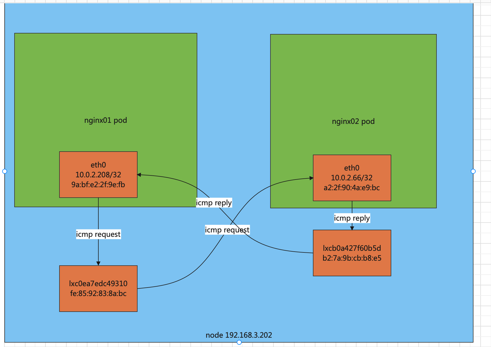

[toc]


# verion info


| 组件   | 版本          | 内核版本          |
| ------ | ------------- | ----------------- |
| ubuntu | 20.04 desktop | 5.13.0-39-generic |
| k8s    | 1.23.5        |                   |
| docker | 20.10.14      |                   |
| helm   | v3.8.2        |                   |
| cilium | v1.10.6       |                   |


# server info


| server config | ip            | gateway      | hostname           | swap | timezone | role        |
| ------------- | ------------- | ------------ | ------------------ | ---- | -------- | ----------- |
| 4C 8G 60G     | 172.16.100.13 | 172.16.100.1 | node-172-16-100-13 | off  |          | master-role |
| 4C 8G 60G     | 172.16.100.14 |              |                    |      |          | node-role   |
| 4C 8G 60G     | 172.16.100.15 |              |                    |      |          | node-role   |


# pre  setting  all-nodes 


## set static ip


当前为dhcp 获取id  设置 为固定ip 


```
ls /etc/netplan/
01-network-manager-all.yaml
```


```
cat /etc/netplan/01-network-manager-all.yaml
```


```
network:
  ethernets:
    enp0s5:
      dhcp4: no
      addresses: [172.16.100.13/24]
      gateway4: 172.16.100.1
      nameservers:
              addresses: [172.16.100.1,114.114.114.114]
  version: 2
```


注意网卡名字  enp0s5 


## set hostname


```
hostnamectl  set-hostname node-172-16-100-13
```


## set swap


```
grep swapfile /etc/fstab 
#/swapfile                                 none            swap    sw              0       0
```


```
swapoff  -a
```


## set timezone and ntp client


```
timedatectl set-timezone Asia/Shanghai
```


```
 apt-get  update -y
 apt-get install ntp -y
 systemctl  enable --now   ntp
```


## docker-ce install


```
apt-get update -y
apt-get install -y \
    ca-certificates \
    curl \
    gnupg \
    lsb-release
```


```
 curl -fsSL https://download.docker.com/linux/ubuntu/gpg | sudo gpg --dearmor -o /usr/share/keyrings/docker-archive-keyring.gpg
```


```
 echo \
  "deb [arch=$(dpkg --print-architecture) signed-by=/usr/share/keyrings/docker-archive-keyring.gpg] https://download.docker.com/linux/ubuntu \
  $(lsb_release -cs) stable" | sudo tee /etc/apt/sources.list.d/docker.list > /dev/null
```


```
apt-get update -y
```


```
apt-get install -y docker-ce=5:20.10.14~3-0~ubuntu-focal  docker-ce-cli=5:20.10.14~3-0~ubuntu-focal  containerd.io
```


```
docker --version
Docker version 20.10.14, build a224086
```


## set cgroup settings


### docker


```
mkdir /etc/docker
cat <<EOF | sudo tee /etc/docker/daemon.json
{
  "exec-opts": ["native.cgroupdriver=systemd"],
  "log-driver": "json-file",
  "log-opts": {
    "max-size": "100m"
  },
  "storage-driver": "overlay2"
}
EOF
```


```
systemctl enable docker
systemctl daemon-reload
systemctl restart docker
```


### kubelet 

```
mkdir -p  /var/lib/kubelet/
cat > /var/lib/kubelet/config.yaml <<EOF
apiVersion: kubelet.config.k8s.io/v1beta1
kind: KubeletConfiguration
cgroupDriver: systemd
EOF
```


# install packages k8s  all-nodes 


## for  kernal options


```
cat <<EOF | sudo tee /etc/modules-load.d/k8s.conf
br_netfilter
EOF

cat <<EOF | sudo tee /etc/sysctl.d/k8s.conf
net.bridge.bridge-nf-call-ip6tables = 1
net.bridge.bridge-nf-call-iptables = 1
EOF
sudo sysctl --system
```


## for  apt repo


```
apt-get install -y apt-transport-https ca-certificates curl
```

 


must  cant curl      curl -fsSLo /usr/share/keyrings/kubernetes-archive-keyring.gpg https://packages.cloud.google.com/apt/doc/apt-key.gpg


```
curl -fsSLo /usr/share/keyrings/kubernetes-archive-keyring.gpg https://packages.cloud.google.com/apt/doc/apt-key.gpg
```


```
echo "deb [signed-by=/usr/share/keyrings/kubernetes-archive-keyring.gpg] https://apt.kubernetes.io/ kubernetes-xenial main" | sudo tee /etc/apt/sources.list.d/kubernetes.list
```


```
apt-get update
```


##  install kubeadm 


```
apt-get install   kubelet=1.23.5-00 kubeadm=1.23.5-00 kubectl=1.23.5-00 -y
```


```
apt-mark hold    kubelet=1.23.5-00 kubeadm=1.23.5-00 kubectl=1.23.5-00 
```


##  pre  images


```
kubeadm config images list  --kubernetes-version=v1.23.5
```


```
kubeadm config images pull  --kubernetes-version=v1.23.5 \
--image-repository registry.aliyuncs.com/google_containers
```


#   init cluster


## init cluster master-role


```
kubeadm init \
--image-repository registry.aliyuncs.com/google_containers \
--skip-phases=addon/kube-proxy \
--apiserver-advertise-address=192.168.3.201 \
--kubernetes-version=v1.23.5 \
--service-cidr=10.96.0.0/12 \
--pod-network-cidr=10.244.0.0/16 \
--node-name=192.168.3.201 
```


##  jon to cluster node-role


192.168.3.202

192.168.3.203


```
kubeadm join 192.168.3.201:6443 --token 5yr29j.x0huyln8l83yzjj3 \
--node-name=192.168.3.202 \
--discovery-token-ca-cert-hash sha256:b017a62aac33534093152742c4e2226091725ea88d3dbc8d5332191dcb5f40f0
```


```
kubeadm join 192.168.3.201:6443 --token 5yr29j.x0huyln8l83yzjj3 \
--node-name=192.168.3.203 \
--discovery-token-ca-cert-hash sha256:b017a62aac33534093152742c4e2226091725ea88d3dbc8d5332191dcb5f40f0
```


# install  cilium  cni master-role


```
helm template cilium cilium/cilium \
--version=1.10.6 \
--debug=true \
--namespace=kube-system \
--set bpf.masquerade=true \
--set enable-host-legacy-routing=false \
--set tunnel=vxlan \
--set kubeProxyReplacement=strict \
--set k8sServiceHost=192.168.3.201 \
--set k8sServicePort=6443  \
--set --debug-verbose=datapath  > cilium_1.10.6yaml
```


```
kubectl  apply -f cilium_1.10.6yaml
```


```
kubectl  -n kube-system exec -it cilium-8n9wv -- bash
```


```
cilium status
KVStore:                Ok   Disabled
Kubernetes:             Ok   1.23 (v1.23.5) [linux/amd64]
Kubernetes APIs:        ["cilium/v2::CiliumClusterwideNetworkPolicy", "cilium/v2::CiliumEndpoint", "cilium/v2::CiliumNetworkPolicy", "cilium/v2::CiliumNode", "core/v1::Namespace", "core/v1::Node", "core/v1::Pods", "core/v1::Service", "discovery/v1::EndpointSlice", "networking.k8s.io/v1::NetworkPolicy"]
KubeProxyReplacement:   Strict   [ens33 192.168.3.202 (Direct Routing)]
Cilium:                 Ok   1.10.6 (v1.10.6-17d3d15)
NodeMonitor:            Listening for events on 128 CPUs with 64x4096 of shared memory
Cilium health daemon:   Ok   
IPAM:                   IPv4: 4/254 allocated from 10.0.2.0/24, 
BandwidthManager:       Disabled
Host Routing:           BPF
Masquerading:           BPF   [ens33]   10.0.2.0/24 [IPv4: Enabled, IPv6: Disabled]
Controller Status:      30/30 healthy
Proxy Status:           OK, ip 10.0.2.127, 0 redirects active on ports 10000-20000
Hubble:                 Ok   Current/Max Flows: 210/4095 (5.13%), Flows/s: 0.77   Metrics: Disabled
Encryption:             Disabled
Cluster health:         3/3 reachable   (2022-05-05T14:33:52Z)
```


```
kubectl get  -n kube-system cm  cilium-config -o json | jq .data
```


```
{
  "auto-direct-node-routes": "false",
  "bpf-lb-external-clusterip": "false",
  "bpf-lb-map-max": "65536",
  "bpf-map-dynamic-size-ratio": "0.0025",
  "bpf-policy-map-max": "16384",
  "cgroup-root": "/run/cilium/cgroupv2",
  "cilium-endpoint-gc-interval": "5m0s",
  "cluster-id": "",
  "cluster-name": "default",
  "cluster-pool-ipv4-cidr": "10.0.0.0/8",
  "cluster-pool-ipv4-mask-size": "24",
  "custom-cni-conf": "false",
  "debug": "false",
  "disable-cnp-status-updates": "true",
  "enable-auto-protect-node-port-range": "true",
  "enable-bandwidth-manager": "false",
  "enable-bpf-clock-probe": "true",
  "enable-bpf-masquerade": "true",
  "enable-endpoint-health-checking": "true",
  "enable-health-check-nodeport": "true",
  "enable-health-checking": "true",
  "enable-hubble": "true",
  "enable-ipv4": "true",
  "enable-ipv4-masquerade": "true",
  "enable-ipv6": "false",
  "enable-ipv6-masquerade": "true",
  "enable-l2-neigh-discovery": "true",
  "enable-l7-proxy": "true",
  "enable-local-redirect-policy": "false",
  "enable-policy": "default",
  "enable-remote-node-identity": "true",
  "enable-session-affinity": "true",
  "enable-well-known-identities": "false",
  "enable-xt-socket-fallback": "true",
  "hubble-disable-tls": "false",
  "hubble-listen-address": ":4244",
  "hubble-socket-path": "/var/run/cilium/hubble.sock",
  "hubble-tls-cert-file": "/var/lib/cilium/tls/hubble/server.crt",
  "hubble-tls-client-ca-files": "/var/lib/cilium/tls/hubble/client-ca.crt",
  "hubble-tls-key-file": "/var/lib/cilium/tls/hubble/server.key",
  "identity-allocation-mode": "crd",
  "install-iptables-rules": "true",
  "install-no-conntrack-iptables-rules": "false",
  "ipam": "cluster-pool",
  "kube-proxy-replacement": "strict",
  "kube-proxy-replacement-healthz-bind-address": "",
  "monitor-aggregation": "medium",
  "monitor-aggregation-flags": "all",
  "monitor-aggregation-interval": "5s",
  "node-port-bind-protection": "true",
  "operator-api-serve-addr": "127.0.0.1:9234",
  "preallocate-bpf-maps": "false",
  "sidecar-istio-proxy-image": "cilium/istio_proxy",
  "tunnel": "vxlan"
}
```


##   get cluser status


```
kubectl get componentstatus
```


```
Warning: v1 ComponentStatus is deprecated in v1.19+
NAME                 STATUS    MESSAGE                         ERROR
scheduler            Healthy   ok                              
controller-manager   Healthy   ok                              
etcd-0               Healthy   {"health":"true","reason":""}   
```


```
kubectl  get node
```


```
apt install net-tools
```


### enable host routing


```
 kubectl  -n kube-system exec -it cilium-7cf9h -- cilium  status
```


#  verify cluster


## verify service


###  create a deploy 

```
cat <<EOF | kubectl apply -f -
apiVersion: apps/v1
kind: Deployment
metadata:
  name: nginx-deployment
  labels:
    app: nginx
spec:
  replicas: 3
  selector:
    matchLabels:
      app: nginx
  template:
    metadata:
      labels:
        app: nginx
    spec:
      containers:
      - name: nginx
        image: nginx:1.14.2
        ports:
        - containerPort: 80
EOF
```


### create a service for deploy 


```
kubectl  -n default expose deploy  nginx-deployment  --port=80 --target-port=80 --type=NodePort
```


```
kubectl  get svc nginx-deployment
```


```
NAME               TYPE       CLUSTER-IP       EXTERNAL-IP   PORT(S)        AGE
nginx-deployment   NodePort   10.104.180.187   <none>        80:31887/TCP   7s
```


```
curl  172.16.100.13:31887
curl  172.16.100.14:31887
curl  172.16.100.15:31887
```


## verify coredns


```
cat > pod-nginx.yaml <<EOF
apiVersion: v1
kind: Pod
metadata:
  name: nginx
spec:
  containers:
  - name: nginx
    image: nginx
    imagePullPolicy: IfNotPresent
    ports:
    - containerPort: 80
EOF
```


```
kubectl create -f pod-nginx.yaml
```


```
kubectl exec  nginx -i -t -- /bin/bash
```


```
curl  nginx-deployment
```


ok

可以访问nginx


```
apt-get update -y
apt-get  install dnsutils -y
```


```
nslookup  nginx-deployment
```


可以解析


输出

```shell
Server:         10.96.0.10
Address:        10.96.0.10#53

Name:   nginx-deployment.default.svc.cluster.local
Address: 10.108.43.43

root@nginx:/#   
```


# same node 


```
cat > pod-nginx.yaml <<EOF
apiVersion: v1
kind: Pod
metadata:
  name: nginx01
spec:
  nodeName: 192.168.3.202
  containers:
  - name: nginx
    image: yimtune/nginx:1.21.6
    imagePullPolicy: IfNotPresent
    ports:
    - containerPort: 80
---
apiVersion: v1
kind: Pod
metadata:
  name: nginx02
spec:
  nodeName: 192.168.3.202
  containers:
  - name: nginx
    image: yimtune/nginx:1.21.6
    imagePullPolicy: IfNotPresent
    ports:
    - containerPort: 80
EOF
```


```
kubectl  apply -f pod-nginx.yaml
```


###   信息收集


192.168.2.202 上收集信息


| device          | ip            | mac               | namespace  | pod     | device type | ifindex | peer_ifindex |
| --------------- | ------------- | ----------------- | ---------- | ------- | ----------- | ------- | ------------ |
| eth0            | 10.0.2.208/32 | 9a:bf:e2:2f:9e:fb | nginx01 ns | nginx01 | veth pair   | 25      | 26           |
| lxc0ea7edc49310 |               | fe:85:92:83:8a:bc | root ns    |         | veth pair   | 26      | 25           |
|                 |               |                   |            |         |             |         |              |
| cilium_host     | 10.0.2.127/32 | 9e:11:4c:79:6f:ba | root ns    |         | veth pair   | 5       | 4            |
| cilium_net      |               | ee:ea:57:58:cb:3e | root ns    |         | veth pair   | 4       | 5            |
|                 |               |                   |            |         |             |         |              |
| eth0            | 10.0.2.66/32  | a2:2f:90:4a:e9:bc | nginx02 ns | nginx02 | veth pair   | 27      | 28           |
| lxcb0a427f60b5d |               | b2:7a:9b:cb:b8:e5 | root ns    |         | veth pair   | 28      | 27           |
|                 |               |                   |            |         |             |         |              |
| cilium_vxlan    |               | 8e:24:73:a0:bc:3e | root ns    |         | vxlan       | 6       |              |
|                 |               |                   |            |         |             |         |              |
|                 |               |                   |            |         |             |         |              |
|                 |               |                   |            |         |             |         |              |
|                 |               |                   |            |         |             |         |              |


```
root@node-192-168-3-201:~# kubectl  get pod -o wide  | grep nginx0
nginx01                            1/1     Running   0          45s   10.0.2.208   192.168.3.202
nginx02                            1/1     Running   0          45s   10.0.2.66    192.168.3.202
```


### tcpdump 追踪 相同 node 上的pod





抓包


```
tcpdump icmp or arp  -pne -i lxcb0a427f60b5d
```


```
root@nginx01:/# ping 10.0.2.66 -c 1
PING 10.0.2.66 (10.0.2.66) 56(84) bytes of data.
64 bytes from 10.0.2.66: icmp_seq=1 ttl=63 time=0.148 ms
```


```
root@nginx01:/# tcpdump -pne -i eth0 icmp


13:56:45.342619    #01  源mac nginx01 eth0  目的mac  该设备对端 lxc0ea7edc49310
9a:bf:e2:2f:9e:fb > fe:85:92:83:8a:bc, ethertype IPv4 (0x0800), length 98: 10.0.2.208 > 10.0.2.66: ICMP echo request, id 4, seq 1, length 64


13:56:45.342747   #06  源mac  nginx01 eht0 对端mac    目的mac  本设备mac
fe:85:92:83:8a:bc > 9a:bf:e2:2f:9e:fb, ethertype IPv4 (0x0800), length 98: 10.0.2.66 > 10.0.2.208: ICMP echo reply, id 4, seq 1, length 64
```


```
root@node-192-168-3-202:~#  tcpdump -pne -i lxc0ea7edc49310 icmp

13:56:45.342624   #02  源mac nginx01 eth0    目的mac  本设备mac
9a:bf:e2:2f:9e:fb > fe:85:92:83:8a:bc, ethertype IPv4 (0x0800), length 98: 10.0.2.208 > 10.0.2.66: ICMP echo request, id 4, seq 1, length 64
```


```
# 此信息 不相关  同 node 不走 cilium_host
root@node-192-168-3-202:~# tcpdump -pne -i cilium_host icmp

13:56:52.783593 
8e:24:73:a0:bc:3e > 9e:11:4c:79:6f:ba, ethertype IPv4 (0x0800), length 50: 10.0.1.219 > 10.0.2.127: ICMP echo reply, id 29565, seq 14806, length 16

13:56:52.785493 
8e:24:73:a0:bc:3e > 9e:11:4c:79:6f:ba, ethertype IPv4 (0x0800), length 50: 10.0.0.93 > 10.0.2.127: ICMP echo reply, id 29565, seq 14806, length 16

13:57:52.786060 
8e:24:73:a0:bc:3e > 9e:11:4c:79:6f:ba, ethertype IPv4 (0x0800), length 50: 10.0.1.219 > 10.0.2.127: ICMP echo reply, id 21314, seq 32512, length 16

13:57:52.786708 
8e:24:73:a0:bc:3e > 9e:11:4c:79:6f:ba, ethertype IPv4 (0x0800), length 50: 10.0.0.93 > 10.0.2.127: ICMP echo reply, id 21314, seq 32512, length 16
```


```
# 此信息 不相关   同 node 不走 cilium_net

root@node-192-168-3-202:~# tcpdump -pne -i cilium_net icmp

13:56:52.783580 
8e:24:73:a0:bc:3e > 9e:11:4c:79:6f:ba, ethertype IPv4 (0x0800), length 50: 10.0.1.219 > 10.0.2.127: ICMP echo reply, id 29565, seq 14806, length 16

13:56:52.785489 
8e:24:73:a0:bc:3e > 9e:11:4c:79:6f:ba, ethertype IPv4 (0x0800), length 50: 10.0.0.93 > 10.0.2.127: ICMP echo reply, id 29565, seq 14806, length 16

13:57:52.786044 
8e:24:73:a0:bc:3e > 9e:11:4c:79:6f:ba, ethertype IPv4 (0x0800), length 50: 10.0.1.219 > 10.0.2.127: ICMP echo reply, id 21314, seq 32512, length 16

13:57:52.786672 
8e:24:73:a0:bc:3e > 9e:11:4c:79:6f:ba, ethertype IPv4 (0x0800), length 50: 10.0.0.93 > 10.0.2.127: ICMP echo reply, id 21314, seq 32512, length 16

13:58:52.784264 
8e:24:73:a0:bc:3e > 9e:11:4c:79:6f:ba, ethertype IPv4 (0x0800), length 50: 10.0.1.219 > 10.0.2.127: ICMP echo reply, id 53232, seq 19597, length 16

13:58:52.791340 
8e:24:73:a0:bc:3e > 9e:11:4c:79:6f:ba, ethertype IPv4 (0x0800), length 50: 10.0.0.93 > 10.0.2.127: ICMP echo reply, id 53232, seq 19597, length 16
```


extra info

```
cilium  ip list | grep 10.0.1.219
10.0.1.219/32      health   

cilium  ip list | grep 10.0.2.127
10.0.2.127/32      host                      

cilium  ip list | grep 10.0.0.93 
10.0.0.93/32       health
```


```
root@node-192-168-3-202:~# tcpdump -pne -i lxcb0a427f60b5d  icmp

# 只有 reply     
13:56:45.342747  #   05 源mac     nginx02 eht0  目的mac  本设备mac
a2:2f:90:4a:e9:bc > b2:7a:9b:cb:b8:e5, ethertype IPv4 (0x0800), length 98: 10.0.2.66 > 10.0.2.208: ICMP echo reply, id 4, seq 1, length 64
```


```
root@nginx02:/# tcpdump -pne -i eth0 icmp

13:56:45.342624     #03 源mac nginx02 eth0 对端设备 lxcb0a427f60b5d       目的mac 本设备mac
b2:7a:9b:cb:b8:e5 > a2:2f:90:4a:e9:bc, ethertype IPv4 (0x0800), length 98: 10.0.2.208 > 10.0.2.66: ICMP echo request, id 4, seq 1, length 64

13:56:45.342745     # 04 源mac  本设备mac     目的mac nginx02 eth0 对端设备 lxcb0a427f60b5d      
a2:2f:90:4a:e9:bc > b2:7a:9b:cb:b8:e5, ethertype IPv4 (0x0800), length 98: 10.0.2.66 > 10.0.2.208: ICMP echo reply, id 4, seq 1, length 64

```


### cilium monitor


```
docker exec -it nginx01 bash
ping  10.0.2.66 -c 1
```


```
-> endpoint 2586 flow 0x0 identity 8844->8844 state new ifindex lxcb0a427f60b5d orig-ip 10.0.2.208: 10.0.2.208 -> 10.0.2.66 EchoRequest

-> endpoint 988 flow 0x0 identity 8844->8844 state reply ifindex lxc0ea7edc49310 orig-ip 10.0.2.66: 10.0.2.66 -> 10.0.2.208 EchoReply

```


```
cilium identity  get 8844

ID     LABELS
8844   k8s:io.cilium.k8s.namespace.labels.kubernetes.io/metadata.name=default
       k8s:io.cilium.k8s.policy.cluster=default
       k8s:io.cilium.k8s.policy.serviceaccount=default
       k8s:io.kubernetes.pod.namespace=default
root@node-192-168-3-202:/home/cilium# 
```


```
cilium endpoint   get 2586
cilium endpoint   get 988
```


### pwru

```
```


# different node


```
cat > pod-nginx.yaml <<EOF
apiVersion: v1
kind: Pod
metadata:
  name: nginx05
spec:
  nodeName: 192.168.3.202
  containers:
  - name: nginx05
    image: yimtune/nginx:1.21.6
    imagePullPolicy: IfNotPresent
    ports:
    - containerPort: 80
---
apiVersion: v1
kind: Pod
metadata:
  name: nginx06
spec:
  nodeName: 192.168.3.203
  containers:
  - name: nginx06
    image: yimtune/nginx:1.21.6
    imagePullPolicy: IfNotPresent
    ports:
    - containerPort: 80
EOF
```


```
kubectl  apply -f pod-nginx.yaml
```


 信息收集


| device          | ip               | mac               | ns      | pod     | type     | ifindex | peer_ifindex |     node      |
| --------------- | ---------------- | ----------------- | ------- | ------- | -------- | ------- | ------------ | :-----------: |
| eth0            | 10.0.2.170/32    | 3a:e9:d0:c1:e4:30 | nginx05 | nginx05 | vethpair |         |              | 192.168.3.202 |
| lxc2f3d383d3096 |                  | de:7e:61:f9:8c:9f | root    |         | vethpair | 30      | 29           | 192.168.3.202 |
|                 |                  |                   |         |         |          |         |              |               |
| cilium_host     | 10.0.2.127/32    | 9e:11:4c:79:6f:ba | root    |         | vethpair | 5       | 4            | 192.168.3.202 |
| cilium_net      |                  | ee:ea:57:58:cb:3e | root    |         | vethpair | 4       | 5            | 192.168.3.202 |
|                 |                  |                   |         |         |          |         |              |               |
| cilium_vxlan    |                  | 8e:24:73:a0:bc:3e | root    |         | vxlan    |         |              | 192.168.3.202 |
|                 |                  |                   |         |         |          |         |              |               |
| ens33           | 192.168.3.202/24 | 00:0c:29:0b:c3:c7 |         |         |          |         |              | 192.168.3.202 |
|                 |                  |                   |         |         |          |         |              |               |
| eth0            | 10.0.0.205/32    | a2:48:e0:12:a9:16 | nginx06 | nginx06 |          | 19      | 20           | 192.168.3.203 |
| lxc8d8350e7cf83 |                  | c2:64:59:a2:1e:9c | root    |         |          | 20      | 19           | 192.168.3.203 |
|                 |                  |                   |         |         |          |         |              |               |
| cilium_host     | 10.0.0.56/32     | 12:ba:84:2a:9d:6b | root    |         |          | 5       | 4            | 192.168.3.203 |
| cilium_net      |                  | 1a:92:57:65:b1:eb | root    |         |          | 4       | 5            | 192.168.3.203 |
|                 |                  |                   |         |         |          |         |              |               |
| cilium_vxlan    |                  | 56:54:e1:09:e7:eb |         |         | vxlan    |         |              | 192.168.3.203 |
|                 |                  |                   |         |         |          |         |              |               |
| ens33           | 192.168.3.203/24 | 00:0c:29:03:e4:2f |         |         |          |         |              | 192.168.3.203 |


抓包


```
nginx05


root@nginx05:/# tcpdump icmp  -pne -i eth0             


17:20:09.082430  # 01 
3a:e9:d0:c1:e4:30 > de:7e:61:f9:8c:9f, ethertype IPv4 (0x0800), length 98: 10.0.2.170 > 10.0.0.205: ICMP echo request, id 10, seq 1, length 64

src-mac nginx05-eht0
dst-mac lxc2f3d383d3096


-------

17:20:09.084151 
de:7e:61:f9:8c:9f > 3a:e9:d0:c1:e4:30, ethertype IPv4 (0x0800), length 98: 10.0.0.205 > 10.0.2.170: ICMP echo reply, id 10, seq 1, length 64

src-mac lxc2f3d383d3096
dst-mac nginx05-eht0


192.168.3.202

tcpdump icmp  -pne -i lxc2f3d383d3096

17:20:09.082434  # 02
3a:e9:d0:c1:e4:30 > de:7e:61:f9:8c:9f, ethertype IPv4 (0x0800), length 98: 10.0.2.170 > 10.0.0.205: ICMP echo request, id 10, seq 1, length 64


src-mac nginx05-eht0
dst-mac lxc2f3d383d3096


192.168.3.202
tcpdump icmp or  arp -pne -i cilium_vxlan

17:20:09.082898 # 03
3a:e9:d0:c1:e4:30 > de:7e:61:f9:8c:9f, ethertype IPv4 (0x0800), length 98: 10.0.2.170 > 10.0.0.205: ICMP echo request, id 10, seq 1, length 64

17:20:09.084151 
a2:48:e0:12:a9:16 > c2:64:59:a2:1e:9c, ethertype IPv4 (0x0800), length 98: 10.0.0.205 > 10.0.2.170: ICMP echo reply, id 10, seq 1, length 64


192.168.3.202

tcpdump icmp or  arp -pne -i  ens33 # 没有有效信息

```


```

192.168.3.203

tcpdump icmp or  arp -pne -i  ens33   # 没有有效信息


192.168.3.203
tcpdump icmp or  arp -pne -i cilium_vxlan

17:20:09.083077 
3a:e9:d0:c1:e4:30 > de:7e:61:f9:8c:9f, ethertype IPv4 (0x0800), length 98: 10.0.2.170 > 10.0.0.205: ICMP echo request, id 10, seq 1, length 64

17:20:09.083516 
a2:48:e0:12:a9:16 > c2:64:59:a2:1e:9c, ethertype IPv4 (0x0800), length 98: 10.0.0.205 > 10.0.2.170: ICMP echo reply, id 10, seq 1, length 64


192.168.3.203

tcpdump icmp or  arp -pne -i lxc8d8350e7cf83
 

17:20:09.083340 
a2:48:e0:12:a9:16 > c2:64:59:a2:1e:9c, ethertype IPv4 (0x0800), length 98: 10.0.0.205 > 10.0.2.170: ICMP echo reply, id 10, seq 1, length 64


nginx06

root@nginx06:/# tcpdump icmp or  arp -pne -i eth0             

17:20:09.083077 
c2:64:59:a2:1e:9c > a2:48:e0:12:a9:16, ethertype IPv4 (0x0800), length 98: 10.0.2.170 > 10.0.0.205: ICMP echo request, id 10, seq 1, length 64

17:20:09.083337 
a2:48:e0:12:a9:16 > c2:64:59:a2:1e:9c, ethertype IPv4 (0x0800), length 98: 10.0.0.205 > 10.0.2.170: ICMP echo reply, id 10, seq 1, length 64
```


| 时间            | 抓包设备                   | src-mac         | dst-mac         | type         |
| --------------- | -------------------------- | --------------- | --------------- | ------------ |
| 17:20:09.082430 | nginx05 eth0               | nginx05-eht0    | lxc2f3d383d3096 | icmp request |
| 17:20:09.082434 | lxc2f3d383d3096            | nginx05 eth0    | lxc2f3d383d3096 | icmp request |
| 17:20:09.082898 | cilium_vxlan/192.168.3.202 | nginx05-eht0    | lxc2f3d383d3096 | icmp request |
| 17:20:09.083077 | cilium_vxlan/192.168.3.203 | nginx05-eht0    | lxc2f3d383d3096 | icmp request |
| 17:20:09.083077 | nginx06 eth0               | lxc8d8350e7cf83 | nginx06-eht0    | icmp request |
|                 |                            |                 |                 |              |
| 17:20:09.083337 | nginx06-eht0               | nginx06-eht0    | lxc8d8350e7cf83 | icmp reply   |
| 17:20:09.083340 | lxc8d8350e7cf83            | nginx06-eht0    | lxc8d8350e7cf83 | icmp reply   |
| 17:20:09.083516 | cilium_vxlan/192.168.3.203 | nginx06-eht0    | lxc8d8350e7cf83 | icmp reply   |
| 17:20:09.084151 | cilium_vxlan/192.168.3.202 | nginx06-eht0    | lxc8d8350e7cf83 | icmp reply   |
| 17:20:09.084151 | nginx05 eth0               | lxc2f3d383d3096 | nginx05 eth0    | icmp reply   |
|                 |                            |                 |                 |              |
|                 |                            |                 |                 |              |
|                 |                            |                 |                 |              |
|                 |                            |                 |                 |              |
|                 |                            |                 |                 |              |
|                 |                            |                 |                 |              |
|                 |                            |                 |                 |              |
|                 |                            |                 |                 |              |


