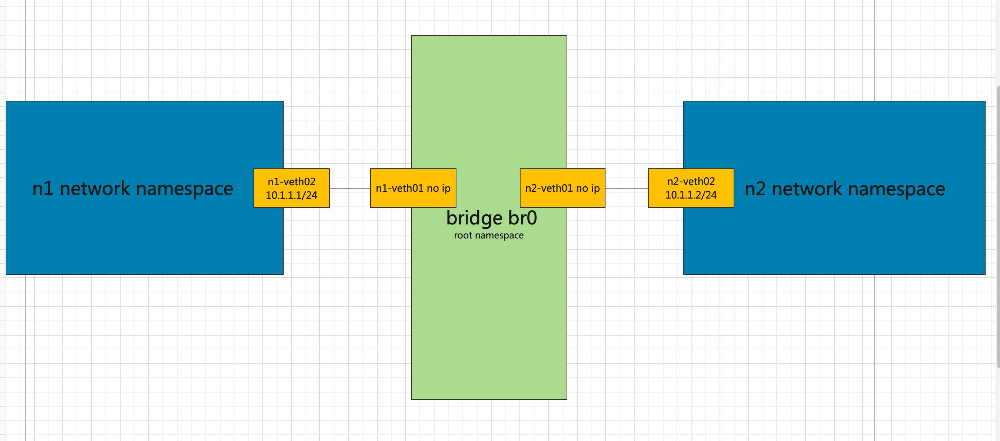

[toc]


# 1  实验1


## 1.1 用一个 bridge 连接两对 veth





```
# 创建  ns 
ip netns add n1

# 创建 veth pair 设备
ip  link add  n1-veth01  type veth peer name n1-veth02

# 将  n1-veth02 置于 n1
ip link set n1-veth02 netns  n1

#  配置ip 地址
ip netns exec  n1  ip  addr add  10.1.1.1/24 dev n1-veth02

# 启动 设备
ip netns exec  n1 ip  link set  up n1-veth02 up
ip  link set  n1-veth01 up
```


```
# 创建  ns 
ip netns add n2

# 创建 veth pair 设备
ip  link add  n2-veth01  type veth peer name n2-veth02

# 将  n2-veth02 置于 n2
ip link set n2-veth02 netns  n2

#  配置ip 地址
ip netns exec  n2  ip  addr add  10.1.1.2/24 dev n2-veth02

# 启动 设备
ip netns exec  n2 ip  link set  up n2-veth02 up
ip  link set  n2-veth01 up
```


```
#创建网桥
ip link add br0 type bridge
ip link set br0 up
ip link set dev n1-veth01  master br0
ip link set dev n2-veth01  master br0
```


```
# 测试 ping 互相ping 都通
ip netns exec  n1  ping  10.1.1.2
ip netns exec  n2  ping  10.1.1.1
```


## 1.2 测试 trunk


--------------------

```
ip link set br0 type bridge vlan_filtering 1

cat  /sys/class/net/br0/bridge/vlan_filtering 
bridge vlan add dev n1-veth01  vid 100 pvid untagged master
bridge vlan add dev n2-veth01  vid 100 pvid untagged master

```


```
bridge vlan show br0
port    vlan ids
n1-veth01        1 Egress Untagged
         100 PVID Egress Untagged

n2-veth01        1 Egress Untagged
         100 PVID Egress Untagged

br0      1 PVID Egress Untagged

```


```
bridge vlan add dev br0  vid 100 pvid untagged self
```


```
bridge vlan show br0
port    vlan ids
n1-veth01        1 Egress Untagged
         100 PVID Egress Untagged

n2-veth01        1 Egress Untagged
         100 PVID Egress Untagged

br0      1 Egress Untagged
         100 PVID Egress Untagged
```


```
 bridge vlan del dev br0  vid 1 untagged self
```


```
bridge vlan show br0
port    vlan ids
n1-veth01        1 Egress Untagged
         100 PVID Egress Untagged

n2-veth01        1 Egress Untagged
         100 PVID Egress Untagged

br0      100 PVID Egress Untagged
```


```
 bridge vlan del dev n1-veth01  vid 1
 bridge vlan del dev n2-veth01  vid 1
```


```
[root@localhost ~]# bridge vlan show br0
port    vlan ids
n1-veth01        100 PVID Egress Untagged

n2-veth01        100 PVID Egress Untagged

br0      100 PVID Egress Untagged
```


```
bridge vlan add dev n1-veth01  vid 100 pvid  tagged master


执行上面这一条 网络不通了，

bridge vlan show br0
port    vlan ids
n1-veth01        100 PVID

n2-veth01        100 PVID Egress Untagged

br0      100 PVID Egress Untagged


```


```
为br0 配置一个ip 地址

ip  addr add  10.1.1.3/24 dev  br0

# ping  10.1.1.2  通

ping 10.1.1.2
PING 10.1.1.2 (10.1.1.2) 56(84) bytes of data.
64 bytes from 10.1.1.2: icmp_seq=1 ttl=64 time=0.064 ms
64 bytes from 10.1.1.2: icmp_seq=2 ttl=64 time=0.089 ms
```


```
#  设置  n2-veth01 位 tagged
bridge vlan add dev n2-veth01  vid 100 pvid  tagged master


bridge vlan show br0
port    vlan ids
n1-veth01        100 PVID

n2-veth01        100 PVID

br0      100 PVID Egress Untagged


无法再ping 通  10.1.1.2
```


```
# 为两个ns 里的网卡设置vlan
ip netns exec  n1  ip link add link n1-veth02 name n1-veth02.100  type vlan id 100
ip netns exec  n2  ip link add link n2-veth02 name n2-veth02.100  type vlan id 100
```


```
# 为vlan 设备配置ip
ip netns exec  n1  ip  addr add  100.1.1.1/24 dev n1-veth02.100
ip netns exec  n2  ip  addr add  100.1.1.2/24 dev n2-veth02.100
```


```
# 启动两个vlan 设备

ip netns exec  n1 ip  link set  up n1-veth02.100  up
ip netns exec  n2 ip  link set  up n2-veth02.100  up

```


```
# ping 测试

ip netns exec  n1  ping  100.1.1.2 #  通
ip netns exec  n2  ping  100.1.1.1 #  通

查看当前br0 设备的情况


bridge vlan show br0
port    vlan ids
n1-veth01        100 PVID

n2-veth01        100 PVID

br0      100 PVID Egress Untagged


# 在ping 的时候可以看到数据包中的vlan id


ip addr del  10.1.1.3/24 dev br0


tcpdump  -e -i  n1-veth01    | grep vlan
tcpdump  -e -i  n2-veth01    | grep vla


tcpdump  -n -e -i  br0    | grep vlan # 没有vlan 信息

```


```
bridge vlan show br0
port    vlan ids
n1-veth01        100 PVID

n2-veth01        100 PVID

br0      100 PVID Egress Untagged


# 去掉br0 的vlan


bridge vlan del dev br0  vid 100  pvid untagged self
[root@localhost ~]# bridge vlan show br0
port    vlan ids
n1-veth01        100 PVID

n2-veth01        100 PVID

br0     None


#  当前情况   100.1.1.1  100.1.1.2 可以互相ping 通


#  当前情况  10.1.1.1 10.1.1.2  不可以互相ping 通

```


```

增加一个vlan 过滤条目   VLAN ID 100 
untagged 指定的VLAN在出口时将被视为未标记
bridge vlan add dev veth01 vid 100 pvid untagged master
```


------------


```
# 当前网络情况

bridge vlan show 
port    vlan ids
n1-veth01        100 PVID

n2-veth01        100 PVID

br0     None
```


```
#  二层的协议 不需要开启  ip_forward
echo 0 > /proc/sys/net/ipv4/ip_forward
[root@localhost ~]#  cat /proc/sys/net/ipv4/ip_forward
0
```


```
# 为 n1-veth01  和 n1-veth02 再添加一个vlan


bridge vlan add dev n1-veth01  vid 200
bridge vlan add dev n2-veth01  vid 200


[root@localhost ~]# bridge  vlan show br0
port    vlan ids
n1-veth01        100 PVID
         200

n2-veth01        100 PVID
         200

br0     None


# 为两个ns 里的网卡设置vlan
ip netns exec  n1  ip link add link n1-veth02 name n1-veth02.200  type vlan id 200
ip netns exec  n2  ip link add link n2-veth02 name n2-veth02.200  type vlan id 200


# 为vlan 设备配置ip
ip netns exec  n1  ip  addr add  200.1.1.1/24 dev n1-veth02.200
ip netns exec  n2  ip  addr add  200.1.1.2/24 dev n2-veth02.200


# 启动两个vlan 设备

ip netns exec  n1 ip  link set  up n1-veth02.200  up
ip netns exec  n2 ip  link set  up n2-veth02.200  up


# ping test


ip netns exec  n1  ip a
1: lo: <LOOPBACK> mtu 65536 qdisc noop state DOWN group default qlen 1000
    link/loopback 00:00:00:00:00:00 brd 00:00:00:00:00:00
2: n1-veth02.100@n1-veth02: <BROADCAST,MULTICAST,UP,LOWER_UP> mtu 1500 qdisc noqueue state UP group default qlen 1000
    link/ether f2:6b:1a:e4:f4:73 brd ff:ff:ff:ff:ff:ff
    inet 100.1.1.1/24 scope global n1-veth02.100
       valid_lft forever preferred_lft forever
    inet6 fe80::f06b:1aff:fee4:f473/64 scope link 
       valid_lft forever preferred_lft forever
3: n1-veth02@if4: <BROADCAST,MULTICAST,UP,LOWER_UP> mtu 1500 qdisc noqueue state UP group default qlen 1000
    link/ether f2:6b:1a:e4:f4:73 brd ff:ff:ff:ff:ff:ff link-netnsid 0
    inet 10.1.1.1/24 scope global n1-veth02
       valid_lft forever preferred_lft forever
    inet6 fe80::f06b:1aff:fee4:f473/64 scope link 
       valid_lft forever preferred_lft forever
4: n1-veth02.200@n1-veth02: <BROADCAST,MULTICAST,UP,LOWER_UP> mtu 1500 qdisc noqueue state UP group default qlen 1000
    link/ether f2:6b:1a:e4:f4:73 brd ff:ff:ff:ff:ff:ff
    inet 200.1.1.1/24 scope global n1-veth02.200
       valid_lft forever preferred_lft forever
    inet6 fe80::f06b:1aff:fee4:f473/64 scope link 
       valid_lft forever preferred_lft forever
       
       
       
       
ip netns exec  n2  ip a 
1: lo: <LOOPBACK> mtu 65536 qdisc noop state DOWN group default qlen 1000
    link/loopback 00:00:00:00:00:00 brd 00:00:00:00:00:00
2: n2-veth02.100@n2-veth02: <BROADCAST,MULTICAST,UP,LOWER_UP> mtu 1500 qdisc noqueue state UP group default qlen 1000
    link/ether 96:a6:67:db:62:0d brd ff:ff:ff:ff:ff:ff
    inet 100.1.1.2/24 scope global n2-veth02.100
       valid_lft forever preferred_lft forever
    inet6 fe80::94a6:67ff:fedb:620d/64 scope link 
       valid_lft forever preferred_lft forever
3: n2-veth02.200@n2-veth02: <BROADCAST,MULTICAST,UP,LOWER_UP> mtu 1500 qdisc noqueue state UP group default qlen 1000
    link/ether 96:a6:67:db:62:0d brd ff:ff:ff:ff:ff:ff
    inet 200.1.1.2/24 scope global n2-veth02.200
       valid_lft forever preferred_lft forever
    inet6 fe80::94a6:67ff:fedb:620d/64 scope link 
       valid_lft forever preferred_lft forever
5: n2-veth02@if6: <BROADCAST,MULTICAST,UP,LOWER_UP> mtu 1500 qdisc noqueue state UP group default qlen 1000
    link/ether 96:a6:67:db:62:0d brd ff:ff:ff:ff:ff:ff link-netnsid 0
    inet 10.1.1.2/24 scope global n2-veth02
       valid_lft forever preferred_lft forever
    inet6 fe80::94a6:67ff:fedb:620d/64 scope link 
       valid_lft forever preferred_lft forever
       
       
       
       
       

ip netns exec  n2  ping  200.1.1.1
PING 200.1.1.1 (200.1.1.1) 56(84) bytes of data.
64 bytes from 200.1.1.1: icmp_seq=1 ttl=64 time=0.073 ms
64 bytes from 200.1.1.1: icmp_seq=2 ttl=64 time=0.063 ms


ip netns exec  n1  ping  200.1.1.2
PING 200.1.1.2 (200.1.1.2) 56(84) bytes of data.
64 bytes from 200.1.1.2: icmp_seq=1 ttl=64 time=0.045 ms
64 bytes from 200.1.1.2: icmp_seq=2 ttl=64 time=0.103 ms


-----------------
bridge     vlan      show

port             vlan ids
n1-veth01        100 PVID
                 200
n2-veth01        100 PVID
                 200
br0              None
--------------------

brctl show
bridge name     bridge id               STP enabled     interfaces
br0             8000.7a90867ebcb9       no              n1-veth01
                                                        n2-veth01
-----------------------------                                                        
                                                        
br0 上可以抓到 vlan100 vlan200 的信息

tcpdump  -n -e  -i br0
[root@localhost ~]# tcpdump  -n -e  -i br0 
tcpdump: verbose output suppressed, use -v or -vv for full protocol decode
listening on br0, link-type EN10MB (Ethernet), capture size 262144 bytes
13:11:24.861189 96:a6:67:db:62:0d > f2:6b:1a:e4:f4:73, ethertype 802.1Q (0x8100), length 102: vlan 100, p 0, ethertype IPv4, 100.1.1.2 > 100.1.1.1: ICMP echo request, id 5127, seq 42, length 64
13:11:24.861316 f2:6b:1a:e4:f4:73 > 96:a6:67:db:62:0d, ethertype 802.1Q (0x8100), length 102: vlan 100, p 0, ethertype IPv4, 100.1.1.1 > 100.1.1.2: ICMP echo reply, id 5127, seq 42, length 64
--------
[root@localhost ~]# tcpdump  -n -e  -i br0 
tcpdump: verbose output suppressed, use -v or -vv for full protocol decode
listening on br0, link-type EN10MB (Ethernet), capture size 262144 bytes
13:11:54.936198 96:a6:67:db:62:0d > f2:6b:1a:e4:f4:73, ethertype 802.1Q (0x8100), length 102: vlan 200, p 0, ethertype IPv4, 200.1.1.2 > 200.1.1.1: ICMP echo request, id 5130, seq 4, length 64
13:11:54.936350 f2:6b:1a:e4:f4:73 > 96:a6:67:db:62:0d, ethertype 802.1Q (0x8100), length 102: vlan 200, p 0, ethertype IPv4, 200.1.1.1 > 200.1.1.2: ICMP echo reply, id 5130, seq 4, length 64
```


-------------------


```
测试pvid


不在  ns1 ns2  设置 vlan 100  直接使用  接口 n1-veth02  n2-veth02

ns2
ip link set n1-veth02.100 down
ip   link  del  n1-veth02.100


ns1
ip link set n1-veth02.100 down
ip   link  del  n1-veth02.100


[root@localhost ~]# ip netns exec n1   ip a
1: lo: <LOOPBACK> mtu 65536 qdisc noop state DOWN group default qlen 1000
    link/loopback 00:00:00:00:00:00 brd 00:00:00:00:00:00
3: n1-veth02@if4: <BROADCAST,MULTICAST,UP,LOWER_UP> mtu 1500 qdisc noqueue state UP group default qlen 1000
    link/ether f2:6b:1a:e4:f4:73 brd ff:ff:ff:ff:ff:ff link-netnsid 0
    inet 10.1.1.1/24 scope global n1-veth02
       valid_lft forever preferred_lft forever
    inet6 fe80::f06b:1aff:fee4:f473/64 scope link 
       valid_lft forever preferred_lft forever
4: n1-veth02.200@n1-veth02: <BROADCAST,MULTICAST,UP,LOWER_UP> mtu 1500 qdisc noqueue state UP group default qlen 1000
    link/ether f2:6b:1a:e4:f4:73 brd ff:ff:ff:ff:ff:ff
    inet 200.1.1.1/24 scope global n1-veth02.200
       valid_lft forever preferred_lft forever
    inet6 fe80::f06b:1aff:fee4:f473/64 scope link 
       valid_lft forever preferred_lft forever
       
      
       
[root@localhost ~]# ip netns exec n2   ip a
1: lo: <LOOPBACK> mtu 65536 qdisc noop state DOWN group default qlen 1000
    link/loopback 00:00:00:00:00:00 brd 00:00:00:00:00:00
3: n2-veth02.200@n2-veth02: <BROADCAST,MULTICAST,UP,LOWER_UP> mtu 1500 qdisc noqueue state UP group default qlen 1000
    link/ether 96:a6:67:db:62:0d brd ff:ff:ff:ff:ff:ff
    inet 200.1.1.2/24 scope global n2-veth02.200
       valid_lft forever preferred_lft forever
    inet6 fe80::94a6:67ff:fedb:620d/64 scope link 
       valid_lft forever preferred_lft forever
5: n2-veth02@if6: <BROADCAST,MULTICAST,UP,LOWER_UP> mtu 1500 qdisc noqueue state UP group default qlen 1000
    link/ether 96:a6:67:db:62:0d brd ff:ff:ff:ff:ff:ff link-netnsid 0
    inet 10.1.1.2/24 scope global n2-veth02
       valid_lft forever preferred_lft forever
    inet6 fe80::94a6:67ff:fedb:620d/64 scope link 
       valid_lft forever preferred_lft forever
       
       
       
       
       
       


# 相当于设置了 默认vlan id
bridge vlan add dev n1-veth01  vid 100 pvid  untagged master 
bridge vlan add dev n2-veth01  vid 100 pvid  untagged master


[root@localhost ~]# bridge vlan show
port    vlan ids
n1-veth01        100 PVID Egress Untagged
         200

n2-veth01        100 PVID Egress Untagged
         200

br0     None


测试


[root@localhost ~]# ip netns exec n1  ping 10.1.1.2
PING 10.1.1.2 (10.1.1.2) 56(84) bytes of data.
64 bytes from 10.1.1.2: icmp_seq=1 ttl=64 time=0.042 ms
64 bytes from 10.1.1.2: icmp_seq=2 ttl=64 time=0.082 ms


[root@localhost ~]# ip netns exec n1  ping 200.1.1.2
PING 200.1.1.2 (200.1.1.2) 56(84) bytes of data.
64 bytes from 200.1.1.2: icmp_seq=1 ttl=64 time=0.088 ms
64 bytes from 200.1.1.2: icmp_seq=2 ttl=64 time=0.104 ms
64 bytes from 200.1.1.2: icmp_seq=3 ttl=64 time=0.103 ms
64 bytes from 200.1.1.2: icmp_seq=4 ttl=64 time=0.105 ms
^C


tcpdump 


[root@localhost ~]# tcpdump  -n -e -i br0 
tcpdump: verbose output suppressed, use -v or -vv for full protocol decode
listening on br0, link-type EN10MB (Ethernet), capture size 262144 bytes

13:39:07.211344 f2:6b:1a:e4:f4:73 > 96:a6:67:db:62:0d, ethertype 802.1Q (0x8100), length 102: vlan 100, p 0, ethertype IPv4, 10.1.1.1 > 10.1.1.2: ICMP echo request, id 5239, seq 1, length 64
13:39:07.211396 96:a6:67:db:62:0d > f2:6b:1a:e4:f4:73, ethertype 802.1Q (0x8100), length 102: vlan 100, p 0, ethertype IPv4, 10.1.1.2 > 10.1.1.1: ICMP echo reply, id 5239, seq 1, length 64


[root@localhost ~]# tcpdump  -n -e -i br0 
tcpdump: verbose output suppressed, use -v or -vv for full protocol decode
listening on br0, link-type EN10MB (Ethernet), capture size 262144 bytes
13:39:35.397554 f2:6b:1a:e4:f4:73 > 96:a6:67:db:62:0d, ethertype 802.1Q (0x8100), length 102: vlan 200, p 0, ethertype IPv4, 200.1.1.1 > 200.1.1.2: ICMP echo request, id 5241, seq 1, length 64
13:39:35.397610 96:a6:67:db:62:0d > f2:6b:1a:e4:f4:73, ethertype 802.1Q (0x8100), length 102: vlan 200, p 0, ethertype IPv4, 200.1.1.2 > 200.1.1.1: ICMP echo reply, id 5241, seq 1, length 64


```


```
二、SVI 接口 -- VLAN 间路由

一个交换机可能会有多个VLAN与其相连，则需要通过三层流量让这些VLAN间进行通信。而SVI(Switch virtual interface)即为路由间选择的虚拟VLAN接口。

7eb7ec6364fc

废话不多说直接上命令

增加SVI接口

$ ip link add link br0 name br0.100 type vlan id 100

$ ip addr add 192.168.1.1/24 dev br0.100

连接VM1和VM2的接口增加VLAN过滤ID 100 和 200

$ ip link set br0 type bridge vlan_filtering 1

$ bridge vlan add dev veth1 vid 100 pvid untagged master

VM1和VM2的默认网关指向SVI接口

$ ip route rep default via 192.168.1.1

关键一步：br0也要增加VLAN过滤ID 100 和 200。当VM1第一次想要发数据到VM2，会先问网关的MAC地址，ARP请求到达veth1后会打上ID=100的VLAN TAG。然后数据会到达br0.100，br0.100会作ARP应答，数据到达br0后，若br0没有这增加这两个ID的VLAN过滤条目，则会将数据丢弃。所以 br0也要增加VLAN过滤ID 100 和 200(感觉解释得不太清楚，反正就要打，不打数据就会被丢 :sweat_smile:)

$ bridge vlan add dev br0 vid 100 pvid untagged self

其实要不要加这个 pvid untagged我也没太搞清楚……:sweat:评论区有大神指点就好了。
```


-----


# 2 linux bridge test vlan 


-------------


```
只能有一个 设置为   pvid self

untagged 去掉标签发送

tagged 带标签发送
```


```
bridge  -c vlan sh
```


```
ip link add name swbridge type bridge vlan_filtering 1 vlan_default_pvid 0
ip link set swbridge up
```


```
# port2
ip link set port2 master swbridge 
ip link set port2 up

# port3
ip link set port3 master swbridge
ip link set port3 up

# port54
ip link set port54 master swbridge
ip link set port54 up
```


```
bridge vlan add vid 2 dev port2 pvid
bridge vlan add vid 3 dev port3 pvid
bridge vlan add vid 2 dev port54 untagged
bridge vlan add vid 3 dev port54 untagged
bridge vlan add vid 2 dev swbridge self
bridge vlan add vid 3 dev swbridge self
```


##   重要参考


https://superuser.com/questions/1436860/how-do-vlan-access-ports-and-trunk-ports-work-on-linux


https://docs.bisdn.de/network_configuration/vlan_bridging.html


https://unix.stackexchange.com/questions/699499/linux-bridge-with-trunk-ports-and-self-bridge-port


https://developers.redhat.com/blog/2017/09/14/vlan-filter-support-on-bridge#


#  4  使用两个虚拟交换机test trunk


## 4.1  基础环境


| 设备  | 交换机直连网络 |            |            |      |      |      |      |      |      |
| ----- | -------------- | ---------- | ---------- | ---- | ---- | ---- | ---- | ---- | ---- |
| nssw1 | nssw1-eth0     | nssw1-eth1 | nssw1-eth2 |      |      |      |      |      |      |
| nssw2 | nssw2-eth0     |            |            |      |      |      |      |      |      |
| nspc1 |                | nspc1-eth1 | nspc1-eth2 |      |      |      |      |      |      |
| nspc2 |                |            |            |      |      |      |      |      |      |
|       |                |            |            |      |      |      |      |      |      |
|       |                |            |            |      |      |      |      |      |      |
|       |                |            |            |      |      |      |      |      |      |
|       |                |            |            |      |      |      |      |      |      |
|       |                |            |            |      |      |      |      |      |      |


```
# 创建两个 虚拟交换机用的  ns 

ip netns add nssw1
ip netns add nssw2


# 创建 veth pair 设备
ip  link add nssw1-eth0 type veth  peer name nssw2-eth0


# 将  n1-veth02 置于 n1
ip link set  nssw1-eth0  netns nssw1
ip link set  nssw2-eth0  netns nssw2
```


```
# 查看ns
ip netns ls
nssw2 (id: 1)
nssw1 (id: 0)
```


```
# 创建两个pc 机用的ns
ip netns add nspc1
ip netns add nspc2


# 创建 veth pair 设备
ip  link add nspc1-eth1 type veth  peer name nssw1-eth1
ip  link add nspc1-eth2 type veth  peer name nssw1-eth2


ip  link add nspc2-eth1 type veth  peer name nssw2-eth1
ip  link add nspc2-eth2 type veth  peer name nssw2-eth2


ip link set  nssw1-eth1  netns nssw1
ip link set  nssw1-eth2  netns nssw1


ip link set  nssw2-eth1  netns nssw2
ip link set  nssw2-eth2  netns nssw2


ip link set  nspc1-eth1  netns nspc1
ip link set  nspc1-eth2  netns nspc1

ip link set  nspc2-eth1  netns nspc2
ip link set  nspc2-eth2  netns nspc2
```


## 4.2 


###  nssw1

```
ip netns exec nssw1 bash
```


```
ip link add nssw1-br0 type bridge
ip link set nssw1-br0 up
ip link set dev nssw1-eth0  master nssw1-br0
ip link set dev nssw1-eth1  master nssw1-br0
ip link set dev nssw1-eth2  master nssw1-br0
```


```
exit
```


### nssw2


```
ip netns exec nssw2 bash
```


```
ip link add nssw2-br0 type bridge
ip link set nssw2-br0 up
ip link set dev nssw2-eth0  master nssw2-br0
ip link set dev nssw2-eth1  master nssw2-br0
ip link set dev nssw2-eth2  master nssw2-br0
```


```
exit
```


### 配置 trunk


##### nssw1 


```
ip netns exec nssw1 bash
```


```
bridge  vlan show
port    vlan ids
nssw1-eth0       1 PVID Egress Untagged

nssw1-eth1       1 PVID Egress Untagged

nssw1-eth2       1 PVID Egress Untagged

nssw1-br0        1 PVID Egress Untagged
```


```
ip  link set  nssw1-eth0 up
ip  link set  nssw1-eth1 up
ip  link set  nssw1-eth2 up
ip  link set  nssw1-br0 up
```


```
ip link add link nssw1-eth0  name nssw1-eth0.100  type  vlan id 100

ip link set nssw1-eth0.100 master nssw1-br0
brctl  delif   nssw1-br0 nssw1-eth0.100
```


```
bridge   vlan show
port    vlan ids
nssw1-eth0       1 PVID Egress Untagged

nssw1-eth1       1 PVID Egress Untagged

nssw1-eth2       1 PVID Egress Untagged

nssw1-br0        1 PVID Egress Untagged

nssw1-eth0.100   1 PVID Egress Untagged

nssw1-eth0.100
```


```
[root@localhost ~]# brctl show
bridge name     bridge id               STP enabled     interfaces
nssw1-br0               8000.0e37c84814cb       no              nssw1-eth0
                                                        nssw1-eth0.100
                                                        nssw1-eth1
                                                        nssw1-eth2
```


```
ip link set nssw1-br0 type bridge vlan_filtering 1
```


```
ip link add link nssw1-eth0  name nssw1-eth0.200  type  vlan id 200
ip link add link nssw1-eth0  name nssw1-eth0.300  type  vlan id 300


ip  link set  nssw1-eth0.200 up
ip  link set  nssw1-eth0.300 up
```


##### nssw2


```
ip netns exec nssw2 bash
```


```
bridge  vlan show
port    vlan ids
nssw2-eth0       1 PVID Egress Untagged

nssw2-eth1       1 PVID Egress Untagged

nssw2-eth2       1 PVID Egress Untagged

nssw2-br0        1 PVID Egress Untagged
```


```
ip  link set  nssw2-eth0 up
ip  link set  nssw2-eth1 up
ip  link set  nssw2-eth2 up
ip  link set  nssw2-br0 up
```


```
ip link add link nssw2-eth0  name nssw2-eth0.100  type  vlan id 100
ip link set nssw2-eth0.100 master nssw2-br0
brctl  delif   nssw2-br0 nssw2-eth0.100
```


```
bridge  vlan show
port    vlan ids
nssw2-eth0       1 PVID Egress Untagged

nssw2-eth1       1 PVID Egress Untagged

nssw2-eth2       1 PVID Egress Untagged

nssw2-br0        1 PVID Egress Untagged

nssw2-eth0.100   1 PVID Egress Untagged

nssw2-eth0.100
```


------------------


nssw1

```
bridge vlan add dev nssw1-eth0 vid 100 master
bridge vlan add dev nssw1-eth0 vid 200 master
bridge vlan add dev nssw1-eth0 vid 300 master

bridge vlan add dev nssw1-eth0  vid 1 pvid untagged master
```


```
[root@localhost ~]# brctl show
bridge name     bridge id               STP enabled     interfaces
nssw1-br0               8000.0e37c84814cb       no              nssw1-eth0
                                                        nssw1-eth1
                                                        nssw1-eth2
                                                
                                                        
                                                                                                     
```


```
bridge vlan add dev nssw1-eth1 vid 100 master
bridge vlan add dev nssw1-eth2 vid 200 master


 bridge  vlan show
port    vlan ids
nssw1-eth0       1 PVID Egress Untagged
         100
         200
         300

nssw1-eth1       1 PVID Egress Untagged
         100

nssw1-eth2       1 PVID Egress Untagged
         200

nssw1-br0        1 PVID Egress Untagged


```


nssw2


```
bridge vlan add dev nssw2-eth0 vid 100 master
bridge vlan add dev nssw2-eth0 vid 200 master
bridge vlan add dev nssw2-eth0 vid 300 master


bridge vlan add dev nssw2-eth1 vid 100 master
bridge vlan add dev nssw2-eth2 vid 200 master


bridge  vlan show
port    vlan ids
nssw2-eth0       1 PVID Egress Untagged
         100
         200
         300

nssw2-eth1       1 PVID Egress Untagged
         100

nssw2-eth2       1 PVID Egress Untagged
         200

nssw2-br0        1 PVID Egress Untagged


```


####  测试联通性


```
# 为vlan 设备配置ip


ip netns exec  nspc1 ip  link set  up nspc1-eth1  up
ip netns exec  nspc2 ip  link set  up nspc2-eth1  up


ip netns exec  nspc1  ip link add link nspc1-eth1 name nspc1-eth1.100  type vlan id 100
ip netns exec  nspc2  ip link add link nspc2-eth1 name nspc2-eth1.100  type vlan id 100


ip netns exec  nspc1  ip  addr add  100.1.1.1/24 dev nspc1-eth1.100
ip netns exec  nspc2  ip  addr add  100.1.1.2/24 dev nspc2-eth1.100


# 启动两个vlan 设备

ip netns exec  nspc1 ip  link set  up nspc1-eth1.100  up
ip netns exec  nspc2 ip  link set  up nspc2-eth1.100  up


pc 互相ping 不通
```


---------------


```
ip link set nssw1-br0 type bridge vlan_filtering 1


bridge vlan add dev nssw1-br0 vid 100 self


ip link set nssw2-br0 type bridge vlan_filtering 1
bridge vlan add dev nssw2-br0 vid 100 self


```


```
bridge vlan add dev nssw1-br0  vid 100 pvid untagged self
bridge vlan add dev nssw2-br0  vid 100 pvid untagged self
```


```
ip link set nssw1-eth0.100 master nssw1-br0
ip link set nssw2-eth0.100 master nssw2-br0
```


```
bridge vlan add  dev nssw1-eth0.100  vid 100 master


bridge vlan add  dev nssw2-eth0.100  vid 100 master
```


# 5 测试


```
ip link add br0 type bridge
ip link set  br0 type bridge vlan_filtering 1
bridge vlan del dev br0 vid 1 self
bridge vlan add dev br0 vid 10 untagged pvid self


bridge vlan add dev br0 vid 20  tagged  self


ip link set dev eth0 master br0
```


```
ip link add br0 type bridge
ip link set br0 up
ip link set br0 type bridge vlan_filtering 1
ip link set eth0 master br0
```


```
ip tuntap add dev  guest_1_tap_0  mod tap 
ip tuntap add dev  guest_2_tap_0  mod tap 

ip tuntap add dev  guest_2_tap_1  mod tap 
ip tuntap add dev  guest_3_tap_0  mod tap 
```


```
ip link set guest_1_tap_0 master br0
ip link set guest_2_tap_0 master br0

ip link set guest_2_tap_1 master br0
ip link set guest_3_tap_0 master br0
```


```
bridge vlan add dev guest_1_tap_0 vid 2 pvid untagged master
bridge vlan add dev guest_2_tap_0 vid 2 pvid untagged master

bridge vlan add dev guest_2_tap_1 vid 3 pvid untagged master
bridge vlan add dev guest_3_tap_0 vid 3 pvid untagged master

bridge vlan add dev eth0 vid 2 master
bridge vlan add dev eth0 vid 3 master
```


```
# bridge vlan show
port    vlan ids
bond0    1 PVID Egress Untagged
         2
         3

br0      1 PVID Egress Untagged

guest_1_tap_0    1 Egress Untagged
         2 PVID Egress Untagged

guest_2_tap_0    1 Egress Untagged
         2 PVID Egress Untagged

guest_2_tap_1    1 Egress Untagged
         3 PVID Egress Untagged

guest_3_tap_0    1 Egress Untagged
         3 PVID Egress Untagged
```


-------------


```
[root@localhost ~]# bridge  vlan show
port    vlan ids
eth0     1 PVID Egress Untagged
         2
         3

br0      1 PVID Egress Untagged

guest_1_tap_0    1 Egress Untagged
         2 PVID Egress Untagged

guest_2_tap_0    1 Egress Untagged
         2 PVID Egress Untagged

guest_2_tap_1    1 Egress Untagged
         3 PVID Egress Untagged

guest_3_tap_0    1 Egress Untagged
         3 PVID Egress Untagged

```


```
# 创建  ns 
ip netns add n1

# 创建 veth pair 设备
ip  link add  n1-veth01  type veth peer name n1-veth02

# 将  n1-veth02 置于 n1
ip link set n1-veth02 netns  n1

#   设置vlan

ip netns exec  n1  ip link add link n1-veth02 name n1-veth02.2  type vlan id 2


#   桥接到 br0

ip link set n1-veth01  master br0


bridge vlan add dev n1-veth01 vid 2 pvid untagged master


ip netns exec  n1  ip  addr add  10.1.1.2/24 dev n1-veth02.2

# 启动 设备

ip link set n1-veth01 up


ip netns exec  n1 ip  link set  up  n1-veth02 up


ip netns exec  n1 ip  link set  up  n1-veth02.2 up


ip addr add 10.0.1.1/24 dev  guest_2_tap_0
ip link set up  guest_2_tap_0
```


# 6 测试   测试通过


```
两个交换机
三个pc
一共五个设备  都是用network namespace 模拟    然后用veth pair 相连


交换机1 三个口
交换机2 两个口


交换机1  交换机2  各用一个口相连

交换机1 剩下两个口 各接  一个pc    nspc1 接入了 vlan 100 vlan 200    nspc3 接入了 vlan 200
交换机2 剩下一个口 接    一个pc    nspc2 接如了 vlan 100 vlan 200


所有vlan 100 互通
所有vlan 200 互通
```


```
# 创建两个 虚拟交换机用的  ns 

ip netns add nssw1
ip netns add nssw2


# 创建 veth pair 设备
ip  link add nssw1-eth0 type veth  peer name nssw2-eth0


# 将  n1-veth02 置于 n1
ip link set  nssw1-eth0  netns nssw1
ip link set  nssw2-eth0  netns nssw2

```


```
#  创建网桥


ip netns exec  nssw1 bash
ip link set nssw1-eth0 up


ip link add nssw1-br0 type bridge
ip link set nssw1-br0 up
ip link set dev nssw1-eth0  master nssw1-br0
ip  addr add  10.1.1.1/24 dev nssw1-br0


ip netns exec  nssw2 bash
ip link set nssw2-eth0 up


ip link add nssw2-br0 type bridge
ip link set nssw2-br0 up
ip link set dev nssw2-eth0  master nssw2-br0
ip  addr add  10.1.1.2/24 dev nssw2-br0


# ping ok
ip netns exec  nssw1 bash
ping 10.1.1.2


# ping ok
ip netns exec  nssw2 bash
ping 10.1.1.1


#  查看当前默认vlan 


nssw1

bridge  vlan show
port    vlan ids
nssw1-eth0       1 PVID Egress Untagged
nssw1-br0        1 PVID Egress Untagged

brctl  show
bridge name     bridge id               STP enabled     interfaces
nssw1-br0               8000.9a365c8cafc8       no              nssw1-eth0


nssw2

bridge  vlan show
port    vlan ids
nssw2-eth0       1 PVID Egress Untagged
nssw2-br0        1 PVID Egress Untagged

brctl show
bridge name     bridge id               STP enabled     interfaces
nssw2-br0               8000.c2a83b658de5       no              nssw2-eth0

```


```
创建两个pc 用 ns


# 创建两个pc 机用的ns
ip netns add nspc1
ip netns add nspc2


# 创建 veth pair 设备
ip  link add nspc1-eth1 type veth  peer name nssw1-eth1
ip  link add nspc2-eth1 type veth  peer name nssw2-eth1


ip link set  nssw1-eth1  netns nssw1
ip link set  nssw2-eth1  netns nssw2


ip link set  nspc1-eth1  netns nspc1
ip link set  nspc2-eth1  netns nspc2


ip  netns exec nssw1  ip link set nssw1-eth1  up
ip  netns exec nssw1  ip link set dev nssw1-eth1  master nssw1-br0


ip  netns exec nssw2  ip link set nssw2-eth1  up
ip  netns exec nssw2  ip link set dev nssw2-eth1  master nssw2-br0


ip  netns exec nspc1  ip link set nspc1-eth1  up
ip  netns exec nspc2  ip link set nspc2-eth1  up


ip  netns exec nspc1   ip  addr add  10.1.1.101/24 dev nspc1-eth1
ip  netns exec nspc2   ip  addr add  10.1.1.102/24 dev nspc2-eth1


测试

ip  netns exec nspc1   bash
 ping 10.1.1.102  # 通
 
 
 
ip  netns exec nspc2   bash
ping 10.1.1.101   # 通


# 去掉  nssw1-br0  nssw2-br0 上的地址

ip  netns exec   nssw1 bash
ip  addr del  10.1.1.1/24 dev nssw1-br0

ip  netns exec   nssw2 bash
ip  addr del  10.1.1.2/24 dev nssw2-br0


# 再次测试 ok

ip  netns exec nspc1  ping  10.1.1.102
ip  netns exec nspc2  ping  10.1.1.101


```


```
#  两个 网桥设备 是通过 nssw1-eth0  nssw2-eth0  这跟线连在一起的，需要设置 这个两个接口为 vlan 100


ip  netns exec  nssw1   bridge  vlan show
port    vlan ids
nssw1-eth0       1 PVID Egress Untagged

nssw1-br0        1 PVID Egress Untagged

nssw1-eth1       1 PVID Egress Untagged


ip  netns exec  nssw2   bridge  vlan show
port    vlan ids
nssw2-eth0       1 PVID Egress Untagged

nssw2-br0        1 PVID Egress Untagged

nssw2-eth1       1 PVID Egress Untagged


# 首先设置网桥  开启 vlan_filtering 

ip  netns exec  nssw1 ip link set nssw1-br0 type bridge vlan_filtering 1
ip  netns exec  nssw2 ip link set nssw2-br0 type bridge vlan_filtering 1

# 再次测试  ping ok


# vlan 变为 tagged pvid 1

ip  netns exec  nssw1 bridge vlan add dev nssw1-eth0 vid  1 pvid  tagged master
ip  netns exec  nssw2 bridge vlan add dev nssw2-eth0 vid  1 pvid  tagged master


[root@localhost ~]# ip  netns exec nssw1    bridge vlan show
port    vlan ids
nssw1-eth0       1 PVID

nssw1-br0        1 PVID Egress Untagged

nssw1-eth1       1 PVID Egress Untagged

[root@localhost ~]# ip  netns exec nssw2    bridge vlan show
port    vlan ids
nssw2-eth0       1 PVID

nssw2-br0        1 PVID Egress Untagged

nssw2-eth1       1 PVID Egress Untagged


# ping ok


# 修改 vlan id 1  改为100


ip  netns exec  nssw1 bridge vlan add dev nssw1-eth0 vid  100 pvid  tagged master
ip  netns exec  nssw2 bridge vlan add dev nssw2-eth0 vid  100 pvid  tagged master


# 去掉 vlan 1


ip  netns exec  nssw1 bridge vlan del dev nssw1-eth0 vid  1 
ip  netns exec  nssw2 bridge vlan del dev nssw2-eth0 vid  1 


[root@localhost ~]# ip  netns exec nssw1    bridge vlan show
port    vlan ids
nssw1-eth0       100 PVID

nssw1-br0        1 PVID Egress Untagged

nssw1-eth1       1 PVID Egress Untagged

[root@localhost ~]# ip  netns exec nssw2   bridge vlan show
port    vlan ids
nssw2-eth0       100 PVID

nssw2-br0        1 PVID Egress Untagged

nssw2-eth1       1 PVID Egress Untagged


# 无法ping 通


 
#  nspc1  nspc2 设置vlan 100
ip netns exec  nspc1  ip link add link nspc1-eth1 name nspc1-eth1.100  type vlan id 100
ip netns exec  nspc2  ip link add link nspc2-eth1 name nspc2-eth1.100  type vlan id 100


ip  netns exec nspc1  ip link set nspc1-eth1.100  up
ip  netns exec nspc2  ip link set nspc2-eth1.100  up


ip  netns exec nspc1   ip  addr add  100.1.1.101/24 dev nspc1-eth1.100
ip  netns exec nspc2   ip  addr add  100.1.1.102/24 dev nspc2-eth1.100


# 测试

ip  netns exec nspc1   bash
ping 100.1.1.102  不通


ip  netns exec  nssw1 bridge vlan add dev nssw1-eth1 vid  100 pvid  tagged master
ip  netns exec  nssw2 bridge vlan add dev nssw2-eth1 vid  100 pvid  tagged master


# 测试 通了


# 查看 vlan


[root@localhost ~]# ip netns exec nssw1  bridge vlan show
port    vlan ids
nssw1-eth0       100 PVID

nssw1-br0        1 PVID Egress Untagged

nssw1-eth1       1 Egress Untagged
         100 PVID


[root@localhost ~]# ip netns exec nssw2  bridge vlan show
port    vlan ids
nssw2-eth0       100 PVID

nssw2-br0        1 PVID Egress Untagged

nssw2-eth1       1 Egress Untagged
         100 PVID
         
         
        


可以抓包看见
tcpdump -n -e -i nssw1-br0
tcpdump: verbose output suppressed, use -v or -vv for full protocol decode
listening on nssw1-br0, link-type EN10MB (Ethernet), capture size 262144 bytes
22:02:16.446779 7a:24:e8:ca:e5:79 > 36:6c:ad:68:bf:21, ethertype 802.1Q (0x8100), length 102: vlan 100, p 0, ethertype IPv4, 100.1.1.102 > 100.1.1.101: ICMP echo request, id 5237, seq 27, length 64
22:02:16.446939 36:6c:ad:68:bf:21 > 7a:24:e8:ca:e5:79, ethertype 802.1Q (0x8100), length 102: vlan 100, p 0, ethertype IPv4, 100.1.1.101 > 100.1.1.102: ICMP echo reply, id 5237, seq 27, length 64
```


```
# 再添加一个 vlan 200

ip  netns exec  nssw1 bridge vlan add dev nssw1-eth0 vid  200   tagged master
ip  netns exec  nssw2 bridge vlan add dev nssw2-eth0 vid  200   tagged master


ip  netns exec  nssw1 bridge vlan add dev nssw1-eth1 vid  200   tagged master
ip  netns exec  nssw2 bridge vlan add dev nssw2-eth1 vid  200   tagged master


#  nspc1  nspc2 设置vlan 200
ip netns exec  nspc1  ip link add link nspc1-eth1 name nspc1-eth1.200  type vlan id 200
ip netns exec  nspc2  ip link add link nspc2-eth1 name nspc2-eth1.200  type vlan id 200


ip  netns exec nspc1  ip link set nspc1-eth1.200  up
ip  netns exec nspc2  ip link set nspc2-eth1.200  up


ip  netns exec nspc1   ip  addr add  200.1.1.101/24 dev nspc1-eth1.200
ip  netns exec nspc2   ip  addr add  200.1.1.102/24 dev nspc2-eth1.200


# 测试ok


# 保存通时的记录

[root@localhost ~]# ip netns exec nssw1 bridge vlan show
port    vlan ids
nssw1-eth0       100 PVID
         200

nssw1-br0        1 PVID Egress Untagged

nssw1-eth1       1 Egress Untagged
         100 PVID
         200


[root@localhost ~]# ip netns exec nssw2 bridge vlan show
port    vlan ids
nssw2-eth0       100 PVID
         200

nssw2-br0        1 PVID Egress Untagged

nssw2-eth1       1 Egress Untagged
         100 PVID
         200


```


```
# 创建一个 nspc3 测试 vlan 的隔离

ip netns add nspc3


# 创建 veth pair 设备
ip  link add nspc3-eth3 type veth  peer name nssw1-eth3


ip link set  nspc3-eth3  netns nspc3
ip link set  nssw1-eth3  netns nssw1


ip netns exec nssw1  ip link set  nssw1-eth3 up
ip netns exec nssw1  ip link set dev nssw1-eth3   master  nssw1-br0


ip netns exec nspc3  ip link set nspc3-eth3 up


# nspc3 不设置vlan 先测试
ip  netns exec nspc3   ip  addr add  10.1.1.3/24 dev nspc3-eth3


ip  netns exec nspc3   bash
[root@localhost ~]# ping 10.1.1.102


# tcpdump
ip  netns exec  nssw1    bash


# 先看pc3 直连的口 nssw1-eth3  有包
[root@localhost ~]# tcpdump  -n -e -i nssw1-eth3
tcpdump: verbose output suppressed, use -v or -vv for full protocol decode
listening on nssw1-eth3, link-type EN10MB (Ethernet), capture size 262144 bytes
22:27:00.851266 ca:63:37:d8:7d:d9 > Broadcast, ethertype ARP (0x0806), length 42: Request who-has 10.1.1.102 tell 10.1.1.3, length 28
22:27:01.852935 ca:63:37:d8:7d:d9 > Broadcast, ethertype ARP (0x0806), length 42: Request who-has 10.1.1.102 tell 10.1.1.3, length 28


# 看网桥  nssw1-br0 有包


[root@localhost ~]# tcpdump  -n -e -i nssw1-br0
tcpdump: verbose output suppressed, use -v or -vv for full protocol decode
listening on nssw1-br0, link-type EN10MB (Ethernet), capture size 262144 bytes
22:27:52.959424 ca:63:37:d8:7d:d9 > Broadcast, ethertype ARP (0x0806), length 42: Request who-has 10.1.1.102 tell 10.1.1.3, length 28
22:27:53.961745 ca:63:37:d8:7d:d9 > Broadcast, ethertype ARP (0x0806), length 42: Request who-has 10.1.1.102 tell 10.1.1.3, length 28


# 看  nssw1-eth0 没包
tcpdump  -n -e -i  nssw1-eth0


# 查看vlan   ping 不通是正常的

ip netns exec nssw1 bridge  vlan show
port    vlan ids
nssw1-eth0       100 PVID
         200

nssw1-br0        1 PVID Egress Untagged

nssw1-eth1       1 Egress Untagged
         100 PVID
         200

nssw1-eth3       1 PVID Egress Untagged


# 修改  nssw1-eth3 vlan 

ip  netns exec  nssw1 bridge vlan add dev nssw1-eth3 vid  200   tagged master
ip  netns exec  nssw1 bridge vlan  del dev nssw1-eth3 vid  1


ip  netns exec nspc3  ip link  add link nspc3-eth3 name nspc3-eth3.200  type vlan id 200
ip  netns exec nspc3  ip link  set nspc3-eth3.200  up
ip  netns exec nspc3  ip addr add  200.1.1.103/24 dev nspc3-eth3.200


#. 测试

ip  netns exec nspc3   bash


[root@localhost ~]# ping  200.1.1.101
PING 200.1.1.101 (200.1.1.101) 56(84) bytes of data.
64 bytes from 200.1.1.101: icmp_seq=1 ttl=64 time=0.050 ms
64 bytes from 200.1.1.101: icmp_seq=2 ttl=64 time=0.091 ms


[root@localhost ~]# ping  200.1.1.102
PING 200.1.1.102 (200.1.1.102) 56(84) bytes of data.
64 bytes from 200.1.1.102: icmp_seq=1 ttl=64 time=0.057 ms
64 bytes from 200.1.1.102: icmp_seq=2 ttl=64 time=0.268 ms


#  记录当前成功的信息


[root@localhost ~]# ip  netns exec nssw1 bridge vlan show
port    vlan ids
nssw1-eth0       100 PVID
         200

nssw1-br0        1 PVID Egress Untagged

nssw1-eth1       1 Egress Untagged
         100 PVID
         200

nssw1-eth3       200

[root@localhost ~]# ip  netns exec nssw2 bridge vlan show
port    vlan ids
nssw2-eth0       100 PVID
         200

nssw2-br0        1 PVID Egress Untagged

nssw2-eth1       1 Egress Untagged
         100 PVID
         200

[root@localhost ~]# 


[root@localhost ~]# ip  netns exec nssw1 brctl show
bridge name     bridge id               STP enabled     interfaces
nssw1-br0               8000.16a582899009       no              nssw1-eth0
                                                        nssw1-eth1
                                                        nssw1-eth3
[root@localhost ~]# ip  netns exec nssw2 brctl show
bridge name     bridge id               STP enabled     interfaces
nssw2-br0               8000.3ea6d0a37f91       no              nssw2-eth0
                                                        nssw2-eth1
                                                        
                                                                                                                


[root@localhost ~]# ip  netns exec nspc1 ip a
1: lo: <LOOPBACK> mtu 65536 qdisc noop state DOWN group default qlen 1000
    link/loopback 00:00:00:00:00:00 brd 00:00:00:00:00:00
2: nspc1-eth1.100@nspc1-eth1: <BROADCAST,MULTICAST,UP,LOWER_UP> mtu 1500 qdisc noqueue state UP group default qlen 1000
    link/ether 36:6c:ad:68:bf:21 brd ff:ff:ff:ff:ff:ff
    inet 100.1.1.101/24 scope global nspc1-eth1.100
       valid_lft forever preferred_lft forever
    inet6 fe80::346c:adff:fe68:bf21/64 scope link 
       valid_lft forever preferred_lft forever
3: nspc1-eth1.200@nspc1-eth1: <BROADCAST,MULTICAST,UP,LOWER_UP> mtu 1500 qdisc noqueue state UP group default qlen 1000
    link/ether 36:6c:ad:68:bf:21 brd ff:ff:ff:ff:ff:ff
    inet 200.1.1.101/24 scope global nspc1-eth1.200
       valid_lft forever preferred_lft forever
    inet6 fe80::346c:adff:fe68:bf21/64 scope link 
       valid_lft forever preferred_lft forever
6: nspc1-eth1@if5: <BROADCAST,MULTICAST,UP,LOWER_UP> mtu 1500 qdisc noqueue state UP group default qlen 1000
    link/ether 36:6c:ad:68:bf:21 brd ff:ff:ff:ff:ff:ff link-netnsid 0
    inet 10.1.1.101/24 scope global nspc1-eth1
       valid_lft forever preferred_lft forever
    inet6 fe80::346c:adff:fe68:bf21/64 scope link 
       valid_lft forever preferred_lft forever
       
       
       
       
       
[root@localhost ~]# ip  netns exec nspc2 ip a
1: lo: <LOOPBACK> mtu 65536 qdisc noop state DOWN group default qlen 1000
    link/loopback 00:00:00:00:00:00 brd 00:00:00:00:00:00
2: nspc2-eth1.100@nspc2-eth1: <BROADCAST,MULTICAST,UP,LOWER_UP> mtu 1500 qdisc noqueue state UP group default qlen 1000
    link/ether 7a:24:e8:ca:e5:79 brd ff:ff:ff:ff:ff:ff
    inet 100.1.1.102/24 scope global nspc2-eth1.100
       valid_lft forever preferred_lft forever
    inet6 fe80::7824:e8ff:feca:e579/64 scope link 
       valid_lft forever preferred_lft forever
3: nspc2-eth1.200@nspc2-eth1: <BROADCAST,MULTICAST,UP,LOWER_UP> mtu 1500 qdisc noqueue state UP group default qlen 1000
    link/ether 7a:24:e8:ca:e5:79 brd ff:ff:ff:ff:ff:ff
    inet 200.1.1.102/24 scope global nspc2-eth1.200
       valid_lft forever preferred_lft forever
    inet6 fe80::7824:e8ff:feca:e579/64 scope link 
       valid_lft forever preferred_lft forever
8: nspc2-eth1@if7: <BROADCAST,MULTICAST,UP,LOWER_UP> mtu 1500 qdisc noqueue state UP group default qlen 1000
    link/ether 7a:24:e8:ca:e5:79 brd ff:ff:ff:ff:ff:ff link-netnsid 0
    inet 10.1.1.102/24 scope global nspc2-eth1
       valid_lft forever preferred_lft forever
    inet6 fe80::7824:e8ff:feca:e579/64 scope link 
       valid_lft forever preferred_lft forever
       
       
       
[root@localhost ~]# ip  netns exec nspc3 ip a
1: lo: <LOOPBACK> mtu 65536 qdisc noop state DOWN group default qlen 1000
    link/loopback 00:00:00:00:00:00 brd 00:00:00:00:00:00
2: nspc3-eth3.200@nspc3-eth3: <BROADCAST,MULTICAST,UP,LOWER_UP> mtu 1500 qdisc noqueue state UP group default qlen 1000
    link/ether ca:63:37:d8:7d:d9 brd ff:ff:ff:ff:ff:ff
    inet 200.1.1.103/24 scope global nspc3-eth3.200
       valid_lft forever preferred_lft forever
    inet6 fe80::c863:37ff:fed8:7dd9/64 scope link 
       valid_lft forever preferred_lft forever
10: nspc3-eth3@if9: <BROADCAST,MULTICAST,UP,LOWER_UP> mtu 1500 qdisc noqueue state UP group default qlen 1000
    link/ether ca:63:37:d8:7d:d9 brd ff:ff:ff:ff:ff:ff link-netnsid 1
    inet 10.1.1.3/24 scope global nspc3-eth3
       valid_lft forever preferred_lft forever
    inet6 fe80::c863:37ff:fed8:7dd9/64 scope link 
       valid_lft forever preferred_lft forever
[root@localhost ~]# 
```

 


# 7 用两台vm当作交换机 测试 trunk 连线


```
vmware 

vm1  port1    vmware-桥接网络    ssh
     port2    vmware-vlan段     交换机直连接口   另一头连的 vm2-port2
     port3    vmware-vlan段     连接其他vm 接口


vm2  port1    vmware-桥接网络    ssh
     port2    vmware-vlan段     交换机直连接口   另一头连的 vm2-port1
     port3    vmware-vlan段     连接其他vm 接口
     
     
vm3
 
vm4
 
 
 
 
 
```


