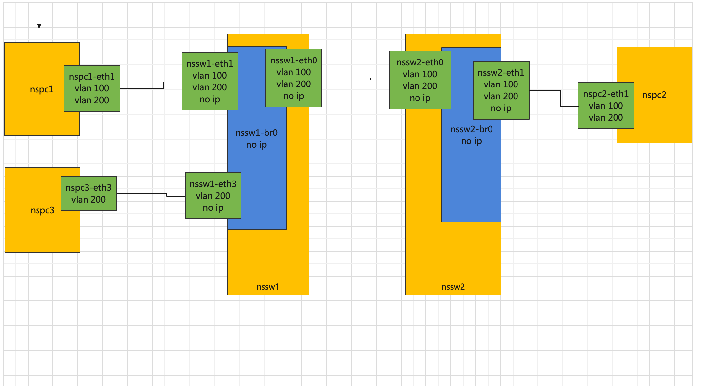

[toc]


# 1  用一个bridge连接两对veth


```
# 创建  ns 
ip netns add n1

# 创建 veth pair 设备
ip  link add  n1-veth01  type veth peer name n1-veth02

# 将  n1-veth02 置于 n1
ip link set n1-veth02 netns  n1

#  配置ip 地址
ip netns exec  n1  ip  addr add  10.1.1.1/24 dev n1-veth02

# 启动 设备
ip netns exec  n1 ip  link set  up n1-veth02 up
ip  link set  n1-veth01 up
```


```
# 创建  ns 
ip netns add n2

# 创建 veth pair 设备
ip  link add  n2-veth01  type veth peer name n2-veth02

# 将  n2-veth02 置于 n2
ip link set n2-veth02 netns  n2

#  配置ip 地址
ip netns exec  n2  ip  addr add  10.1.1.2/24 dev n2-veth02

# 启动 设备
ip netns exec  n2 ip  link set  up n2-veth02 up
ip  link set  n2-veth01 up
```


```
#创建网桥
ip link add br0 type bridge
ip link set br0 up
ip link set dev n1-veth01  master br0
ip link set dev n2-veth01  master br0
```


```bash
#查看网桥信息
brctl show

bridge name     bridge id               STP enabled     interfaces
br0             8000.668ffd0b30d9       no              n1-veth01
                                                        n2-veth01
```


```bash
#查看当前vlan 信息
bridge  vlan show

port    vlan ids
n1-veth01        1 PVID Egress Untagged
n2-veth01        1 PVID Egress Untagged
br0              1 PVID Egress Untagged
```


```
# 测试 ping 互相ping 都通
ip netns exec  n1  ping  10.1.1.2
ip netns exec  n2  ping  10.1.1.1
```


# 2 测试 vlan trunk 口


## 设置 vlan 


```
#  二层的协议 不需要开启  ip_forward
echo 0 > /proc/sys/net/ipv4/ip_forward
```


```
# 为br0上的两个接口设置vlan
bridge vlan add dev n1-veth01  vid 100 pvid  tagged master
bridge vlan add dev n2-veth01  vid 100 pvid  tagged master


bridge vlan add dev n1-veth01  vid 200 tagged master
bridge vlan add dev n2-veth01  vid 200 tagged master


# 删除br0 所有接口上的默认vlan
bridge vlan del dev n1-veth01  vid 1
bridge vlan del dev n2-veth01  vid 1
bridge vlan del dev br0        vid 1 self
```


```
# 查看vlan 信息
bridge  vlan show

port             vlan ids
n1-veth01        100 PVID
                 200

n2-veth01        100 PVID
                 200
                 
br0              None


# 查看网桥信息 同上一节相比没有变化

brctl  show 
bridge name     bridge id               STP enabled     interfaces
br0             8000.668ffd0b30d9       no              n1-veth01
                                                        n2-veth01
```


```
# 执行这个命令后 不再能互相ping 通
ip link set br0 type bridge vlan_filtering 1
```


##  测试vlan 100

```
# 为两个ns 里的网卡设置vlan
ip netns exec  n1  ip link add link n1-veth02 name n1-veth02.100  type vlan id 100
ip netns exec  n2  ip link add link n2-veth02 name n2-veth02.100  type vlan id 100


# 为vlan 设备配置ip
ip netns exec  n1  ip  addr add  100.1.1.1/24 dev n1-veth02.100
ip netns exec  n2  ip  addr add  100.1.1.2/24 dev n2-veth02.100

# 启动两个vlan 设备
ip netns exec  n1 ip  link set  up n1-veth02.100  up
ip netns exec  n2 ip  link set  up n2-veth02.100  up
```


```
# 测试 ping 互相ping 都通
ip netns exec  n1  ping  -I 100.1.1.1 100.1.1.2
ip netns exec  n2  ping  -I 100.1.1.2 100.1.1.1
```


```
# tcpdump 抓包 有去有回 有vlan 100 相关信息

ip netns exec  n1  ping -I 100.1.1.1 100.1.1.2


tcpdump  -n -e -i br0

17:14:56.454981 f2:27:88:44:cb:80 > 62:f7:c9:cf:c5:cc, ethertype 802.1Q (0x8100), length 102: vlan 100, p 0, ethertype IPv4, 100.1.1.1 > 100.1.1.2: ICMP echo request, id 4784, seq 17, length 64

17:14:56.455006 62:f7:c9:cf:c5:cc > f2:27:88:44:cb:80, ethertype 802.1Q (0x8100), length 102: vlan 100, p 0, ethertype IPv4, 100.1.1.2 > 100.1.1.1: ICMP echo reply, id 4784, seq 17, length 64
```


## 测试vlan 200


```
# 为两个ns 里的网卡设置vlan
ip netns exec  n1  ip link add link n1-veth02 name n1-veth02.200  type vlan id 200
ip netns exec  n2  ip link add link n2-veth02 name n2-veth02.200  type vlan id 200


# 为vlan 设备配置ip
ip netns exec  n1  ip  addr add  200.1.1.1/24 dev n1-veth02.200
ip netns exec  n2  ip  addr add  200.1.1.2/24 dev n2-veth02.200


# 启动两个vlan 设备
ip netns exec  n1 ip  link set  up n1-veth02.200  up
ip netns exec  n2 ip  link set  up n2-veth02.200  up
```


```
# 测试 ping 互相ping 都通
ip netns exec  n1  ping -I 200.1.1.1   200.1.1.2
ip netns exec  n2  ping -I 200.1.1.2   200.1.1.1
```


```
# tcpdump 抓包 有去有回 有vlan 200 相关信息

ip netns exec  n1  ping -I 200.1.1.1 200.1.1.2


tcpdump  -n -e -i br0

17:47:11.315233 f2:27:88:44:cb:80 > 62:f7:c9:cf:c5:cc, ethertype 802.1Q (0x8100), length 102: vlan 200, p 0, ethertype IPv4, 200.1.1.1 > 200.1.1.2: ICMP echo request, id 4860, seq 51, length 64

17:47:11.315494 62:f7:c9:cf:c5:cc > f2:27:88:44:cb:80, ethertype 802.1Q (0x8100), length 102: vlan 200, p 0, ethertype IPv4, 200.1.1.2 > 200.1.1.1: ICMP echo reply, id 4860, seq 51, length 64
```


## 测试vlan 的隔离


```
# 不通   vlan 100 到 vlan 200 
ip netns exec  n1  ping -I  100.1.1.1     200.1.1.2
```


##  测试 让两个vlan 三层可达


------


```
# 参考内容
二、SVI 接口 -- VLAN 间路由

一个交换机可能会有多个VLAN与其相连，则需要通过三层流量让这些VLAN间进行通信。而SVI(Switch virtual interface)即为路由间选择的虚拟VLAN接口。

7eb7ec6364fc

废话不多说直接上命令

增加SVI接口

$ ip link add link br0 name br0.100 type vlan id 100

$ ip addr add 192.168.1.1/24 dev br0.100

连接VM1和VM2的接口增加VLAN过滤ID 100 和 200

$ ip link set br0 type bridge vlan_filtering 1

$ bridge vlan add dev veth1 vid 100 pvid untagged master

VM1和VM2的默认网关指向SVI接口

$ ip route rep default via 192.168.1.1

关键一步：br0也要增加VLAN过滤ID 100 和 200。当VM1第一次想要发数据到VM2，会先问网关的MAC地址，ARP请求到达veth1后会打上ID=100的VLAN TAG。然后数据会到达br0.100，br0.100会作ARP应答，数据到达br0后，若br0没有这增加这两个ID的VLAN过滤条目，则会将数据丢弃。所以 br0也要增加VLAN过滤ID 100 和 200(感觉解释得不太清楚，反正就要打，不打数据就会被丢 :sweat_smile:)

$ bridge vlan add dev br0 vid 100 pvid untagged self

其实要不要加这个 pvid untagged我也没太搞清楚……:sweat:评论区有大神指点就好了。
```


```


ip link add link br0 name br0.100 type vlan id 100
ip addr add 100.1.1.254/24 dev br0.100
ip  link set  br0.100  up

ip link add link br0 name br0.200 type vlan id 200
ip addr add 200.1.1.254/24 dev br0.200
ip  link set  br0.200  up


bridge vlan add dev br0 vid 100 pvid tagged self
bridge vlan add dev br0 vid 200 pvid tagged self


n1

ip route rep default via 100.1.1.254

n2

ip route rep default via 200.1.1.254


# 每个ns 只保留一个vlan 
n1
ip link set  n1-veth02.200 down
ip link del  n1-veth02.200

n2

ip link set  n2-veth02.100 down
ip  link del n2-veth02.100
```


```
# n1 测试
ping -I 100.1.1.1 200.1.1.2
PING 200.1.1.2 (200.1.1.2) from 100.1.1.1 : 56(84) bytes of data.
64 bytes from 200.1.1.2: icmp_seq=1 ttl=63 time=0.064 ms
64 bytes from 200.1.1.2: icmp_seq=2 ttl=63 time=0.129 ms


# n2 测试
ping -I 200.1.1.2 100.1.1.1
PING 100.1.1.1 (100.1.1.1) from 200.1.1.2 : 56(84) bytes of data.
64 bytes from 100.1.1.1: icmp_seq=1 ttl=63 time=0.060 ms
64 bytes from 100.1.1.1: icmp_seq=2 ttl=63 time=0.128 ms

```


记录验证成功的信息

```
n1 路由
route -n
Kernel IP routing table
Destination     Gateway         Genmask         Flags Metric Ref    Use Iface
0.0.0.0         100.1.1.254     0.0.0.0         UG    0      0        0 n1-veth02.100
10.1.1.0        0.0.0.0         255.255.255.0   U     0      0        0 n1-veth02
100.1.1.0       0.0.0.0         255.255.255.0   U     0      0        0 n1-veth02.100


n2 路由
route -n
Kernel IP routing table
Destination     Gateway         Genmask         Flags Metric Ref    Use Iface
0.0.0.0         200.1.1.254     0.0.0.0         UG    0      0        0 n2-veth02.200
10.1.1.0        0.0.0.0         255.255.255.0   U     0      0        0 n2-veth02
200.1.1.0       0.0.0.0         255.255.255.0   U     0      0        0 n2-veth02.200


n1 网卡信息

[root@localhost ~]# ip a
1: lo: <LOOPBACK> mtu 65536 qdisc noop state DOWN group default qlen 1000
    link/loopback 00:00:00:00:00:00 brd 00:00:00:00:00:00
2: n1-veth02.100@n1-veth02: <BROADCAST,MULTICAST,UP,LOWER_UP> mtu 1500 qdisc noqueue state UP group default qlen 1000
    link/ether 32:c4:23:2f:a4:bc brd ff:ff:ff:ff:ff:ff
    inet 100.1.1.1/24 scope global n1-veth02.100
       valid_lft forever preferred_lft forever
    inet6 fe80::30c4:23ff:fe2f:a4bc/64 scope link 
       valid_lft forever preferred_lft forever
3: n1-veth02@if4: <BROADCAST,MULTICAST,UP,LOWER_UP> mtu 1500 qdisc noqueue state UP group default qlen 1000
    link/ether 32:c4:23:2f:a4:bc brd ff:ff:ff:ff:ff:ff link-netnsid 0
    inet 10.1.1.1/24 scope global n1-veth02
       valid_lft forever preferred_lft forever
    inet6 fe80::30c4:23ff:fe2f:a4bc/64 scope link 
       valid_lft forever preferred_lft forever
       
       
       
n2 网卡信息

ip a
1: lo: <LOOPBACK> mtu 65536 qdisc noop state DOWN group default qlen 1000
    link/loopback 00:00:00:00:00:00 brd 00:00:00:00:00:00
3: n2-veth02.200@n2-veth02: <BROADCAST,MULTICAST,UP,LOWER_UP> mtu 1500 qdisc noqueue state UP group default qlen 1000
    link/ether 9a:27:d9:e5:c9:ff brd ff:ff:ff:ff:ff:ff
    inet 200.1.1.2/24 scope global n2-veth02.200
       valid_lft forever preferred_lft forever
    inet6 fe80::9827:d9ff:fee5:c9ff/64 scope link 
       valid_lft forever preferred_lft forever
5: n2-veth02@if6: <BROADCAST,MULTICAST,UP,LOWER_UP> mtu 1500 qdisc noqueue state UP group default qlen 1000
    link/ether 9a:27:d9:e5:c9:ff brd ff:ff:ff:ff:ff:ff link-netnsid 0
    inet 10.1.1.2/24 scope global n2-veth02
       valid_lft forever preferred_lft forever
    inet6 fe80::9827:d9ff:fee5:c9ff/64 scope link 
       valid_lft forever preferred_lft forever
```


```
宿主机路由信息
route -n
Kernel IP routing table
Destination     Gateway         Genmask         Flags Metric Ref    Use Iface
0.0.0.0         172.16.100.1    0.0.0.0         UG    0      0        0 eth0
100.1.1.0       0.0.0.0         255.255.255.0   U     0      0        0 br0.100
169.254.0.0     0.0.0.0         255.255.0.0     U     1002   0        0 eth0
172.16.100.0    0.0.0.0         255.255.255.0   U     0      0        0 eth0
200.1.1.0       0.0.0.0         255.255.255.0   U     0      0        0 br0.200


宿主机 网卡信息
[root@localhost ~]# ip a
1: lo: <LOOPBACK,UP,LOWER_UP> mtu 65536 qdisc noqueue state UNKNOWN group default qlen 1000
    link/loopback 00:00:00:00:00:00 brd 00:00:00:00:00:00
    inet 127.0.0.1/8 scope host lo
       valid_lft forever preferred_lft forever
    inet6 ::1/128 scope host 
       valid_lft forever preferred_lft forever
2: eth0: <BROADCAST,MULTICAST,UP,LOWER_UP> mtu 1500 qdisc pfifo_fast state UP group default qlen 1000
    link/ether 00:1c:42:3e:cd:72 brd ff:ff:ff:ff:ff:ff
    inet 172.16.100.8/24 brd 172.16.100.255 scope global dynamic eth0
       valid_lft 1646sec preferred_lft 1646sec
    inet6 fdb2:2c26:f4e4:0:21c:42ff:fe3e:cd72/64 scope global mngtmpaddr dynamic 
       valid_lft 2591994sec preferred_lft 604794sec
    inet6 fe80::21c:42ff:fe3e:cd72/64 scope link 
       valid_lft forever preferred_lft forever
4: n1-veth01@if3: <BROADCAST,MULTICAST,UP,LOWER_UP> mtu 1500 qdisc noqueue master br0 state UP group default qlen 1000
    link/ether f6:3c:84:6f:08:e9 brd ff:ff:ff:ff:ff:ff link-netnsid 0
    inet6 fe80::f43c:84ff:fe6f:8e9/64 scope link 
       valid_lft forever preferred_lft forever
6: n2-veth01@if5: <BROADCAST,MULTICAST,UP,LOWER_UP> mtu 1500 qdisc noqueue master br0 state UP group default qlen 1000
    link/ether fe:17:d3:a3:5b:cb brd ff:ff:ff:ff:ff:ff link-netnsid 1
    inet6 fe80::fc17:d3ff:fea3:5bcb/64 scope link 
       valid_lft forever preferred_lft forever
7: br0: <BROADCAST,MULTICAST,UP,LOWER_UP> mtu 1500 qdisc noqueue state UP group default qlen 1000
    link/ether f6:3c:84:6f:08:e9 brd ff:ff:ff:ff:ff:ff
    inet6 fe80::7487:6aff:fece:3478/64 scope link 
       valid_lft forever preferred_lft forever
8: br0.100@br0: <BROADCAST,MULTICAST,UP,LOWER_UP> mtu 1500 qdisc noqueue state UP group default qlen 1000
    link/ether f6:3c:84:6f:08:e9 brd ff:ff:ff:ff:ff:ff
    inet 100.1.1.254/24 scope global br0.100
       valid_lft forever preferred_lft forever
    inet6 fe80::f43c:84ff:fe6f:8e9/64 scope link 
       valid_lft forever preferred_lft forever
9: br0.200@br0: <BROADCAST,MULTICAST,UP,LOWER_UP> mtu 1500 qdisc noqueue state UP group default qlen 1000
    link/ether f6:3c:84:6f:08:e9 brd ff:ff:ff:ff:ff:ff
    inet 200.1.1.254/24 scope global br0.200
       valid_lft forever preferred_lft forever
    inet6 fe80::f43c:84ff:fe6f:8e9/64 scope link 
       valid_lft forever preferred_lft forever
[root@localhost ~]# 


vlan 信息
[root@localhost ~]# bridge  vlan show
port    vlan ids
n1-veth01        100 PVID
         200

n2-veth01        100 PVID
         200

br0      100
         200 PVID
         
         
         
         
br0 抓包

n1 ping


ping -I 100.1.1.1 200.1.1.2

tcpdump  -n -e -i br0
tcpdump: verbose output suppressed, use -v or -vv for full protocol decode
listening on br0, link-type EN10MB (Ethernet), capture size 262144 bytes
20:46:48.416131 32:c4:23:2f:a4:bc > f6:3c:84:6f:08:e9, ethertype 802.1Q (0x8100), length 102: vlan 100, p 0, ethertype IPv4, 100.1.1.1 > 200.1.1.2: ICMP echo request, id 7854, seq 1, length 64
20:46:48.416183 f6:3c:84:6f:08:e9 > 9a:27:d9:e5:c9:ff, ethertype 802.1Q (0x8100), length 102: vlan 200, p 0, ethertype IPv4, 100.1.1.1 > 200.1.1.2: ICMP echo request, id 7854, seq 1, length 64
20:46:48.416204 9a:27:d9:e5:c9:ff > f6:3c:84:6f:08:e9, ethertype 802.1Q (0x8100), length 102: vlan 200, p 0, ethertype IPv4, 200.1.1.2 > 100.1.1.1: ICMP echo reply, id 7854, seq 1, length 64
20:46:48.416211 f6:3c:84:6f:08:e9 > 32:c4:23:2f:a4:bc, ethertype 802.1Q (0x8100), length 102: vlan 100, p 0, ethertype IPv4, 200.1.1.2 > 100.1.1.1: ICMP echo reply, id 7854, seq 1, length 64
20:46:49.417932 32:c4:23:2f:a4:bc > f6:3c:84:6f:08:e9, ethertype 802.1Q (0x8100), length 102: vlan 100, p 0, ethertype IPv4, 100.1.1.1 > 200.1.1.2: ICMP echo request, id 7854, seq 2, length 64


n1 ping
ping -I 100.1.1.1 200.1.1.254

tcpdump  -n -e -i br0
tcpdump: verbose output suppressed, use -v or -vv for full protocol decode
listening on br0, link-type EN10MB (Ethernet), capture size 262144 bytes
20:50:07.580268 32:c4:23:2f:a4:bc > f6:3c:84:6f:08:e9, ethertype 802.1Q (0x8100), length 102: vlan 100, p 0, ethertype IPv4, 100.1.1.1 > 200.1.1.254: ICMP echo request, id 7860, seq 4, length 64
20:50:07.580397 f6:3c:84:6f:08:e9 > 32:c4:23:2f:a4:bc, ethertype 802.1Q (0x8100), length 102: vlan 100, p 0, ethertype IPv4, 200.1.1.254 > 100.1.1.1: ICMP echo reply, id 7860, seq 4, length 64
20:50:08.580231 32:c4:23:2f:a4:bc > f6:3c:84:6f:08:e9, ethertype 802.1Q (0x8100), length 102: vlan 100, p 0, ethertype IPv4, 100.1.1.1 > 200.1.1.254: ICMP echo request, id 7860, seq 5, length 64
20:50:08.580380 f6:3c:84:6f:08:e9 > 32:c4:23:2f:a4:bc, ethertype 802.1Q (0x8100), length 102: vlan 100, p 0, ethertype IPv4, 200.1.1.254 > 100.1.1.1: ICMP echo reply, id 7860, seq 5, length 64


# 需要开启ip forward  否则 100.1.1.1 只能到达 200.1.1.254 但是无法到达 200.1.1.2

echo 1 >  /proc/sys/net/ipv4/ip_forward

```


## 测试 不设置默认 vlan id


```
# 使用没有配置vlan 的 设备 测试ping 
ip netns exec  n1  ping -I  10.1.1.1   10.1.1.2

# 有去无回 被打上了默认的 vlan 100 
tcpdump   -n -e -i br0

17:49:30.072954 f2:27:88:44:cb:80 > Broadcast, ethertype 802.1Q (0x8100), length 46: vlan 100, p 0, ethertype ARP, Request who-has 10.1.1.2 tell 10.1.1.1, length 28

17:49:31.074904 f2:27:88:44:cb:80 > Broadcast, ethertype 802.1Q (0x8100), length 46: vlan 100, p 0, ethertype ARP, Request who-has 10.1.1.2 tell 10.1.1.1, length 28

17:49:33.077638 f2:27:88:44:cb:80 > Broadcast, ethertype 802.1Q (0x8100), length 46: vlan 100, p 0, ethertype ARP, Request who-has 10.1.1.2 tell 10.1.1.1, length 28

17:49:34.081121 f2:27:88:44:cb:80 > Broadcast, ethertype 802.1Q (0x8100), length 46: vlan 100, p 0, ethertype ARP, Request who-has 10.1.1.2 tell 10.1.1.1, length 28

```


## 设置虚拟交换机允许默认 vlan 100


```
#修改前
bridge  vlan show

port             vlan ids
n1-veth01        100 PVID
                  200

n2-veth01        100 PVID
                  200

br0               None


# 在br0 添加vlan

bridge vlan add dev br0  vid 100 tagged pvid self


```


------#-------------------#--------------------_#


-------------------


```
测试pvid

不在  ns1 ns2  设置 vlan 100  直接使用  接口 n1-veth02  n2-veth02

ns2
ip link set n1-veth02.100 down
ip   link  del  n1-veth02.100


ns1
ip link set n1-veth02.100 down
ip   link  del  n1-veth02.100


[root@localhost ~]# ip netns exec n1   ip a
1: lo: <LOOPBACK> mtu 65536 qdisc noop state DOWN group default qlen 1000
    link/loopback 00:00:00:00:00:00 brd 00:00:00:00:00:00
3: n1-veth02@if4: <BROADCAST,MULTICAST,UP,LOWER_UP> mtu 1500 qdisc noqueue state UP group default qlen 1000
    link/ether f2:6b:1a:e4:f4:73 brd ff:ff:ff:ff:ff:ff link-netnsid 0
    inet 10.1.1.1/24 scope global n1-veth02
       valid_lft forever preferred_lft forever
    inet6 fe80::f06b:1aff:fee4:f473/64 scope link 
       valid_lft forever preferred_lft forever
4: n1-veth02.200@n1-veth02: <BROADCAST,MULTICAST,UP,LOWER_UP> mtu 1500 qdisc noqueue state UP group default qlen 1000
    link/ether f2:6b:1a:e4:f4:73 brd ff:ff:ff:ff:ff:ff
    inet 200.1.1.1/24 scope global n1-veth02.200
       valid_lft forever preferred_lft forever
    inet6 fe80::f06b:1aff:fee4:f473/64 scope link 
       valid_lft forever preferred_lft forever
       
      
       
[root@localhost ~]# ip netns exec n2   ip a
1: lo: <LOOPBACK> mtu 65536 qdisc noop state DOWN group default qlen 1000
    link/loopback 00:00:00:00:00:00 brd 00:00:00:00:00:00
3: n2-veth02.200@n2-veth02: <BROADCAST,MULTICAST,UP,LOWER_UP> mtu 1500 qdisc noqueue state UP group default qlen 1000
    link/ether 96:a6:67:db:62:0d brd ff:ff:ff:ff:ff:ff
    inet 200.1.1.2/24 scope global n2-veth02.200
       valid_lft forever preferred_lft forever
    inet6 fe80::94a6:67ff:fedb:620d/64 scope link 
       valid_lft forever preferred_lft forever
5: n2-veth02@if6: <BROADCAST,MULTICAST,UP,LOWER_UP> mtu 1500 qdisc noqueue state UP group default qlen 1000
    link/ether 96:a6:67:db:62:0d brd ff:ff:ff:ff:ff:ff link-netnsid 0
    inet 10.1.1.2/24 scope global n2-veth02
       valid_lft forever preferred_lft forever
    inet6 fe80::94a6:67ff:fedb:620d/64 scope link 
       valid_lft forever preferred_lft forever
       


# 相当于设置了 默认vlan id
bridge vlan add dev n1-veth01  vid 100 pvid  untagged master 
bridge vlan add dev n2-veth01  vid 100 pvid  untagged master


[root@localhost ~]# bridge vlan show
port    vlan ids
n1-veth01        100 PVID Egress Untagged
         200

n2-veth01        100 PVID Egress Untagged
         200

br0     None


测试


[root@localhost ~]# ip netns exec n1  ping 10.1.1.2
PING 10.1.1.2 (10.1.1.2) 56(84) bytes of data.
64 bytes from 10.1.1.2: icmp_seq=1 ttl=64 time=0.042 ms
64 bytes from 10.1.1.2: icmp_seq=2 ttl=64 time=0.082 ms


[root@localhost ~]# ip netns exec n1  ping 200.1.1.2
PING 200.1.1.2 (200.1.1.2) 56(84) bytes of data.
64 bytes from 200.1.1.2: icmp_seq=1 ttl=64 time=0.088 ms
64 bytes from 200.1.1.2: icmp_seq=2 ttl=64 time=0.104 ms
64 bytes from 200.1.1.2: icmp_seq=3 ttl=64 time=0.103 ms
64 bytes from 200.1.1.2: icmp_seq=4 ttl=64 time=0.105 ms
^C


tcpdump 


[root@localhost ~]# tcpdump  -n -e -i br0 
tcpdump: verbose output suppressed, use -v or -vv for full protocol decode
listening on br0, link-type EN10MB (Ethernet), capture size 262144 bytes

13:39:07.211344 f2:6b:1a:e4:f4:73 > 96:a6:67:db:62:0d, ethertype 802.1Q (0x8100), length 102: vlan 100, p 0, ethertype IPv4, 10.1.1.1 > 10.1.1.2: ICMP echo request, id 5239, seq 1, length 64
13:39:07.211396 96:a6:67:db:62:0d > f2:6b:1a:e4:f4:73, ethertype 802.1Q (0x8100), length 102: vlan 100, p 0, ethertype IPv4, 10.1.1.2 > 10.1.1.1: ICMP echo reply, id 5239, seq 1, length 64


[root@localhost ~]# tcpdump  -n -e -i br0 
tcpdump: verbose output suppressed, use -v or -vv for full protocol decode
listening on br0, link-type EN10MB (Ethernet), capture size 262144 bytes
13:39:35.397554 f2:6b:1a:e4:f4:73 > 96:a6:67:db:62:0d, ethertype 802.1Q (0x8100), length 102: vlan 200, p 0, ethertype IPv4, 200.1.1.1 > 200.1.1.2: ICMP echo request, id 5241, seq 1, length 64
13:39:35.397610 96:a6:67:db:62:0d > f2:6b:1a:e4:f4:73, ethertype 802.1Q (0x8100), length 102: vlan 200, p 0, ethertype IPv4, 200.1.1.2 > 200.1.1.1: ICMP echo reply, id 5241, seq 1, length 64


```


# 2 linux bridge test vlan 


-------------


```
只能有一个 设置为   pvid self

untagged 去掉标签发送

tagged 带标签发送
```


```
bridge  -c vlan sh
```


```
ip link add name swbridge type bridge vlan_filtering 1 vlan_default_pvid 0
ip link set swbridge up
```


```
# port2
ip link set port2 master swbridge 
ip link set port2 up

# port3
ip link set port3 master swbridge
ip link set port3 up

# port54
ip link set port54 master swbridge
ip link set port54 up
```


```
bridge vlan add vid 2 dev port2 pvid
bridge vlan add vid 3 dev port3 pvid
bridge vlan add vid 2 dev port54 untagged
bridge vlan add vid 3 dev port54 untagged
bridge vlan add vid 2 dev swbridge self
bridge vlan add vid 3 dev swbridge self
```


##   重要参考


https://superuser.com/questions/1436860/how-do-vlan-access-ports-and-trunk-ports-work-on-linux


https://docs.bisdn.de/network_configuration/vlan_bridging.html


https://unix.stackexchange.com/questions/699499/linux-bridge-with-trunk-ports-and-self-bridge-port


https://developers.redhat.com/blog/2017/09/14/vlan-filter-support-on-bridge#


# 6 测试   测试通过





```
两个交换机
三个pc
一共五个设备  都是用network namespace 模拟    然后用veth pair 相连


交换机1 三个口
交换机2 两个口


交换机1  交换机2  各用一个口相连

交换机1 剩下两个口 各接  一个pc    nspc1 接入了 vlan 100 vlan 200    nspc3 接入了 vlan 200
交换机2 剩下一个口 接    一个pc    nspc2 接如了 vlan 100 vlan 200


所有vlan 100 互通
所有vlan 200 互通
```


```
# 创建两个 虚拟交换机用的  ns 

ip netns add nssw1
ip netns add nssw2


# 创建 veth pair 设备
ip  link add nssw1-eth0 type veth  peer name nssw2-eth0


# 将 nssw1-eth0 置于 nssw1  将 nssw2-eth0 置于 nssw2
ip link set  nssw1-eth0  netns nssw1
ip link set  nssw2-eth0  netns nssw2

# 相当于在 nssw1 nssw2 之间之间接了一根网线
```


```
#  创建网桥


# 进入nssw1 内
ip netns exec  nssw1 bash

ip link set nssw1-eth0 up

ip link add nssw1-br0 type bridge
ip link set nssw1-br0 up
ip link set dev nssw1-eth0  master nssw1-br0
ip  addr add  10.1.1.1/24 dev nssw1-br0
exit


# 进入nssw2 内
ip netns exec  nssw2 bash

ip link set nssw2-eth0 up

ip link add nssw2-br0 type bridge
ip link set nssw2-br0 up
ip link set dev nssw2-eth0  master nssw2-br0
ip  addr add  10.1.1.2/24 dev nssw2-br0
exit


# 先测试下 这个网线是否ok

# ping ok
ip netns exec  nssw1 ping 10.1.1.2


# ping ok
ip netns exec  nssw2 ping 10.1.1.1


#  查看当前默认vlan 


nssw1

bridge  vlan show
port    vlan ids
nssw1-eth0       1 PVID Egress Untagged
nssw1-br0        1 PVID Egress Untagged

brctl  show
bridge name     bridge id               STP enabled     interfaces
nssw1-br0               8000.9a365c8cafc8       no              nssw1-eth0


nssw2

bridge  vlan show
port    vlan ids
nssw2-eth0       1 PVID Egress Untagged
nssw2-br0        1 PVID Egress Untagged

brctl show
bridge name     bridge id               STP enabled     interfaces
nssw2-br0               8000.c2a83b658de5       no              nssw2-eth0

```


```
创建两个pc 用 ns


# 创建两个pc 机用的ns
ip netns add nspc1
ip netns add nspc2


# 创建 veth pair 设备
ip  link add nspc1-eth1 type veth  peer name nssw1-eth1
ip  link add nspc2-eth1 type veth  peer name nssw2-eth1


ip link set  nssw1-eth1  netns nssw1
ip link set  nssw2-eth1  netns nssw2


ip link set  nspc1-eth1  netns nspc1
ip link set  nspc2-eth1  netns nspc2


ip  netns exec nssw1  ip link set nssw1-eth1  up
ip  netns exec nssw1  ip link set dev nssw1-eth1  master nssw1-br0


ip  netns exec nssw2  ip link set nssw2-eth1  up
ip  netns exec nssw2  ip link set dev nssw2-eth1  master nssw2-br0


ip  netns exec nspc1  ip link set nspc1-eth1  up
ip  netns exec nspc2  ip link set nspc2-eth1  up


ip  netns exec nspc1   ip  addr add  10.1.1.101/24 dev nspc1-eth1
ip  netns exec nspc2   ip  addr add  10.1.1.102/24 dev nspc2-eth1


测试

ip  netns exec nspc1  ping 10.1.1.102 
# 通
 
 
 
ip  netns exec nspc2  ping 10.1.1.101   
# 通


# 去掉  nssw1-br0  nssw2-br0 上的地址

ip  netns exec   nssw1 ip  addr del  10.1.1.1/24 dev nssw1-br0
ip  netns exec   nssw2 ip  addr del  10.1.1.2/24 dev nssw2-br0


# 再次测试 ok

ip  netns exec nspc1  ping  10.1.1.102 -c 2
ip  netns exec nspc2  ping  10.1.1.101 -c 2
```


```
#  两个 网桥设备 是通过 nssw1-eth0  nssw2-eth0  这跟线连在一起的，需要设置 这个两个接口为 vlan 100


ip  netns exec  nssw1   bridge  vlan show
port    vlan ids
nssw1-eth0       1 PVID Egress Untagged

nssw1-br0        1 PVID Egress Untagged

nssw1-eth1       1 PVID Egress Untagged


ip  netns exec  nssw2   bridge  vlan show
port    vlan ids
nssw2-eth0       1 PVID Egress Untagged

nssw2-br0        1 PVID Egress Untagged

nssw2-eth1       1 PVID Egress Untagged


# 首先设置网桥  开启 vlan_filtering 

ip  netns exec  nssw1 ip link set nssw1-br0 type bridge vlan_filtering 1
ip  netns exec  nssw2 ip link set nssw2-br0 type bridge vlan_filtering 1


#  先删除 vlan1

ip  netns exec  nssw1 bridge vlan del dev nssw1-eth0 vid  1 
ip  netns exec  nssw2 bridge vlan del dev nssw2-eth0 vid  1 


# 添加 vlan 100 vlan 200
ip  netns exec  nssw1 bridge vlan add dev nssw1-eth0 vid  100 pvid  tagged master
ip  netns exec  nssw2 bridge vlan add dev nssw2-eth0 vid  100 pvid  tagged master


ip  netns exec  nssw1 bridge vlan add dev nssw1-eth1 vid  100 pvid  tagged master
ip  netns exec  nssw2 bridge vlan add dev nssw2-eth1 vid  100 pvid  tagged master


 
#  nspc1  nspc2 设置vlan 100
ip netns exec  nspc1  ip link add link nspc1-eth1 name nspc1-eth1.100  type vlan id 100
ip netns exec  nspc2  ip link add link nspc2-eth1 name nspc2-eth1.100  type vlan id 100


ip  netns exec nspc1  ip link set nspc1-eth1.100  up
ip  netns exec nspc2  ip link set nspc2-eth1.100  up

ip  netns exec nspc1   ip  addr add  100.1.1.101/24 dev nspc1-eth1.100
ip  netns exec nspc2   ip  addr add  100.1.1.102/24 dev nspc2-eth1.100


# 测试

ip  netns exec nspc1 ping -I nspc1-eth1.100 100.1.1.102 -c 2


# 测试 通了


# 查看 vlan


[root@localhost ~]# ip netns exec nssw1  bridge vlan show
port    vlan ids
nssw1-eth0       100 PVID

nssw1-br0        1 PVID Egress Untagged

nssw1-eth1       1 Egress Untagged
         100 PVID


[root@localhost ~]# ip netns exec nssw2  bridge vlan show
port    vlan ids
nssw2-eth0       100 PVID

nssw2-br0        1 PVID Egress Untagged

nssw2-eth1       1 Egress Untagged
         100 PVID
         
         
        


可以抓包看见
tcpdump -n -e -i nssw1-br0
tcpdump: verbose output suppressed, use -v or -vv for full protocol decode
listening on nssw1-br0, link-type EN10MB (Ethernet), capture size 262144 bytes
22:02:16.446779 7a:24:e8:ca:e5:79 > 36:6c:ad:68:bf:21, ethertype 802.1Q (0x8100), length 102: vlan 100, p 0, ethertype IPv4, 100.1.1.102 > 100.1.1.101: ICMP echo request, id 5237, seq 27, length 64
22:02:16.446939 36:6c:ad:68:bf:21 > 7a:24:e8:ca:e5:79, ethertype 802.1Q (0x8100), length 102: vlan 100, p 0, ethertype IPv4, 100.1.1.101 > 100.1.1.102: ICMP echo reply, id 5237, seq 27, length 64
```


```
# 再添加一个 vlan 200

ip  netns exec  nssw1 bridge vlan add dev nssw1-eth0 vid  200   tagged master
ip  netns exec  nssw2 bridge vlan add dev nssw2-eth0 vid  200   tagged master


ip  netns exec  nssw1 bridge vlan add dev nssw1-eth1 vid  200   tagged master
ip  netns exec  nssw2 bridge vlan add dev nssw2-eth1 vid  200   tagged master


#  nspc1  nspc2 设置vlan 200
ip netns exec  nspc1  ip link add link nspc1-eth1 name nspc1-eth1.200  type vlan id 200
ip netns exec  nspc2  ip link add link nspc2-eth1 name nspc2-eth1.200  type vlan id 200


ip  netns exec nspc1  ip link set nspc1-eth1.200  up
ip  netns exec nspc2  ip link set nspc2-eth1.200  up


ip  netns exec nspc1   ip  addr add  200.1.1.101/24 dev nspc1-eth1.200
ip  netns exec nspc2   ip  addr add  200.1.1.102/24 dev nspc2-eth1.200


# 测试ok

ip  netns exec nspc1 ping -I  200.1.1.101 200.1.1.102
```


```
# 创建一个 nspc3 测试 vlan 的隔离

ip netns add nspc3


# 创建 veth pair 设备
ip  link add nspc3-eth3 type veth  peer name nssw1-eth3


ip link set  nspc3-eth3  netns nspc3
ip link set  nssw1-eth3  netns nssw1


ip netns exec nssw1  ip link set  nssw1-eth3 up
ip netns exec nssw1  ip link set dev nssw1-eth3   master  nssw1-br0


ip netns exec nspc3  ip link set nspc3-eth3 up


# nspc3 不设置vlan 先测试
ip  netns exec nspc3   ip  addr add  10.1.1.3/24 dev nspc3-eth3


ip  netns exec nspc3 ping 10.1.1.102


# tcpdump
ip  netns exec  nssw1    bash


# 先看pc3 直连的口 nssw1-eth3  有包
[root@localhost ~]# tcpdump  -n -e -i nssw1-eth3
tcpdump: verbose output suppressed, use -v or -vv for full protocol decode
listening on nssw1-eth3, link-type EN10MB (Ethernet), capture size 262144 bytes
22:27:00.851266 ca:63:37:d8:7d:d9 > Broadcast, ethertype ARP (0x0806), length 42: Request who-has 10.1.1.102 tell 10.1.1.3, length 28
22:27:01.852935 ca:63:37:d8:7d:d9 > Broadcast, ethertype ARP (0x0806), length 42: Request who-has 10.1.1.102 tell 10.1.1.3, length 28


# 看网桥  nssw1-br0 有包


[root@localhost ~]# tcpdump  -n -e -i nssw1-br0
tcpdump: verbose output suppressed, use -v or -vv for full protocol decode
listening on nssw1-br0, link-type EN10MB (Ethernet), capture size 262144 bytes
22:27:52.959424 ca:63:37:d8:7d:d9 > Broadcast, ethertype ARP (0x0806), length 42: Request who-has 10.1.1.102 tell 10.1.1.3, length 28
22:27:53.961745 ca:63:37:d8:7d:d9 > Broadcast, ethertype ARP (0x0806), length 42: Request who-has 10.1.1.102 tell 10.1.1.3, length 28


# 看  nssw1-eth0 没包
tcpdump  -n -e -i  nssw1-eth0


# 查看vlan   ping 不通是正常的

ip netns exec nssw1 bridge  vlan show
port    vlan ids
nssw1-eth0       100 PVID
         200

nssw1-br0        1 PVID Egress Untagged

nssw1-eth1       1 Egress Untagged
         100 PVID
         200

nssw1-eth3       1 PVID Egress Untagged


# 修改  nssw1-eth3 vlan 

ip  netns exec  nssw1 bridge vlan add dev nssw1-eth3 vid  200   tagged master
ip  netns exec  nssw1 bridge vlan  del dev nssw1-eth3 vid  1


ip  netns exec nspc3  ip link  add link nspc3-eth3 name nspc3-eth3.200  type vlan id 200
ip  netns exec nspc3  ip link  set nspc3-eth3.200  up
ip  netns exec nspc3  ip addr add  200.1.1.103/24 dev nspc3-eth3.200

#  记录当前成功的信息
ip  netns exec nssw1 brctl show
bridge name     bridge id               STP enabled     interfaces
nssw1-br0               8000.16a582899009       no      nssw1-eth0
                                                        nssw1-eth1
                                                        nssw1-eth3


ip  netns exec nssw2 brctl show
bridge name     bridge id               STP enabled     interfaces
nssw2-br0               8000.3ea6d0a37f91       no      nssw2-eth0
                                                        nssw2-eth1
                                                        
                                                                                                               

ip  netns exec nspc1 ip a
       
ip  netns exec nspc2 ip a

ip  netns exec nspc3 ip a

```

 

```
#  二层的协议 不需要开启  ip_forward
echo 0 > /proc/sys/net/ipv4/ip_forward
```


```1
# 进一步清理测试


ip  netns exec  nssw1 bridge vlan  del dev nssw1-eth1 vid  1
ip  netns exec  nssw2 bridge vlan  del dev nssw2-eth1 vid  1


ip  netns exec  nssw1 bridge vlan  del dev nssw1-br0 vid  1 self
ip  netns exec  nssw2 bridge vlan  del dev nssw2-br0 vid  1 self


最终vlan 信息


ip  netns exec nssw1 bridge vlan show

port              vlan ids
nssw1-eth0        100 PVID
                  200

nssw1-br0          None

nssw1-eth1         100 PVID
                   200

nssw1-eth3         200


ip  netns exec nssw2 bridge vlan show
port             vlan ids
nssw2-eth0       100 PVID
                 200

nssw2-br0        None

nssw2-eth1       100 PVID
                 200


ip  netns exec nspc3 ping -I nspc3-eth3.200  200.1.1.101 # 同一个 交换机  nssw1-br0
ip  netns exec nspc3 ping -I nspc3-eth3.200  200.1.1.102 # 不是同一个交换机 nssw1-br0 + nssw2-br0


ip  netns exec nspc1 ping -I nspc1-eth1.100  100.1.1.102  # 不是同一个交换机 nssw1-br0 + nssw2-br0
ip  netns exec nspc1 ping -I nspc1-eth1.200  200.1.1.103  # 同一个 交换机  nssw1-br0
ip  netns exec nspc1 ping -I nspc1-eth1.200  200.1.1.102  # 不是同一个交换机 nssw1-br0 + nssw2-br0
```


# 7 用两台vm当作交换机 测试 trunk 连线 no pass


```
vmware 

vm1  port1    vmware-桥接网络    ssh
     port2    vmware-vlan段     交换机直连接口   另一头连的 vm2-port2
     port3    vmware-vlan段     连接其他vm 接口


vm2  port1    vmware-桥接网络    ssh
     port2    vmware-vlan段     交换机直连接口   另一头连的 vm2-port1
     port3    vmware-vlan段     连接其他vm 接口
     
     
vm3
 
vm4
 
```


