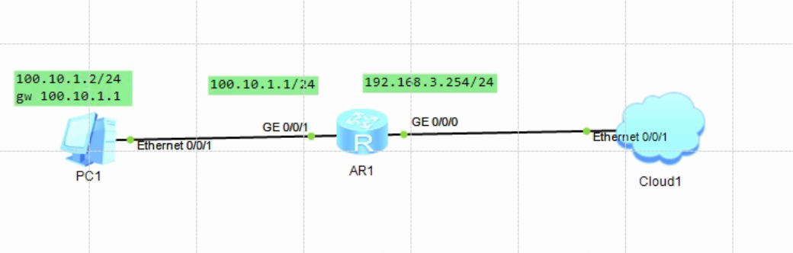

[toc]


## install


```
C:\app\ensp\eNSP\tools
WinPacp_4_13.exe
```


```
dis ip routing-table
```


##  1 nat pc 2 public





AR2240


```
int g 0/0/1
ip a 100.10.1.1 24

ping -a 100.10.1.1 100.10.1.2  // ok


int g 0/0/0
ip a  192.168.3.254  24

ping -a 192.168.3.254 192.168.3.1 // ok


ping -a 100.10.1.1  192.168.3.1 // no ok


// 配置默认路由
ip route-static  0.0.0.0  0.0.0.0  192.168.3.1

ping -a 192.168.3.254 114.114.114.114 // ok
ping -a 100.10.1.1  114.114.114.114 // no ok


int g 0/0/0
nat static global 192.168.3.253 inside 100.10.1.2


// test
pc1
ping 114.114.114.114     /ok


int g 0/0/0
dis thi

interface GigabitEthernet0/0/0
 ip address 192.168.3.254 255.255.255.0 
 nat static global 192.168.3.253 inside 100.10.1.2 netmask 255.255.255.255
return

```


## 2 nat-hostOnlyVm-2-public


```
host only vm

11.1.0.2/24
11.1.0.1 gw


cat /etc/sysconfig/network-scripts/ifcfg-eth0 
NAME=eth0
DEVICE=eth0
ONBOOT=yes
TYPE=Ethernet
BOOTPROTO=none
IPADDR=11.1.0.2
NETMASK=255.255.255.0
GATEWAY=11.1.0.1
DNS1=114.114.114.114
```


```bash
## AR2240

sys

int g 0/0/1
ip a 11.1.0.1 24

ping -a 11.1.0.1 11.1.0.2 // ok


int g 0/0/0
ip a  192.168.3.254  24

ping -a 192.168.3.254 192.168.3.1 // ok


ping -a 11.1.0.1  192.168.3.1 // no ok


// 配置默认路由
ip route-static  0.0.0.0  0.0.0.0  192.168.3.1

ping -a 192.168.3.254  114.114.114.114 # ok
ping -a 11.1.0.1  114.114.114.114  # no ok


int g 0/0/0
nat static global 192.168.3.253 inside 11.1.0.2


// test host only vm

ping 114.114.114.114     #ok


#### 查看接口配置

int g 0/0/0
dis thi

interface GigabitEthernet0/0/0
 ip address 192.168.3.254 255.255.255.0 
 nat static global 192.168.3.253 inside 11.1.0.2 netmask 255.255.255.255
return

```


##  3 nat-hostOnlyVm-2-public-with-switch


```
AR2240
S5700
```


```
host only vm2

11.1.0.2/24
11.1.0.1 gw


cat /etc/sysconfig/network-scripts/ifcfg-eth0 
NAME=eth0
DEVICE=eth0
ONBOOT=yes
TYPE=Ethernet
BOOTPROTO=none
IPADDR=11.1.0.2
NETMASK=255.255.255.0
GATEWAY=11.1.0.1
DNS1=114.114.114.114


host only vm3

11.1.0.3/24
11.1.0.1 gw


cat /etc/sysconfig/network-scripts/ifcfg-eth0 
NAME=eth0
DEVICE=eth0
ONBOOT=yes
TYPE=Ethernet
BOOTPROTO=none
IPADDR=11.1.0.3
NETMASK=255.255.255.0
GATEWAY=11.1.0.1
DNS1=114.114.114.114
```


```
## AR2240

sys

int g 0/0/1
ip a 11.1.0.1 24

ping -a 11.1.0.1 11.1.0.2 // ok
ping -a 11.1.0.1 11.1.0.3 // ok


int g 0/0/0
ip a  192.168.3.254  24

ping -a 192.168.3.254 192.168.3.1 // ok


// 配置默认路由
ip route-static  0.0.0.0  0.0.0.0  192.168.3.1

ping -a 192.168.3.254  114.114.114.114 # ok


int g 0/0/0
nat static global 192.168.3.252 inside 11.1.0.2
nat static global 192.168.3.253 inside 11.1.0.3


// test host only vm2 vm3


ping 114.114.114.114     #ok


#### 查看接口配置

int g 0/0/0

interface GigabitEthernet0/0/0
 ip address 192.168.3.254 255.255.255.0 
 nat static global 192.168.3.252 inside 11.1.0.2 netmask 255.255.255.255
 nat static global 192.168.3.253 inside 11.1.0.3 netmask 255.255.255.255
#
return

```


## 4 nat-differentNetHostOnlyVm-2-public-with-switch


```
AR2240
S5700
```


```bash
##### 

host only vm-250

11.1.0.250/24
11.1.0.1 gw


cat /etc/sysconfig/network-scripts/ifcfg-eth0 
NAME=eth0
DEVICE=eth0
ONBOOT=yes
TYPE=Ethernet
BOOTPROTO=none
IPADDR=11.1.0.250
NETMASK=255.255.255.0
GATEWAY=11.1.0.1
DNS1=114.114.114.114


##### 

host only vm-251

11.1.0.251/24
11.1.0.1 gw


cat /etc/sysconfig/network-scripts/ifcfg-eth0 
NAME=eth0
DEVICE=eth0
ONBOOT=yes
TYPE=Ethernet
BOOTPROTO=none
IPADDR=11.1.0.251
NETMASK=255.255.255.0
GATEWAY=11.1.0.1
DNS1=114.114.114.114


##### 

host only vm-252

12.1.0.252/24
12.1.0.1 gw


cat /etc/sysconfig/network-scripts/ifcfg-eth0 
NAME=eth0
DEVICE=eth0
ONBOOT=yes
TYPE=Ethernet
BOOTPROTO=none
IPADDR=12.1.0.252
NETMASK=255.255.255.0
GATEWAY=12.1.0.1
DNS1=114.114.114.114


#####
host only vm-253

12.1.0.253/24
12.1.0.1 gw


cat /etc/sysconfig/network-scripts/ifcfg-eth0 
NAME=eth0
DEVICE=eth0
ONBOOT=yes
TYPE=Ethernet
BOOTPROTO=none
IPADDR=12.1.0.253
NETMASK=255.255.255.0
GATEWAY=12.1.0.1
DNS1=114.114.114.114
```


```bash
## AR2240

sys


#####
int g 0/0/1
ip a 11.1.0.1 24

#####
int g 0/0/2
ip a 12.1.0.1 24


#####
int g 0/0/0
ip a  192.168.3.254  24


#####  配置默认路由
ip route-static  0.0.0.0  0.0.0.0  192.168.3.1

##### test 
ping -a 192.168.3.254  114.114.114.114 # ok


##### 配置nat
int g 0/0/0
nat static global 192.168.3.250 inside 11.1.0.250
nat static global 192.168.3.251 inside 11.1.0.251
nat static global 192.168.3.252 inside 12.1.0.252
nat static global 192.168.3.253 inside 12.1.0.253


##### test hostOnly  vm-250 vm-251 vm-252 vm-253


ping 114.114.114.114     #ok


##### 查看接口配置

int g 0/0/0

[V200R003C00]
#
interface GigabitEthernet0/0/0
 ip address 192.168.3.254 255.255.255.0 
 nat static global 192.168.3.250 inside 11.1.0.250 netmask 255.255.255.255
 nat static global 192.168.3.251 inside 11.1.0.251 netmask 255.255.255.255
 nat static global 192.168.3.252 inside 12.1.0.252 netmask 255.255.255.255
 nat static global 192.168.3.253 inside 12.1.0.253 netmask 255.255.255.255
#
return
[Huawei-GigabitEthernet0/0/0]
```


```bash
# 两个网段是直连路由 本来就是通的


dis ip routing-table 


Destination/Mask    Proto   Pre  Cost      Flags NextHop         Interface

0.0.0.0/0          Static  60   0          RD   192.168.3.1     GigabitEthernet 0/0/0


11.1.0.0/24         Direct  0    0           D   11.1.0.1        GigabitEthernet 0/0/1
11.1.0.1/32         Direct  0    0           D   127.0.0.1       GigabitEthernet 0/0/1
11.1.0.255/32       Direct  0    0          D   127.0.0.1     GigabitEthernet 0/0/1


12.1.0.0/24         Direct  0    0           D   12.1.0.1        GigabitEthernet0/0/2
12.1.0.1/32         Direct  0    0           D   127.0.0.1       GigabitEthernet0/0/2
12.1.0.255/32       Direct  0    0           D   127.0.0.1       GigabitEthernet0/0/2

127.0.0.0/8         Direct  0    0           D   127.0.0.1       InLoopBack0
127.0.0.1/32        Direct  0    0           D   127.0.0.1       InLoopBack0
127.255.255.255/32  Direct  0    0      D   127.0.0.1       InLoopBack0


192.168.3.0/24  Direct  0    0           D   192.168.3.254   GigabitEthernet0/0/0


192.168.3.250/32  Unr     64   0           D   127.0.0.1       InLoopBack0
192.168.3.251/32  Unr     64   0           D   127.0.0.1       InLoopBack0
192.168.3.252/32  Unr     64   0           D   127.0.0.1       InLoopBack0
192.168.3.253/32  Unr     64   0           D   127.0.0.1       InLoopBack0

192.168.3.254/32  Direct  0    0           D   127.0.0.1       GigabitEthernet 0/0/0
192.168.3.255/32  Direct  0    0           D   127.0.0.1       GigabitEthernet 0/0/0


255.255.255.255/32  Direct  0    0           D   127.0.0.1       InLoopBack0
```


```bash
## save config
save all nat2public.cfg
startup saved-configuration  nat2public.cfg
```


#  vmware workstaion hostonly network


| vmware   network name | type      | config                                | 子网        |      |      |
| --------------------- | --------- | ------------------------------------- | ----------- | ---- | ---- |
| VMnet11               | host only | 将主机虚拟适配器连接到此网络/关闭dhcp | 11.1.0.0/24 |      |      |
| VMnet12               | host only | 将主机虚拟适配器连接到此网络/关闭dhcp | 12.1.0.0/24 |      |      |
| VMnet13               | host only | 将主机虚拟适配器连接到此网络/关闭dhcp | 13.1.0.0/24 |      |      |
|                       |           |                                       |             |      |      |
|                       |           |                                       |             |      |      |


ensp cloud


路由器设置默认路由

```

ip route-static 0.0.0.0 0.0.0.0 192.168.3.1

ping 114.114.114.114 ok


```


