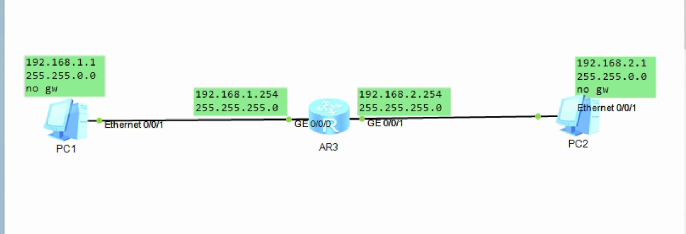
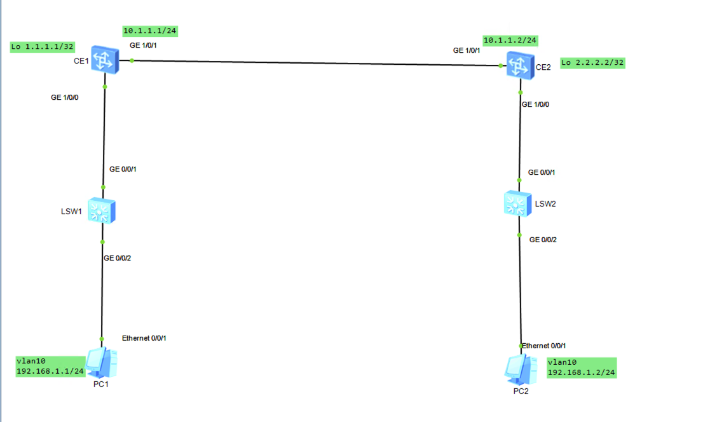
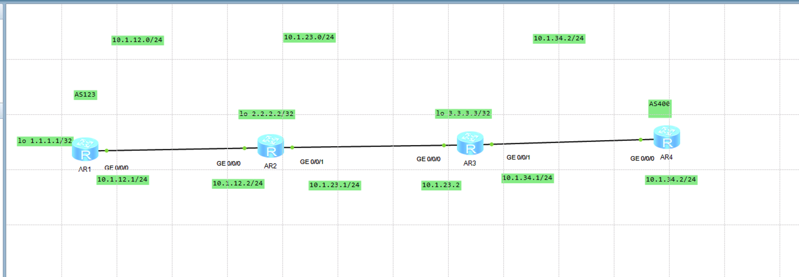
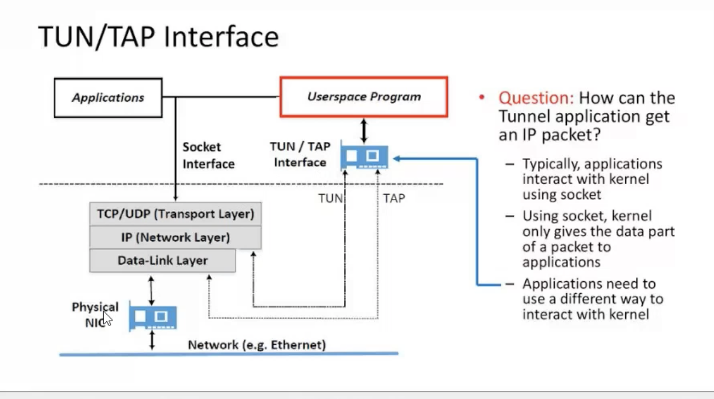

[toc]


[toc]


## 00 

overheads  开销


## 01 2022-04-15

cilium

calico

flannel

ensp 

明细路由

BGP

OSPF

xdp

dpdk

ipvlan


## 02 2022-04-18


## 03 2022-04-19


###  k8s1.23.5


## 04 2022-04-20

网络基础


## 05 2022-04-22


cni

ipvlan cni


overlay 隧道

underlay  


ipvlan 没有lay

macla 没有lay

SR-IOV  x710

dpdk   pmd

vpp  


docker host gateway

```
docker network create -d bridge --subnet 172.19.0.0/16 br19

docker run --name d01 --network br19 -td xxximag


route add -net 172.19.0.0/16 gw 192.168.2.61

两边都加


不做snat 怎么实现
```


docker vxlan


```
直连路由
tcpdump -pne  -i eth0
-p 关闭混杂模式
```


## 06 2022-04-25-pass


```
cilium  v1.10

https://docs.cilium.io/en/v1.10/gettingstarted/


CONFIG_BPF=y
CONFIG_BPF_SYSCALL=y
CONFIG_NET_CLS_BPF=y
CONFIG_BPF_JIT=y
CONFIG_NET_CLS_ACT=y
CONFIG_NET_SCH_INGRESS=y
CONFIG_CRYPTO_SHA1=y
CONFIG_CRYPTO_USER_API_HASH=y
CONFIG_CGROUPS=y
CONFIG_CGROUP_BPF=y


安装最新版   不使用 cilium 命令行 方法安装

curl -L --remote-name-all \
https://github.com/cilium/cilium-cli/releases/latest/download/cilium-linux-amd64.tar.gz{,.sha256sum}

sha256sum --check cilium-linux-amd64.tar.gz.sha256sum

sudo tar xzvfC cilium-linux-amd64.tar.gz /usr/local/bin

rm cilium-linux-amd64.tar.gz{,.sha256sum}

cilium status
cilium versin
cilium install

cilium status

get cilium configmap  配置存放位置


cilium uninstall

```


```
heml template

heml install --dry-run  --set name=cilium cilium ./tplate_dir > cilium.yml


heml add 
helm repo add
helm  repo update


Default Configuration:

Datapath	IPAM	Datastore
Encapsulation	Cluster Pool	Kubernetes CRD


https://docs.cilium.io/en/v1.10/gettingstarted/kubeproxy-free/#kubeproxy-free
```


```
https://docs.cilium.io/en/v1.10/gettingstarted/k8s-install-kubeadm/


```


```
helm template cilium cilium/cilium \
--set version=1.10.6 \
--set namespace=kube-system \
--set kubeProxyReplacement=strict\
--set k8sServiceHost=172.16.100.201\
--set k8sServicePort=6443 > cilium_1.10.6yaml
```


```
vim cilium_1.10.6yaml

debug true
debug-verbose: "datapath"


monitor-aggregaton: none

Encapsulation mode for communication between nodes
-disabled
-vxlan (default)
--geneve


```


```
debug true
debug-verbose: "datapath"
```


```
kubectl apply -f  cilium_1.10.6yaml
```


```
kubectl -n kube-system exec -it cilium-xxx -- bash

cilium status
KubeProxyReplacement: strict
Host Routing：  Legacy？？
Masquerading: IPTables ??
```


```
kubectl -n kube-system  logs  pod  | grep Falling 


requires enable-bpf-masquerade 
Falling back to enable-host-legacy-routing-true

```


```
vim cilium_1.10.6yaml


enable-bpf-masquerade: "true"

delete
kubectl apply -f xxx.yaml

kubectl -n kube-system logs cilium-xxx | grep subsys=daemon


cilium status
Host Routing BPF
Masquerading: BPF [ens33]

创建一个 deploy 
暴露 service 
检查 没有对应的iptables 就算ok 了

kube expose deploy 

iptables-save | grep svc_name 


```


extra


```
cilium status 

IPAM 3/254.  (可用地址1-254.  255广播)
Cluster Pods  cilium 接管的pod


cat /etc/cni/net.d/05-cilium.conf

type: cilium-cni
```


```
https://docs.cilium.io/en/v1.10/gettingstarted/cni-chaining/
```


## 07 2022-04-27-pass


```
vxlan

mac in udp


ip mac


二层 mac
三层 ip
```


vxlan


https://support.huawei.com/enterprise/zh/doc/EDOC1100087027


```
stp
逻辑上阻塞 某个端口
stp 导致带宽利用率 降低
```


```
mstp
vrrp
```


vrrp+smtp


http://www.h3c.com/cn/d_201305/785647_30003_0.htm


```
ecmp 协议
vm  +  L2 +  leaf + L3 + spine (去掉汇聚层 不再使用二层的防环机制)
```


```
linux vxlan  点对点

两个服务器 L3 即可


vni


ip link add vxlan0 type vxlan id 5 dstport 4789 remote  192.168.2.62 local 192.168.2.61 dev ens33

ip -d link show vxlan0

vni id 5

4789  端口是udp 端口


ip addr add 20.1.1.2/24 dev vxlan0
ip link set vxlan0 up


测试
ping -I x.x.x.x x.x.x.x

tcpdump -pne -i ens33 icmp
tcpdump -vvv -pne -i ens33 icmp


p 关闭混杂模式  否则除了这两个服务器的其他服务器上 也能抓到包


清理arp

arp -d 10.0.1.1


```


```
vxlan group 多播组

没有local remote 


ip link add vxlan0 type vxlan id 6 dstport 4789 group 239.1.1.1 dev ens33

ip addr add 10.20.1.3/24 dev vxlan0

ip link set vxlan0 up

4789 端口到底是谁的


```


```
bgp 边界网关协议
bgp  rr    bgp 路由反射器
vtep 

bgp evpn peer 解决 full mesh 问题


vtep  把自己的信息 告诉 bgp rr 
vtep 从 bgp rr 获取其他vtep的信息


full mesh 全链接
每个vtep都连路由器

```


evpn


https://support.huawei.com/enterprise/zh/doc/EDOC1100164807?idPath=24030814


https://arthurchiao.art/blog/spine-leaf-design-zh/


```
cilium


1.11
ipv4-native-routing-cidr: x.x.x.x/y
如果不设置会做snat


1.10
native-routing-cidr: x.x.x.x/y


进入cilium 容器 查看某个 vni id


cilium endpoint list

cilium identity list


lxc86xxxx  veth pair 的一端  抓包 有去无回
单向的

回来的在哪里 ？？

```


## 08 2022-04-29-pass


```
host-routing   is XDP（eXpress Data Path） xdp not kernel bypath
```


cilium  vxlan


overhead


https://cilium.io/blog/2021/05/11/cni-benchmark


https://cilium.io/blog/2020/11/10/cilium-19


```
eBPF host routing

bpf_redirect_peer   进到pod内部
bpf_redirect_neigh  pod 出来
```


```
overhead
```


```
cilium datapath

```


```
two pod on same node

tcpdump -pne -i eth0  (in pod)

-p 关闭混杂模式
tcpdump -pne -i (veth pair in root ns)
```


```
pod 内部网卡 32位掩码 相当于没有和它是一个网段的，直接走了默认路由 走三层
返回的不是网关的mac 地址，（返回的是 veth pari in root ns  网卡设备的mac）


arp 查询

只有 request 没有 reply
```


```
tc filter show ingress
tc filter show egress dev lxcssxwerr
```


```
kubectl -n kube-system exec -t cilium-xxx -- bash

cilium monitor 

cilium monitor -vv   >  xx.txt

identify=xxx

cilium identify list

pod-1 pod-2 on save node

Conntrack lookup  (in pod 1 发出去的) 

Conntrack lookup  (in pod 2 收进来的)


同节点的pod 才用到  eBPF host routing


```


```
1  tcpdup
2  cilium monitor
3  iptables trace-id
4  pwru
```


```
pwru --filter-dst-ip x.x.x.x --filter-proto icmp --output-stack

pwru --filter-dst-ip x.x.x.x --filter-proto icmp --output-tuple
```


```
__ip_local_out
```


```
host reachable services
```


```
cilium 16进制
```


```
next cilium vxlan 扩节点
```


## 09 2022-05-01-pass


```
1 cilium vxlan pod  on  diffent node 
```


```
Hairpin  mode
bpftool net show
bpftool map list --bpffs -j | jq 

bpftool map dump id 92 (16 进制 c0 192)
cilium bpf  tunnel list
```


```
dma
sk buffer
```


```
tcpdump
cilium monitor -vv
```


```
cilium endpoint list
```


```
跨节点通信 什么时候做snat 什么时候不做snat ？？？
cidrxxxx
native-routing 下的参数
```


```
Conntrack lookup
```


https://cilium.io/blog/2021/05/11/cni-benchmark


```
bpftool net show

tc：hoook
```


```
tc filter show dev lxcxxxxx ingress

tc filter show dev lxcxxxxx engress
```


```
cilium tunnel list
```


## 10 2022-05-04-pass


### Native-Routing


https://docs.cilium.io/en/stable/concepts/networking/routing/#id2


https://isovalent.com/blog/post/2021-12-08-ebpf-servicemesh


```
native routing  要求，node l2 可达
```


```
pod  对虚拟机
```


```
精简路由条目
聚合
路由聚合

l3 路由 (no nat )每一跳 都会变mac 地址 但是ip 不变
```


```
查询路由表规则
最长匹配优先  优先最精确的路由  
```


https://support.huawei.com/hedex/hdx.do?docid=EDOC1100196230&lang=zh&id=ZH-CN_CONCEPT_0177102067


https://docs.cilium.io/en/stable/gettingstarted/bird/


```
bird

yum install net-tools bird bird6 -y


```


### ensp


```
## static  route


ar2240


# AR3

sys
sysname AR3

int g0/0/1
ip a 10.0.0.1 24


int g0/0/0
ip a 192.168.2.61 24

dis thi


# AR4
sys
sysname AR4

int g0/0/1
ip a 10.0.1.1 24


int g0/0/0
ip a 192.168.2.62 24

dis thi


dis ip routing-table


AR3
sys
ip route-static 10.0.1.0 24 192.168.2.62


AR4
sys
ip route-static 10.0.0.0 24 192.168.2.61


### OSPF (动态路由)

查看ip
dis ip int b


route1
undo ip route-static 10.0.1.0 24 192.168.2.62


sys
ospf router-id 192.168.2.61
area 0
network 0.0.0.0 255.255.255.255
dis thi


dis ospf peer brief
·


route2

undo ip route-static 10.0.0.0 24 192.168.2.61


sys
ospf router-id 192.168.2.62
area 0
network 0.0.0.0 255.255.255.255
dis thi


dis ospf peer brief


### BGP  边界网关协议

1
sys
undo ospf 1


bgp 12
router-id 192.168.2.61
peer 192.168.2.62 as-number 12
network  10.0.0.0 255.255.255.0

dis thi


2
sys
undo ospf 1


bgp 12

router-id  192.168.2.62

[AR4-bgp]router-id 192.168.2.62
[AR4-bgp]peer 192.168.2.61 as-number 12

network  10.0.1.0 255.255.255.0


dis thi


dis bgp routing-table

```


bgp


https://support.huawei.com/hedex/hdx.do?docid=EDOC1100196230&lang=zh&id=ZH-CN_CONCEPT_0177102067


```
test Native-Routing
```


https://docs.cilium.io/en/latest/concepts/networking/routing/#native-routing


```
路由聚合
```


01:51


```
Each individual node is made aware of all pod IPs of all other nodes and routes are inserted into the Linux kernel routing table to represent this. If all nodes share a single L2 network, then this can be taken care of by enabling the option auto-direct-node-routes: true. Otherwise, an additional system component such as a BGP daemon must be run to distribute the routes. See the guide Using kube-router to run BGP on how to achieve this using the kube-router project.
```


```
L2  可以直接使用。auto-direct-node-routes true
L3 需要
```


```
tunnel: disabled: Enable native routing mode.
ipv4-native-routing-cidr: x.x.x.x/y: Set the CIDR in which native routing can be performed  snat??
```


为了运行本机路由模式，连接运行Cilium的主机的网络必须能够使用提供给POD或其他工作负载的地址转发IP流量。


节点上的Linux内核必须知道如何转发运行Cilium的所有节点的POD包或其他工作负载。这可以通过两种方式实现：


节点本身不知道如何路由所有pod IP，但网络上有一个路由器知道如何到达所有其他pod。在这种情况下，Linux节点被配置为包含指向此类路由器的默认路由。该模型用于云提供商网络集成。有关更多详细信息，请参阅谷歌云、AWS ENI和Azure IPAM。


每个节点都知道所有其他节点的所有pod IP，并将路由插入Linux内核路由表中以表示这一点。如果所有节点共享一个L2网络，则可以通过启用选项auto direct node routes:true来解决这一问题。否则，必须运行额外的系统组件（如BGP守护进程）来分发路由。请参阅使用kube router运行BGP的指南，了解如何使用kube router项目实现这一点。


```
rpcapd
```


## 11 2022-05-06-pass


Host-Reachable Services  + DSR

https://docs.cilium.io/en/latest/gettingstarted/host-services/#host-reachable-services


```
Host-Reachable Services

开启 Host-Reachable Services


kind 

--set hostServices.enable=true

tcpdump -p 关掉混杂模式


tcp 查看三次握手地址 


cilium-agnet --help 

```


------


```

dsr 南北
```


dsr


https://docs.cilium.io/en/latest/gettingstarted/kubeproxy-free/#direct-server-return-dsr


```
require native-routing
```


```
reverse  snat
```


```
helm install cilium ./cilium \
    --namespace kube-system \
    --set tunnel=disabled \  
    --set autoDirectNodeRoutes=true \
    --set kubeProxyReplacement=strict \
    --set loadBalancer.mode=dsr \
    --set k8sServiceHost=REPLACE_WITH_API_SERVER_IP \
    --set k8sServicePort=REPLACE_WITH_API_SERVER_PORT
```


```
monitor-aggregation: "medium"


  ipv4-native-routing-cidr: 10.0.0.0/8
  monitor-aggregation: "none"
  enable-bpf-masquerade: "true"
  enable-endpoint-routes: "false"
```


node port test 


只有http requst 

没有http 200 ok

## 12 2022-05-08-pass


cluster mesh


https://cilium.io/blog/2019/03/12/clustermesh/


```
https://cilium.io/blog/2019/03/12/clustermesh/
```


https://docs.cilium.io/en/v1.11/gettingstarted/clustermesh/clustermesh/#clustermesh


```
kind get clusters
```


```
kubectl --context kind-c1 get pods 
```


```
kind: Cluster
apiVersion: Kind.x-k8s.io/v1alpha4
networking:
        disaleDefaultCNI: true
        kubeProxyMode: "ipvs"
nodes:
        - role: control-plane
        - role: worker
        - role: worker
        
        
kind create         
```


https://metallb.universe.tf/


### kind


docker

heml

cilium cli


```
wget  https://github.com/cilium/cilium-cli/releases/download/v0.11.5/cilium-linux-amd64.tar.gz
```


https://kind.sigs.k8s.io/docs/user/quick-start/#installing-with-a-package-manager


```
curl -Lo ./kind https://kind.sigs.k8s.io/dl/v0.12.0/kind-linux-amd64
chmod +x ./kind
mv ./kind  /usr/local/bin/
```


```
 docker pull kindest/node:v1.23.4
```


```
apt-get install   kubectl=1.23.4-00 -y
```


```
cat >  kind-config1.yaml   <<  EOF
kind: Cluster
apiVersion: kind.x-k8s.io/v1alpha4
nodes:
- role: control-plane
- role: worker
networking:
  disableDefaultCNI: true
  podSubnet: "10.10.0.0/16"
  serviceSubnet: "10.11.0.0/16"
EOF
```


```
kind  delete  clusters  c1
```


-----


```
kind create cluster --config ./kind-config1.yaml --name c1  --image kindest/node:v1.23.4
```


```
kubectl cluster-info --context kind-c1
```


```
kubectl config view
```


------


```
kubectl config use-context kind-c1
```


```
helm repo add cilium https://helm.cilium.io/
```


```
helm install cilium cilium/cilium --version 1.11.1 \
  --namespace kube-system \
  --set ipam.mode=kubernetes \
  --set cluster.id=1 \
  --set cluster.name=cluster1 \
  --set hubble.relay.enabled=true \
  --set  hubble.ui.enabled=true  
```


```
helm repo add bitnami https://charts.bitnami.com/bitnami
```


```
cat >  configmap1.yaml   <<  EOF
configInline:
  peers:
  address-pools:
  - name: default
    protocol: layer2
    addresses:
    - 172.18.0.50-172.18.0.99
EOF
```


```
helm install metallb bitnami/metallb \
  --namespace kube-system \
  -f ./configmap1.yaml
```


```
cilium clustermesh enable --create-ca --service-type LoadBalancer

cilium  status
```


```
kubectl get secret --context kind-c1 -n kube-system cilium-ca -o yaml > cilium-ca.yaml
```


-----


```
kind  delete  clusters  c2
```


```
cat >  kind-config2.yaml   <<  EOF
kind: Cluster
apiVersion: kind.x-k8s.io/v1alpha4
nodes:
- role: control-plane
- role: worker
networking:
  disableDefaultCNI: true
  podSubnet: "10.20.0.0/16"
  serviceSubnet: "10.21.0.0/16"
EOF
```


```
kind create cluster --config ./kind-config2.yaml --name c2  --image kindest/node:v1.23.4
```


```
kubectl config use-context kind-c2
```


```
helm install cilium cilium/cilium --version=1.11.1 \
  --namespace kube-system \
  --set ipam.mode=kubernetes \
  --set cluster.id=2 \
  --set cluster.name=cluster2 \
  --set hubble.relay.enabled=true \
  --set  hubble.ui.enabled=true  
```


```
cat >  configmap2.yaml   <<  EOF
configInline:
  peers:
  address-pools:
  - name: default
    protocol: layer2
    addresses:
    - 172.18.0.100-172.18.0.149
EOF
```


```
helm install metallb bitnami/metallb \
  --namespace kube-system \
  -f ./configmap2.yaml
```


```
kubectl apply -f cilium-ca.yaml --context kind-c2
```


```
cilium clustermesh enable  --service-type LoadBalancer
```


```
root@172-16-100-7:~# cilium clustermesh  status --context kind-c1
✅ Cluster access information is available:
  - 172.18.0.50:2379
✅ Service "clustermesh-apiserver" of type "LoadBalancer" found
🔌 Cluster Connections:
🔀 Global services: [ min:0 / avg:0.0 / max:0 ]


cilium clustermesh  status --context kind-c2
✅ Cluster access information is available:
  - 172.18.0.100:2379
✅ Service "clustermesh-apiserver" of type "LoadBalancer" found
🔌 Cluster Connections:
🔀 Global services: [ min:0 / avg:0.0 / max:0 ]
root@172-16-100-7:~# 
```


```
cilium clustermesh connect --context kind-c2 --destination-context kind-c1
```


```
cilium clustermesh  status --context kind-c1

✅ Cluster access information is available:
  - 172.18.0.50:2379
✅ Service "clustermesh-apiserver" of type "LoadBalancer" found
✅ All 2 nodes are connected to all clusters [min:1 / avg:1.0 / max:1]
🔌 Cluster Connections:
- cluster2: 2/2 configured, 2/2 connected
🔀 Global services: [ min:5 / avg:5.0 / max:5 ]


cilium clustermesh  status --context kind-c2


✅ Cluster access information is available:
  - 172.18.0.100:2379
✅ Service "clustermesh-apiserver" of type "LoadBalancer" found
✅ All 2 nodes are connected to all clusters [min:1 / avg:1.0 / max:1]
🔌 Cluster Connections:
- cluster1: 2/2 configured, 2/2 connected
🔀 Global services: [ min:5 / avg:5.0 / max:5 ]


```


验证


```
## Verify:
kubectl apply -f https://raw.githubusercontent.com/cilium/cilium/1.11.2/examples/kubernetes/clustermesh/global-service-example/cluster1.yaml --context kind-c1
kubectl apply -f https://raw.githubusercontent.com/cilium/cilium/1.11.2/examples/kubernetes/clustermesh/global-service-example/cluster2.yaml --context kind-c2
```


```
root@172-16-100-7:~# kubectl  get pod  --context=kind-c2    -o wide
NAME                          READY   STATUS    RESTARTS   AGE    IP            NODE        NOMINATED NODE   READINESS GATES
rebel-base-6985d8f76f-gm82t   1/1     Running   0          11m    10.20.1.217   c2-worker   <none>           <none>
rebel-base-6985d8f76f-wttww   1/1     Running   0          11m    10.20.1.82    c2-worker   <none>           <none>
x-wing-6d58648f95-qnxgg       1/1     Running   0          2m2s   10.20.1.236   c2-worker   <none>           <none>
x-wing-6d58648f95-r2xcv       1/1     Running   0          114s   10.20.1.13    c2-worker   <none>           <none>

root@172-16-100-7:~# kubectl  get pod  --context=kind-c1    -o wide
NAME                          READY   STATUS    RESTARTS   AGE   IP            NODE        NOMINATED NODE   READINESS GATES
rebel-base-6985d8f76f-6ddwd   1/1     Running   0          12m   10.10.1.196   c1-worker   <none>           <none>
rebel-base-6985d8f76f-j5p7h   1/1     Running   0          12m   10.10.1.234   c1-worker   <none>           <none>
x-wing-6d58648f95-9kf22       1/1     Running   0          12m   10.10.1.218   c1-worker   <none>           <none>
x-wing-6d58648f95-ggbwg       1/1     Running   0          12m   10.10.1.152   c1-worker   <none>           <none>
root@172-16-100-7:~# 
```


```
kubectl  get svc --context kind-c1 | grep 'rebel-base'
rebel-base   ClusterIP   10.11.142.37   <none>        80/TCP    55s
```


```
kubectl  get svc --context kind-c2 | grep 'rebel-base'
rebel-base   ClusterIP   10.21.2.210   <none>        80/TCP    3s
```


x-wing  访问  global server   rebel-base


这里把  kind-c2 的  deployment/x-wing 当作客户端  用任何网络可达的 都可以当作客户端

```
kubectl --context kind-c2 exec -ti deployment/x-wing -- curl rebel-base  
```


```
for i in $(seq 1 10000); do kubectl --context kind-c2 exec -ti deployment/x-wing -- curl rebel-base  ;done
```


删除  kind-c1 的 pod

```
kubectl scale deployment rebel-base --replicas=0 --context kind-c1
```


```
kubectl  get pod  --context kind-c1
NAME                      READY   STATUS    RESTARTS   AGE
x-wing-6d58648f95-9kf22   1/1     Running   0          18m
x-wing-6d58648f95-ggbwg   1/1     Running   0          18m
root@172-16-100-7:~# 
```


用 kind-c1 当作客户端 

```
for i in $(seq 1 10000); do kubectl --context kind-c1 exec -ti deployment/x-wing -- curl rebel-base  ;done
```


----


##### connectivity test


```
cilium hubble port-forward&  --context kind-c1
```


```
root@172-16-100-7:~# cilium connectivity test --context kind-c1
ℹ️  Single-node environment detected, enabling single-node connectivity test
ℹ️  Monitor aggregation detected, will skip some flow validation steps
⌛ [kind-c1] Waiting for deployments [client client2 echo-same-node] to become ready...
⌛ [kind-c1] Waiting for deployments [] to become ready...
⌛ [kind-c1] Waiting for CiliumEndpoint for pod cilium-test/client-7568bc7f86-ccjtz to appear...
⌛ [kind-c1] Waiting for CiliumEndpoint for pod cilium-test/client2-686d5f784b-mbsdt to appear...
⌛ [kind-c1] Waiting for CiliumEndpoint for pod cilium-test/echo-same-node-5767b7b99d-4snb5 to appear...
⌛ [kind-c1] Waiting for Service cilium-test/echo-same-node to become ready...
⌛ [kind-c1] Waiting for NodePort 172.18.0.2:30173 (cilium-test/echo-same-node) to become ready...
⌛ [kind-c1] Waiting for NodePort 172.18.0.3:30173 (cilium-test/echo-same-node) to become ready...
ℹ️  Skipping IPCache check
⌛ [kind-c1] Waiting for pod cilium-test/client-7568bc7f86-ccjtz to reach default/kubernetes service...
⌛ [kind-c1] Waiting for pod cilium-test/client2-686d5f784b-mbsdt to reach default/kubernetes service...
🔭 Enabling Hubble telescope...
⚠️  Unable to contact Hubble Relay, disabling Hubble telescope and flow validation: rpc error: code = Unavailable desc = connection error: desc = "transport: Error while dialing dial tcp 127.0.0.1:4245: connect: connection refused"
ℹ️  Expose Relay locally with:
   cilium hubble enable
   cilium hubble port-forward&
ℹ️  Cilium version: 1.11.1
🏃 Running tests...

[=] Test [no-policies]
......................
[=] Test [allow-all-except-world]
........
[=] Test [client-ingress]
..
[=] Test [echo-ingress]
..
[=] Test [client-egress]
..
[=] Test [to-entities-world]
......
[=] Test [to-cidr-1111]
....
[=] Test [echo-ingress-l7]
..
[=] Test [client-egress-l7]
........
[=] Test [dns-only]
........
[=] Test [to-fqdns]
......
✅ All 11 tests (70 actions) successful, 0 tests skipped, 0 scenarios skipped.
root@172-16-100-7:~# 
```


```
root@172-16-100-7:~# cilium connectivity test --context kind-c2
ℹ️  Single-node environment detected, enabling single-node connectivity test
ℹ️  Monitor aggregation detected, will skip some flow validation steps
⌛ [kind-c2] Waiting for deployments [client client2 echo-same-node] to become ready...
⌛ [kind-c2] Waiting for deployments [] to become ready...
⌛ [kind-c2] Waiting for CiliumEndpoint for pod cilium-test/client-7568bc7f86-pqq2q to appear...
⌛ [kind-c2] Waiting for CiliumEndpoint for pod cilium-test/client2-686d5f784b-q4zvp to appear...
⌛ [kind-c2] Waiting for CiliumEndpoint for pod cilium-test/echo-same-node-5767b7b99d-mpfj5 to appear...
⌛ [kind-c2] Waiting for Service cilium-test/echo-same-node to become ready...
⌛ [kind-c2] Waiting for NodePort 172.18.0.5:31763 (cilium-test/echo-same-node) to become ready...
⌛ [kind-c2] Waiting for NodePort 172.18.0.4:31763 (cilium-test/echo-same-node) to become ready...
ℹ️  Skipping IPCache check
⌛ [kind-c2] Waiting for pod cilium-test/client-7568bc7f86-pqq2q to reach default/kubernetes service...
⌛ [kind-c2] Waiting for pod cilium-test/client2-686d5f784b-q4zvp to reach default/kubernetes service...
🔭 Enabling Hubble telescope...
⚠️  Unable to contact Hubble Relay, disabling Hubble telescope and flow validation: rpc error: code = Unavailable desc = connection error: desc = "transport: Error while dialing dial tcp 127.0.0.1:4245: connect: connection refused"
ℹ️  Expose Relay locally with:
   cilium hubble enable
   cilium hubble port-forward&
ℹ️  Cilium version: 1.11.1
🏃 Running tests...

[=] Test [no-policies]
......................
[=] Test [allow-all-except-world]
........
[=] Test [client-ingress]
..
[=] Test [echo-ingress]
..
[=] Test [client-egress]
..
[=] Test [to-entities-world]
......
[=] Test [to-cidr-1111]
....
[=] Test [echo-ingress-l7]
..
[=] Test [client-egress-l7]
........
[=] Test [dns-only]
........
[=] Test [to-fqdns]
......
✅ All 11 tests (70 actions) successful, 0 tests skipped, 0 scenarios skipped.
root@172-16-100-7:~# 
```


```
cilium hubble port-forward&  --context kind-c2
```


```
cilium hubble enable --context kind-c1
```


```
cilium connectivity test --context kind-c1
cilium connectivity test --context kind-c2
```


```
kubectl  get pod -n cilium-test  --context kind-c1
kubectl  get pod -n cilium-test  --context kind-c2
```


```
kubectl  delete  ns cilium-test  --context kind-c1
kubectl  delete  ns cilium-test  --context kind-c2
```


```
docker cp /usr/local/bin/cilium  c1-control-plane:/opt/

/opt/cilium connectivity test --context kind-c1


```


-----


命令行


```
kubectl  get pod -A --context kind-c1
kubectl  get pod -A --context kind-c2
```


```
docker exec -it c1-worker   crictl  images
docker exec -it c2-worker   crictl  images
```


```
docker exec -it c2-worker  crictl  pull quay.io/cilium/cilium:1.11.1
```


-----


----


##### 信息收集


```
kubectl  get pod -A --context kind-c1
NAMESPACE            NAME                                       READY   STATUS    RESTARTS   AGE
default              rebel-base-6985d8f76f-fd5hf                1/1     Running   0          15m
default              rebel-base-6985d8f76f-xrngp                1/1     Running   0          15m
default              x-wing-6d58648f95-578fj                    1/1     Running   0          15m
default              x-wing-6d58648f95-v59rt                    1/1     Running   0          15m
kube-system          cilium-45gtt                               1/1     Running   0          18m
kube-system          cilium-mkrgl                               1/1     Running   0          18m
kube-system          cilium-operator-67f9b484d8-92pkm           1/1     Running   0          86m
kube-system          cilium-operator-67f9b484d8-9f5wl           1/1     Running   0          56m
kube-system          clustermesh-apiserver-cbd4456bf-5s4nt      2/2     Running   0          23m
kube-system          coredns-64897985d-dqw6w                    1/1     Running   0          88m
kube-system          coredns-64897985d-xbcwh                    1/1     Running   0          88m
kube-system          etcd-c1-control-plane                      1/1     Running   0          88m
kube-system          hubble-relay-85664d47c4-zsf9p              1/1     Running   0          86m
kube-system          hubble-ui-7c6789876c-nkqpg                 3/3     Running   0          56m
kube-system          kube-apiserver-c1-control-plane            1/1     Running   0          88m
kube-system          kube-controller-manager-c1-control-plane   1/1     Running   0          88m
kube-system          kube-proxy-l6sph                           1/1     Running   0          87m
kube-system          kube-proxy-tkrng                           1/1     Running   0          88m
kube-system          kube-scheduler-c1-control-plane            1/1     Running   0          88m
kube-system          metallb-controller-66865674bf-6kn2x        1/1     Running   0          25m
kube-system          metallb-speaker-fc2vb                      1/1     Running   0          25m
local-path-storage   local-path-provisioner-5ddd94ff66-xb6rj    1/1     Running   0          88m


docker exec -it c1-worker   crictl  images

IMAGE                                      TAG                    IMAGE ID            SIZE
docker.io/bitnami/metallb-controller       0.12.1-debian-10-r61   81d1a3e4dc8ad       43.9MB
docker.io/bitnami/metallb-speaker          0.12.1-debian-10-r62   da61e66ac933a       44.8MB
docker.io/cilium/json-mock                 1.2                    094a89b064ebc       62.5MB
docker.io/kindest/kindnetd                 v20211122-a2c10462     ba113d2047d43       40.9MB
docker.io/rancher/local-path-provisioner   v0.0.14                e422121c9c5f9       13.4MB
k8s.gcr.io/build-image/debian-base         buster-v1.7.2          19bad6b08adae       21.1MB
k8s.gcr.io/coredns/coredns                 v1.8.6                 a4ca41631cc7a       13.6MB
k8s.gcr.io/etcd                            3.5.1-0                25f8c7f3da61c       98.9MB
k8s.gcr.io/kube-apiserver                  v1.23.4                0e16468a4aa36       79.6MB
k8s.gcr.io/kube-controller-manager         v1.23.4                65dd3c630e90e       68.1MB
k8s.gcr.io/kube-proxy                      v1.23.4                163898317bef2       113MB
k8s.gcr.io/kube-scheduler                  v1.23.4                696ef30502b11       54.8MB
k8s.gcr.io/pause                           3.6                    6270bb605e12e       302kB
docker.io/envoyproxy/envoy                 <none>                 fe28da4ca57ab       51.4MB
docker.io/library/nginx                    1.15.8                 f09fe80eb0e75       44.7MB
quay.io/cilium/cilium                      <none>                 11553cb737845       157MB
quay.io/cilium/clustermesh-apiserver       <none>                 8f52e3ea3edf9       15.5MB
quay.io/cilium/hubble-relay                <none>                 d42689b386ff3       10.2MB
quay.io/cilium/hubble-ui-backend           <none>                 a029b5706c2d2       14.4MB
quay.io/cilium/hubble-ui                   <none>                 154fa38916304       12.2MB
quay.io/cilium/operator-generic            <none>                 21681b3deb25a       16.3MB
quay.io/coreos/etcd                        v3.4.13                d1985d4043858       32.6MB


docker exec -it c1-control-plane    crictl  images


IMAGE                                      TAG                  IMAGE ID            SIZE
docker.io/kindest/kindnetd                 v20211122-a2c10462   ba113d2047d43       40.9MB
k8s.gcr.io/coredns/coredns                 v1.8.6               a4ca41631cc7a       13.6MB
k8s.gcr.io/etcd                            3.5.1-0              25f8c7f3da61c       98.9MB
k8s.gcr.io/kube-apiserver                  v1.23.4              0e16468a4aa36       79.6MB
quay.io/cilium/cilium                      <none>               11553cb737845       157MB
k8s.gcr.io/kube-proxy                      v1.23.4              163898317bef2       113MB
quay.io/cilium/operator-generic            <none>               21681b3deb25a       16.3MB
docker.io/rancher/local-path-provisioner   v0.0.14              e422121c9c5f9       13.4MB
k8s.gcr.io/build-image/debian-base         buster-v1.7.2        19bad6b08adae       21.1MB
k8s.gcr.io/kube-controller-manager         v1.23.4              65dd3c630e90e       68.1MB
k8s.gcr.io/kube-scheduler                  v1.23.4              696ef30502b11       54.8MB
k8s.gcr.io/pause                           3.6                  6270bb605e12e       302kB


kubectl  get pod -A --context kind-c2

NAMESPACE            NAME                                       READY   STATUS    RESTARTS   AGE
default              rebel-base-6985d8f76f-25sxq                1/1     Running   0          16m
default              rebel-base-6985d8f76f-zpzd2                1/1     Running   0          16m
default              x-wing-6d58648f95-t6dfl                    1/1     Running   0          16m
default              x-wing-6d58648f95-tw54m                    1/1     Running   0          16m
kube-system          cilium-4b4rw                               1/1     Running   0          19m
kube-system          cilium-operator-67f9b484d8-49lpr           1/1     Running   0          37m
kube-system          cilium-operator-67f9b484d8-h8ncw           1/1     Running   0          37m
kube-system          cilium-wsxzg                               1/1     Running   0          19m
kube-system          clustermesh-apiserver-866d964d6c-c4rdf     2/2     Running   0          21m
kube-system          coredns-64897985d-7wqgr                    1/1     Running   0          38m
kube-system          coredns-64897985d-ckgph                    1/1     Running   0          38m
kube-system          etcd-c2-control-plane                      1/1     Running   0          38m
kube-system          hubble-relay-85664d47c4-k8jhf              1/1     Running   0          37m
kube-system          hubble-ui-7c6789876c-h8rw5                 3/3     Running   0          37m
kube-system          kube-apiserver-c2-control-plane            1/1     Running   0          38m
kube-system          kube-controller-manager-c2-control-plane   1/1     Running   0          38m
kube-system          kube-proxy-6d89k                           1/1     Running   0          38m
kube-system          kube-proxy-dx28z                           1/1     Running   0          38m
kube-system          kube-scheduler-c2-control-plane            1/1     Running   0          38m
kube-system          metallb-controller-66865674bf-xdh9c        1/1     Running   0          26m
kube-system          metallb-speaker-zd5v4                      1/1     Running   0          26m
local-path-storage   local-path-provisioner-5ddd94ff66-vpbjb    1/1     Running   0          38m


docker exec -it c2-worker   crictl  images

IMAGE                                      TAG                    IMAGE ID            SIZE
docker.io/bitnami/metallb-controller       0.12.1-debian-10-r61   81d1a3e4dc8ad       43.9MB
docker.io/bitnami/metallb-speaker          0.12.1-debian-10-r62   da61e66ac933a       44.8MB
docker.io/cilium/json-mock                 1.2                    094a89b064ebc       62.5MB
quay.io/cilium/hubble-ui                   <none>                 154fa38916304       12.2MB
docker.io/kindest/kindnetd                 v20211122-a2c10462     ba113d2047d43       40.9MB
docker.io/library/nginx                    1.15.8                 f09fe80eb0e75       44.7MB
quay.io/cilium/cilium                      <none>                 11553cb737845       157MB
docker.io/rancher/local-path-provisioner   v0.0.14                e422121c9c5f9       13.4MB
k8s.gcr.io/build-image/debian-base         buster-v1.7.2          19bad6b08adae       21.1MB
k8s.gcr.io/coredns/coredns                 v1.8.6                 a4ca41631cc7a       13.6MB
k8s.gcr.io/etcd                            3.5.1-0                25f8c7f3da61c       98.9MB
k8s.gcr.io/kube-apiserver                  v1.23.4                0e16468a4aa36       79.6MB
k8s.gcr.io/kube-controller-manager         v1.23.4                65dd3c630e90e       68.1MB
k8s.gcr.io/kube-proxy                      v1.23.4                163898317bef2       113MB
k8s.gcr.io/kube-scheduler                  v1.23.4                696ef30502b11       54.8MB
docker.io/envoyproxy/envoy                 <none>                 fe28da4ca57ab       51.4MB
quay.io/cilium/hubble-relay                <none>                 d42689b386ff3       10.2MB
quay.io/cilium/hubble-ui-backend           <none>                 a029b5706c2d2       14.4MB
quay.io/cilium/operator-generic            <none>                 21681b3deb25a       16.3MB
k8s.gcr.io/pause                           3.6                    6270bb605e12e       302kB
quay.io/cilium/clustermesh-apiserver       <none>                 8f52e3ea3edf9       15.5MB
quay.io/coreos/etcd                        v3.4.13                d1985d4043858       32.6MB


docker exec -it c2-control-plane   crictl  images

IMAGE                                      TAG                  IMAGE ID            SIZE
quay.io/cilium/cilium                      <none>               11553cb737845       157MB
docker.io/kindest/kindnetd                 v20211122-a2c10462   ba113d2047d43       40.9MB
k8s.gcr.io/build-image/debian-base         buster-v1.7.2        19bad6b08adae       21.1MB
quay.io/cilium/operator-generic            <none>               21681b3deb25a       16.3MB
docker.io/rancher/local-path-provisioner   v0.0.14              e422121c9c5f9       13.4MB
k8s.gcr.io/coredns/coredns                 v1.8.6               a4ca41631cc7a       13.6MB
k8s.gcr.io/etcd                            3.5.1-0              25f8c7f3da61c       98.9MB
k8s.gcr.io/kube-apiserver                  v1.23.4              0e16468a4aa36       79.6MB
k8s.gcr.io/kube-controller-manager         v1.23.4              65dd3c630e90e       68.1MB
k8s.gcr.io/kube-proxy                      v1.23.4              163898317bef2       113MB
k8s.gcr.io/kube-scheduler                  v1.23.4              696ef30502b11       54.8MB
k8s.gcr.io/pause                           3.6                  6270bb605e12e       302kB


```


```
root@172-16-100-7:~# cilium clustermesh status  --context kind-c1
✅ Cluster access information is available:
  - 172.18.0.50:2379
✅ Service "clustermesh-apiserver" of type "LoadBalancer" found
✅ All 2 nodes are connected to all clusters [min:1 / avg:1.0 / max:1]
🔌 Cluster Connections:
- cluster2: 2/2 configured, 2/2 connected
🔀 Global services: [ min:6 / avg:6.0 / max:6 ]


root@172-16-100-7:~# cilium clustermesh status  --context kind-c2
✅ Cluster access information is available:
  - 172.18.0.100:2379
✅ Service "clustermesh-apiserver" of type "LoadBalancer" found
✅ All 2 nodes are connected to all clusters [min:1 / avg:1.0 / max:1]
🔌 Cluster Connections:
- cluster1: 2/2 configured, 2/2 connected
🔀 Global services: [ min:6 / avg:6.0 / max:6 ]
root@172-16-100-7:~# 
```


```
root@172-16-100-7:~# cilium status  --context kind-c1
    /¯¯\
 /¯¯\__/¯¯\    Cilium:         OK
 \__/¯¯\__/    Operator:       OK
 /¯¯\__/¯¯\    Hubble:         OK
 \__/¯¯\__/    ClusterMesh:    OK
    \__/

DaemonSet         cilium                   Desired: 2, Ready: 2/2, Available: 2/2
Deployment        cilium-operator          Desired: 2, Ready: 2/2, Available: 2/2
Deployment        hubble-relay             Desired: 1, Ready: 1/1, Available: 1/1
Deployment        hubble-ui                Desired: 1, Ready: 1/1, Available: 1/1
Deployment        clustermesh-apiserver    Desired: 1, Ready: 1/1, Available: 1/1
Containers:       hubble-relay             Running: 1
                  hubble-ui                Running: 1
                  clustermesh-apiserver    Running: 1
                  cilium                   Running: 2
                  cilium-operator          Running: 2
Cluster Pods:     11/11 managed by Cilium
Image versions    cilium                   quay.io/cilium/cilium:v1.11.1@sha256:251ff274acf22fd2067b29a31e9fda94253d2961c061577203621583d7e85bd2: 2
                  cilium-operator          quay.io/cilium/operator-generic:v1.11.1@sha256:977240a4783c7be821e215ead515da3093a10f4a7baea9f803511a2c2b44a235: 2
                  hubble-relay             quay.io/cilium/hubble-relay:v1.11.1@sha256:23d40b2a87a5bf94e0365bd9606721c96f78b8304b61725dca45a0b8a6048203: 1
                  hubble-ui                quay.io/cilium/hubble-ui:v0.8.5@sha256:4eaca1ec1741043cfba6066a165b3bf251590cf4ac66371c4f63fbed2224ebb4: 1
                  hubble-ui                quay.io/cilium/hubble-ui-backend:v0.8.5@sha256:2bce50cf6c32719d072706f7ceccad654bfa907b2745a496da99610776fe31ed: 1
                  hubble-ui                docker.io/envoyproxy/envoy:v1.18.4@sha256:e5c2bb2870d0e59ce917a5100311813b4ede96ce4eb0c6bfa879e3fbe3e83935: 1
                  clustermesh-apiserver    quay.io/coreos/etcd:v3.4.13: 1
                  clustermesh-apiserver    quay.io/cilium/clustermesh-apiserver:v1.11.1@sha256:5732f2ce99096d1c740f3805260dbcfefbe6d7d18d1ac07707ff4ef9536b0ec6: 1
root@172-16-100-7:~# 
root@172-16-100-7:~# 
root@172-16-100-7:~# 


root@172-16-100-7:~# cilium status  --context kind-c2
    /¯¯\
 /¯¯\__/¯¯\    Cilium:         OK
 \__/¯¯\__/    Operator:       OK
 /¯¯\__/¯¯\    Hubble:         OK
 \__/¯¯\__/    ClusterMesh:    OK
    \__/

DaemonSet         cilium                   Desired: 2, Ready: 2/2, Available: 2/2
Deployment        cilium-operator          Desired: 2, Ready: 2/2, Available: 2/2
Deployment        hubble-relay             Desired: 1, Ready: 1/1, Available: 1/1
Deployment        hubble-ui                Desired: 1, Ready: 1/1, Available: 1/1
Deployment        clustermesh-apiserver    Desired: 1, Ready: 1/1, Available: 1/1
Containers:       cilium                   Running: 2
                  cilium-operator          Running: 2
                  hubble-relay             Running: 1
                  hubble-ui                Running: 1
                  clustermesh-apiserver    Running: 1
Cluster Pods:     11/11 managed by Cilium
Image versions    cilium                   quay.io/cilium/cilium:v1.11.1@sha256:251ff274acf22fd2067b29a31e9fda94253d2961c061577203621583d7e85bd2: 2
                  cilium-operator          quay.io/cilium/operator-generic:v1.11.1@sha256:977240a4783c7be821e215ead515da3093a10f4a7baea9f803511a2c2b44a235: 2
                  hubble-relay             quay.io/cilium/hubble-relay:v1.11.1@sha256:23d40b2a87a5bf94e0365bd9606721c96f78b8304b61725dca45a0b8a6048203: 1
                  hubble-ui                quay.io/cilium/hubble-ui:v0.8.5@sha256:4eaca1ec1741043cfba6066a165b3bf251590cf4ac66371c4f63fbed2224ebb4: 1
                  hubble-ui                quay.io/cilium/hubble-ui-backend:v0.8.5@sha256:2bce50cf6c32719d072706f7ceccad654bfa907b2745a496da99610776fe31ed: 1
                  hubble-ui                docker.io/envoyproxy/envoy:v1.18.4@sha256:e5c2bb2870d0e59ce917a5100311813b4ede96ce4eb0c6bfa879e3fbe3e83935: 1
                  clustermesh-apiserver    quay.io/coreos/etcd:v3.4.13: 1
                  clustermesh-apiserver    quay.io/cilium/clustermesh-apiserver:v1.11.1@sha256:5732f2ce99096d1c740f3805260dbcfefbe6d7d18d1ac07707ff4ef9536b0ec6: 1
root@172-16-100-7:~# 
```


## 13 2022-05-09-pass


```
cilium bpf tunnel list

cilium service list

cilium identity list
```


https://01.org/blogs/xuyizhou/2021/accelerate-istio-dataplane-ebpf-part-1


https://thenewstack.io/how-ebpf-streamlines-the-service-mesh/


https://isovalent.com/blog/post/2021-12-08-ebpf-servicemesh


https://isovalent.com/blog/post/2022-05-03-servicemesh-security


----------------------------------- cilium end------------


## 14  2022-05-11-calico-pass


calico


https://projectcalico.docs.tigera.io/getting-started/kubernetes/quickstart


```
calicoctl  node status  --allow-version-mismatch
```


```
ospf bgp 
```


https://projectcalico.docs.tigera.io/maintenance/troubleshoot/vpp


vpp+dpdk


```
ecmp 
```


https://projectcalico.docs.tigera.io/reference/architecture/design/l3-interconnect-fabric


ospf/bgp  + ensp 


calico  基础架构


https://projectcalico.docs.tigera.io/getting-started/kubernetes/self-managed-onprem/onpremises#install-calico


https://projectcalico.docs.tigera.io/getting-started/kubernetes/self-managed-onprem/onpremises#install-calico-with-kubernetes-api-datastore-50-nodes-or-less


```
curl https://projectcalico.docs.tigera.io/manifests/calico.yaml -O
kubectl apply -f calico.yaml
```


```
cat >  kind-ex.yaml   <<  EOF
kind: Cluster
apiVersion: kind.x-k8s.io/v1alpha4
nodes:
        - role: control-plane
        - role: worker
        - role: worker
networking:
        disableDefaultCNI: true
        kubeProxyMode: "ipvs"
EOF
```


```
kind create cluster --config ./kind-ex.yaml  --name calico  --image kindest/node:v1.23.4
```


```
kubectl get pod -A  --context kind-calico
```


```
kubectl apply -f calico.yaml  --context kind-calico
```


```
kubectl  api-resources   --context kind-calico  |  grep ipam
ipamblocks                                     crd.projectcalico.org/v1               false        IPAMBlock
ipamconfigs                                    crd.projectcalico.org/v1               false        IPAMConfig
ipamhandles                                    crd.projectcalico.org/v1               false        IPAMHandle
root@172-16-100-7:~# 


kubectl  api-resources   --context kind-calico  |  grep ippools
ippools                                        crd.projectcalico.org/v1               false        IPPool
```


```
ps -ef | grep bird
root      576388  576293  0 20:50 ?        00:00:00 runsv bird
root      576390  576293  0 20:50 ?        00:00:00 runsv bird6
root      576829  576390  0 20:50 ?        00:00:01 bird6 -R -s /var/run/calico/bird6.ctl -d -c /etc/calico/confd/config/bird6.cfg
```


## 15 2022-05-13-calico-pass


calico-ipip


开启IPIP 禁用 vxlan


https://projectcalico.docs.tigera.io/reference/node/configuration


```
            # Enable IPIP
            - name: CALICO_IPV4POOL_IPIP
              value: "Always"
            # Enable or Disable VXLAN on the default IP pool.
            - name: CALICO_IPV4POOL_VXLAN
              value: "Never"
            # Enable or Disable VXLAN on the default IPv6 IP pool.
            - name: CALICO_IPV6POOL_VXLAN
              value: "Never"
```


calicoctl install


```
curl -L https://github.com/projectcalico/calico/releases/download/v3.23.1/calicoctl-linux-amd64 -o calicoctl
```


```
  Valid resource types are:

    * bgpConfiguration
    * bgpPeer
    * felixConfiguration
    * globalNetworkPolicy
    * globalNetworkSet
    * hostEndpoint
    * ipPool
    * ipReservation
    * kubeControllersConfiguration
    * networkPolicy
    * networkSet
    * node
    * profile
    * workloadEndpoint
```


```
calicoctl   get workloadEndpoint -o wide -A
```


```
ee:ee:ee:ee:ee:ee
```


```
calicoctl   get wep -o wide -A
```


```
cat > test-nginx.yaml <<EOF
apiVersion: v1
kind: Pod
metadata:
  name: nginx01
spec:
  containers:
  - name: nginx
    image: yimtune/nginx:1.21.6
    imagePullPolicy: IfNotPresent
    ports:
    - containerPort: 80
EOF
```


```
kubectl apply  -f test-nginx.yaml
```


```
kubectl   exec -it nginx01  --  route -n
Kernel IP routing table
Destination     Gateway         Genmask         Flags Metric Ref    Use Iface
0.0.0.0         169.254.1.1     0.0.0.0         UG    0      0        0 eth0
169.254.1.1     0.0.0.0         255.255.255.255 UH    0      0        0 eth0
```


https://projectcalico.docs.tigera.io/reference/faq#why-does-my-container-have-a-route-to-16925411


```
源IP 10.244.9.129/32 源mac ce:33:a7:1b:ba:db

目的ip 114.114.114.114  目的mac ?? ee:ee:ee:ee:ee:ee
```


```
kubectl   exec -it nginx01  --  arp -n
Address                  HWtype  HWaddress           Flags Mask            Iface
169.254.1.1              ether   ee:ee:ee:ee:ee:ee   C                     eth0
172.18.0.2               ether   ee:ee:ee:ee:ee:ee   C                     eth0
root@172-16-100-7:~# 


kubectl   exec -it nginx01  --  arp -a
? (169.254.1.1) at ee:ee:ee:ee:ee:ee [ether] on eth0
calico-worker.kind (172.18.0.2) at ee:ee:ee:ee:ee:ee [ether] on eth0


```


### proxy arp





pc1 pc2 位于同一个网络


https://support.huawei.com/enterprise/zh/doc/EDOC1000178148/84487237/configuring-proxy-arp


```
AR3260

sys


int g0/0/0
ip a 192.168.1.254 24


int g0/0/1
ip a 192.168.2.254 24


[Huawei-GigabitEthernet0/0/1]dis ip int b
*down: administratively down
^down: standby
(l): loopback
(s): spoofing
The number of interface that is UP in Physical is 3
The number of interface that is DOWN in Physical is 1
The number of interface that is UP in Protocol is 3
The number of interface that is DOWN in Protocol is 1

Interface                         IP Address/Mask      Physical   Protocol  
GigabitEthernet0/0/0              192.168.1.254/24     up         up        
GigabitEthernet0/0/1              192.168.2.254/24     up         up        
GigabitEthernet0/0/2              unassigned           down       down      
NULL0                             unassigned           up         up(s)     
[Huawei-GigabitEthernet0/0/1]


int g0/0/0
arp-proxy enable

int g0/0/1
arp-proxy enable


```


linux


```
echo 1 > /proc/sys/net/ipv4/conf/eth0/proxy_arp
```


### mac ee:ee:ee:ee:ee:ee


同节点 pod 通信


```
10.244.9.129/32   
```


两个个pod 32位掩码 不是同一网段   走路由 


同节点pod 设备标记表


|                 |                           |      |      |      |
| --------------- | ------------------------- | ---- | ---- | ---- |
| pod1-eht0       | pod1 eht0 网卡            |      |      |      |
| pod1-eht0-ip    | pod1 eht0 网卡ip          |      |      |      |
| pod1-eht0-mac   | pod1 eht0 网卡mac         |      |      |      |
| pod1-gw-ip      | pod1 默认网关ip           |      |      |      |
| pod1-gw-mac     | pod1 默认网关mac          |      |      |      |
| pod1-calico-mac | pod1 eht0 对端设备网卡mac |      |      |      |
| pod1-calico-ip  | pod1 eht0 对端设备网卡ip  |      |      |      |
| pod1-calico     | pod1 eht0 对端设备网卡    |      |      |      |
|                 |                           |      |      |      |
|                 |                           |      |      |      |
| pod2-eht0-ip    | pod2 eht0 网卡ip          |      |      |      |
| pod2-eht0-mac   | pod2 eht0 网卡mac         |      |      |      |
| pod2-gw-ip      | pod2 默认网关ip           |      |      |      |
| pod2-gw-mac     | pod2 默认网关mac          |      |      |      |
| pod2-calico-mac | pod2 eht0 对端设备网卡ip  |      |      |      |
| pod2-calico-ip  | pod2 eht0 对端设备网卡mac |      |      |      |
|                 |                           |      |      |      |
|                 |                           |      |      |      |
|                 |                           |      |      |      |


### pod1-eht0-ip        ping       pod2-eht0-ip 过程


```
1 pod1-eht0-ip     pod2-eht0-ip   都是32位掩码 需要走网关  pod1-gw-ip  四元组见下

源ip     pod1-eht0-ip   源mac    pod1-eht0-mac
目的ip    pod2-eht0-ip  目的mac   pod1-gw-mac（不在一个网段，目的mac是下一跳mac）


2  pod1本地没有缓存 pod1-gw-mac  从接口 pod1-eht0 发送arp 广播   请求 pod1-gw-ip 对应的mac


3  pod1-calico 作为 pod1-eht0 的对端设备，被动的收到了 pod1-eht0设备发送的 arp 请求广播


4  pod1-calico 设备开启了 arp-proxy      
cat  /proc/sys/net/ipv4/conf/cali3362fc7d0e7/proxy_arp
1

pod1-calico 接口上并没有  pod1-gw-ip 但是此时pod1-calico具备返回自己mac地址的能力了

疑问？？？

虽然开启了 proxy_arp 但也需要在自己可达目的ip的情况下才能返回
这里没有任何设备有这个  pod1-gw-ip  为什么还允许  pod1-calico返回自己的mac呢


```


## 16 2022-03-15-calico-pass


https://projectcalico.docs.tigera.io/networking/vxlan-ipip#configure-ip-in-ip-encapsulation-for-all-inter-workload-traffic


```
当ipipMode设置为Always时，Calico将来自启用Calico的主机的所有流量使用IP-in-IP路由到IP池中的所有Calico网络容器和VM。
```


```
calicoctl  get ippool -o wide
kubectl api-resouce | grep calico

calicoctl get ippool -o yaml
ipipMode: Always
vxlanMode: Never
natOutgoing: true 出公网 使用nat

nodeSelector: all()

blockSize: 26  26位掩码
一个24位掩码的网络可以分成4个26位掩码的网络

00
01
10
11

路由聚合 


```


ipip 需要 用bgp技术


```
Calico’s IP in IP implementation uses BGP between Calico nodes.
```


```
calicoctl node status
```


ns  演示直连路由

交换路由 ： 网关都是0        0.0.0.0


```
ip tunnel add 
```


```
tcpdump
link-type RAW    (RAW IP)
link-type EN10MB (Ethernet)

Raw packet data
```


linux ipip

```
tun/tap ？？？


tun 只有ip 没有mac


tun /用户空间 内核空间？？ 

```


calico ipip

not save node  pod 


```
ip -d link show tanl0
ipip 
```


```
route -n


 destination       gateway           genmask         interface
10.244.200.192    172.16.1.12      255.255.255.192     tunl0
```


```
tcpdump 观察 mac 剥离点
```


## 17 2022-05-16-calico-pass


vxlan


### ensp vxlan


https://support.huawei.com/enterprise/zh/doc/EDOC1000178185/4fef8bd9





| 设备名  |      |      |      |      |      |      |      |      |      |      |      |      |      |      |      |      |      |      |      |
| ------- | ---- | ---- | ---- | ---- | ---- | ---- | ---- | ---- | ---- | ---- | ---- | ---- | ---- | ---- | ---- | ---- | ---- | ---- | ---- |
| CE12800 |      |      |      |      |      |      |      |      |      |      |      |      |      |      |      |      |      |      |      |
| S5700   |      |      |      |      |      |      |      |      |      |      |      |      |      |      |      |      |      |      |      |
|         |      |      |      |      |      |      |      |      |      |      |      |      |      |      |      |      |      |      |      |
|         |      |      |      |      |      |      |      |      |      |      |      |      |      |      |      |      |      |      |      |
|         |      |      |      |      |      |      |      |      |      |      |      |      |      |      |      |      |      |      |      |


#### 配置  lsw1     lsw2

```
LSW1

sys
sysname LSW1

创建vlan  10

vlan 10  // 创建vlan10 
q        // 退出

int g0/0/2
port link-type access
port default vlan  10


int g0/0/1
port link-type trunk
port trunk  allow-pass vlan all


LSW2
sys
sysname LSW2


```


##### 配置  CE1 CE2  互联IP


```
CE1

system-view immediately
sysname CE1


int GE 1/0/1


开启端口
[CE1-GE1/0/1]undo shutdown 


将该端口变成3层的 把二层口配置成三层口 否则后面无法配置ip
undo portswitch


配置ip

[CE1-GE1/0/1]ip a 10.1.1.1 24
[CE1-GE1/0/1]dis thi
#
interface GE1/0/1
 undo portswitch
 undo shutdown
 ip address 10.1.1.1 255.255.255.0
#
return
[CE1-GE1/0/1]

```


```
CE2

system-view immediately
sysname CE2


int GE 1/0/1


开启端口
[CE1-GE1/0/1]undo shutdown 

将该端口变成3层的 把二层口配置成三层口 否则后面无法配置ip
undo portswitch


配置ip

ip a 10.1.1.2 24


[CE2-GE1/0/1]dis thi
#
interface GE1/0/1
 undo portswitch
 undo shutdown
 ip address 10.1.1.2 255.255.255.0
#
return
[CE2-GE1/0/1]
```


```
dis ip int b
```


##### CE1 CE2 配置loopback


```
CE1 配置 LO

system-view immediately 
int LoopBack0   // int l0

ip a 1.1.1.1 32
```


```
CE2 配置 LO


system-view immediately 
int LoopBack0   // int l0

ip a 2.2.2.2  32

```


##### 配置 CE1 CE2   ospf  使回环口互通


```
CE1 配置ospf
system-view immediately 


ospf 1 router-id  1.1.1.1

宣告所有网络
a 0
network 0.0.0.0 255.255.255.255


CE2 配置ospf
system-view immediately 


ospf 1 router-id  2.2.2.2

宣告所有网络
a 0
network 0.0.0.0 255.255.255.255


CE1 CE2 确认

dis ospf peer  brief 

互相ping lo0 是通的
```


#### 配置vlan 用的接口  允许 vlan 10 通过

##### CE1

```
system-view  immediately 


int g 1/0/0
undo shutdown
q


bridge-domain 10
vxlan vni 10


int GE 1/0/0.10 mode l2


int GE 1/0/0.10
encapsulation dot1q vid 10


bridge-domain  10


[CE1-GE1/0/0.10]dis thi
#
interface GE1/0/0.10 mode l2
 encapsulation dot1q vid 10
 bridge-domain 10
#
return
```


##### CE2


```
system-view  immediately 


int g 1/0/0
undo shutdown
q


bridge-domain 10
vxlan vni 10
q


int GE 1/0/0.10 mode l2

encapsulation dot1q vid 10


[CE1-GE1/0/0.10]bridge-domain  10


[CE1-GE1/0/0.10]dis thi
#
interface GE1/0/0.10 mode l2
 encapsulation dot1q vid 10
 bridge-domain 10
#
return
```


#### 配置vxlan


```
CE1

system-view  immediately 

int Nve 1

source 1.1.1.1
[CE1-Nve1]vni 10 head-end peer-list  2.2.2.2 // vni 10 是上一步定义的
[CE1-Nve1]dis thi
#
interface Nve1
 source 1.1.1.1
 vni 10 head-end peer-list 2.2.2.2
#
return


[CE1-Nve1]dis vxlan  vni 10 verbose 
    BD ID                  : 10
    State                  : up
    NVE                    : 19
    Source Address         : 1.1.1.1
    Source IPv6 Address    : -
    UDP Port               : 4789
    BUM Mode               : head-end
    Group Address          : -
    Peer List              : 2.2.2.2 
    IPv6 Peer List         : -
[CE1-Nve1]


CE2


system-view  immediately 

int Nve 1

source 2.2.2.2
[CE1-Nve1]vni 10 head-end peer-list  1.1.1.1 // vni 10 是上一步定义的
[CE1-Nve1]dis thi
#
interface Nve1
 source 2.2.2.2
 vni 10 head-end peer-list 1.1.1.1
#
return


[CE2-Nve1]dis vxlan vni 10 verbose 
    BD ID                  : 10
    State                  : up
    NVE                    : 18
    Source Address         : 2.2.2.2
    Source IPv6 Address    : -
    UDP Port               : 4789
    BUM Mode               : head-end
    Group Address          : -
    Peer List              : 1.1.1.1 
    IPv6 Peer List         : -
[CE2-Nve1]


```


##### test 

pc1 ping pc2

pc2 ping pc1


###  calico-vxlan-always


https://projectcalico.docs.tigera.io/networking/vxlan-ipip#configure-vxlan-encapsulation-for-all-inter-workload-traffic


https://projectcalico.docs.tigera.io/getting-started/kubernetes/managed-public-cloud/eks#install-eks-with-calico-networking


```
kubectl apply -f https://projectcalico.docs.tigera.io/manifests/calico-vxlan.yaml
```


https://projectcalico.docs.tigera.io/getting-started/kubernetes/installation/config-options#switching-from-ip-in-ip-to-vxlan


- Replace `calico_backend: "bird"` with `calico_backend: "vxlan"`.

去掉bird 健康检查

```
Comment out the line - -bird-ready and - -bird-live 
```


不同节点 pod


vxlan 不用bgp

```
calicoctl node status
None of the BGP backend processes (BIRD or GoBGP) are running
```


梳理表格


vxlan 设备

节点路由表


```
calicoctl get wep -o wide
tcpdump -pne xxx

vxlan 源端口0 代表随机？
```


```
fdb表
iptables 表
路由表
arp 表
```


## 18 2022-05-18-calico-pass


https://projectcalico.docs.tigera.io/networking/bgp


#### bgp full mesh


#### bgp  反射器


https://support.huawei.com/enterprise/zh/doc/EDOC1000178149/c3e1df01


ospf

https://support.huawei.com/enterprise/zh/doc/EDOC1100082073


水平分割


50:00


```
AR2240
```


### ibgp+ebgp





####  配置ip

```
## AR1
sys
sysname AR1
int g 0/0/0
ip a 10.1.12.1 24


int l0
ip a 1.1.1.1 32


## AR2
sys
sysname AR2
int g 0/0/0
ip a 10.1.12.2 24


int l0
ip a 2.2.2.2 32


int g 0/0/1
ip a 10.1.23.1 24


## AR3
sys
sysname AR3
int g 0/0/0
ip a 10.1.23.2 24


int l0
ip a 3.3.3.3  32


int g 0/0/1
ip a 10.1.34.1  24


## AR4
sys
sysname AR4
int g 0/0/0
ip a 10.1.34.2 24

```


####  配置ospf


```
AR1

sys
ospf 1 router-id  1.1.1.1
a 0.0.0.0
network 1.1.1.1 0.0.0.0      ## 宣告 1.1.1.1/32
network 10.1.12.0 0.0.0.255  ## 宣告 10.1.12.0/24


AR2

sys
ospf 1 router-id 2.2.2.2
a 0.0.0.0
network 2.2.2.2 0.0.0.0
network 10.1.12.0 0.0.0.255
network 10.1.23.0 0.0.0.255


AR3

sys
ospf 1 router-id  3.3.3.3
a 0.0.0.0
network 10.1.23.0 0.0.0.255
network 3.3.3.3   0.0.0.0


AR1 AR2 AR3 查看ospf 状态

dis ospf peer  brief 


```


#### AR1 AR2 IBGP


```
# AR1

sys
bgp 123

router-id 1.1.1.1
peer 3.3.3.3 as-number 123
peer 3.3.3.3 connect-interface l0


# AR3

sys
bgp 123

router-id 3.3.3.3
peer 1.1.1.1 as-number 123
peer 1.1.1.1 connect-interface l0


# AR1 AR3 

dis bgp peer


# 测试bgp 宣告路由
AR3 

环回口1 设置ip
int l1
ip a 66.66.66.66 32

通过bgp 宣告路由

bgp 123
network 66.66.66.66 255.255.255.255

查看bgp 路由条目

dis bgp routing-table


AR1 查看是否有对应路由条目
dis bgp routing-table

```


```
dis ip routing-table
```


```
路由条目引入???
```


#### AR3 AR4 EBGP


```
# AR3
sys
bgp 123
peer  10.1.34.2 as-number 400


# AR4


sys
bgp 400
router-id 10.1.34.2
peer  10.1.34.1 as-number 123


dis bgp peer

```


```
brid 命令后
show route
```


## 19 2020-05-20-calico-pass


calico bgp full mesh


```
calicoctl get ippool -o wide
ipipmode   never
vxlanmode  never


（在一个自治系统才存在水平分割）
由于水平分割 所以需要full mesh

full mesh 条件

1 host 二层可达？？  tcp/170 可达。 满足  full mesh


calico-node
birdcl
show ?
show interface
show route
show route for 10.244.200.192 all


calicoctl get ippool -o wide
cidr 10.244.0.0/16  每26个是一个块 ？？ 路由聚合？？


name                   cidr             nat    ipipmode   vxlanmode   disabled      sleector
default-ipv4-ippool   10.244.0.0/16    true      never       never      false        all()


禁用

kubectl edit ippool default-ipv4-ippool
disabled: true

pod 获取不到地址


calicoctl get xx -o yaml xx.yaml
calicoctl path xx


查看bird 配置文件

/etc/calico/confd/config/bird.cfg
```


## 20 2020-05-22-calico-pass


https://projectcalico.docs.tigera.io/reference/vpp/uplink-configuration


路由反射器


```
路由反射器之间形成 full mesh

AR2 -> bgp rr

rr 指定  路由反射器client

br2

bgp 123
peer 1.1.1.1 reflect-client
peer 3.3.3.3 reflect-client


ar3
宣告bgp 路由

ar1
宣告bgp 路由


迭代查询 

路由转发路径 


```


```
ensp AR2240
```


路由反射器


https://support.huawei.com/enterprise/zh/doc/EDOC1100058307/a2762e21/configguring-a-bgp-route-reflector


https://www.cisco.com/c/zh_cn/support/docs/ip/border-gateway-protocol-bgp/113419-ipv6-bgp-rr-00.pdf


https://projectcalico.docs.tigera.io/reference/architecture/design/l2-interconnect-fabric


https://projectcalico.docs.tigera.io/reference/architecture/design/l3-interconnect-fabric


### calico-router reflector


https://projectcalico.docs.tigera.io/getting-started/kubernetes/hardway/configure-bgp-peering


https://projectcalico.docs.tigera.io/getting-started/kubernetes/hardway/configure-bgp-peering


```
关闭 ipipmode

full-mesh


peer address
peer type 
rr 指定 rr 的客户端

node-to-node mesh  配置为 node specific


calicoctl node status


```


##### 1  配置外部路由反射器


https://projectcalico.docs.tigera.io/networking/bgp#configure-a-global-bgp-peer


##### 2 讲某个node 作为路由反射器


https://projectcalico.docs.tigera.io/networking/bgp#configure-a-node-to-act-as-a-route-reflector


```
 给节点打标签 
 设置 routeReflectorClusterID	

 https://projectcalico.docs.tigera.io/reference/resources/node
 
 配置 peer Kind: BGPeer
 
 name peer-to-rrs   配置多个rr
 
 
 
 
 路由反射器客户端 到 路由反射器 peer 的建立
calicoctl apply -f - <<EOF
kind: BGPPeer
apiVersion: projectcalico.org/v3
metadata:
  name: peer-to-rrs
spec:
  nodeSelector: "!has(calico-route-reflector)"   普通的IBGP对等体 非rr
  peerSelector: has(calico-route-reflector)      路由反射器
EOF                                              两者之间建立 peer

```


```
1 关闭ipipmode 关闭vxlanmode


rr client 角度
calicoctl node status
global


rr 角度
calicoctl node status
peer type
node specific
```


full-mesh-2-bgp-rr


```
组播地址

routeReflectorClusterID: 224.0.0.1 
所有主机的地址（包括所有路由器地址）
```


## 21 2022-05-23-calico


https://projectcalico.docs.tigera.io/reference/architecture/design/l2-interconnect-fabric


https://projectcalico.docs.tigera.io/reference/architecture/design/l3-interconnect-fabric


```
The Downward Default model
只通告默认路由
```


```
AR2240
```


1:21


## 22 2022-05-25-calico-pass


```
vmware e1000
vmxnet3 dpdk
```


https://projectcalico.docs.tigera.io/getting-started/kubernetes/vpp/


https://projectcalico.docs.tigera.io/getting-started/kubernetes/vpp/getting-started


ubuntu 5.11


```
vpp dataplane interface

```


```
ethtool eht0

speed 1000->10

ip tuntap list
eht0 : tap 变成tap设备了


```


https://slideplayer.com/slide/17437344





https://suhu0426.github.io/Web/Presentation/20150203/index.html


https://projectcalico.docs.tigera.io/reference/vpp/host-network


https://projectcalico.docs.tigera.io/maintenance/troubleshoot/vpp


```
calivppctl vppctl node
show interface


两个eth0 mac 一样 并不冲突 因为不在一个协议栈中

show ipip tunnel


pod eth0 点对点 tun 设备

route -n


pcap trace rx tx 30000 intfc any

pacp trace off


ipip  always + vpp
vxlan always + vpp


show vxlan tunnel


vpp 去程 回程


宿主机  eth0 数据包流向

eth0-> vpp tap0   -> 外部


show tap
```


## 23-2022-05-27-calico-pass


calico ipam


```
whereabouts
```


https://projectcalico.docs.tigera.io/networking/get-started-ip-addresses


```
/etc/cni/net.d/10-calico.conflist

ipam
type calico-ipam


localhost???
```


```
ippool 

固定ip 地址 


calico get ippool -i yaml


指定固定IP
```


https://projectcalico.docs.tigera.io/networking/use-specific-ip


https://cloud.ibm.com/docs/openshift?topic=openshift-ts-app-container-start&locale=es


```
calicoctl ipam check
```


## 24-2022-05-29-flannel

